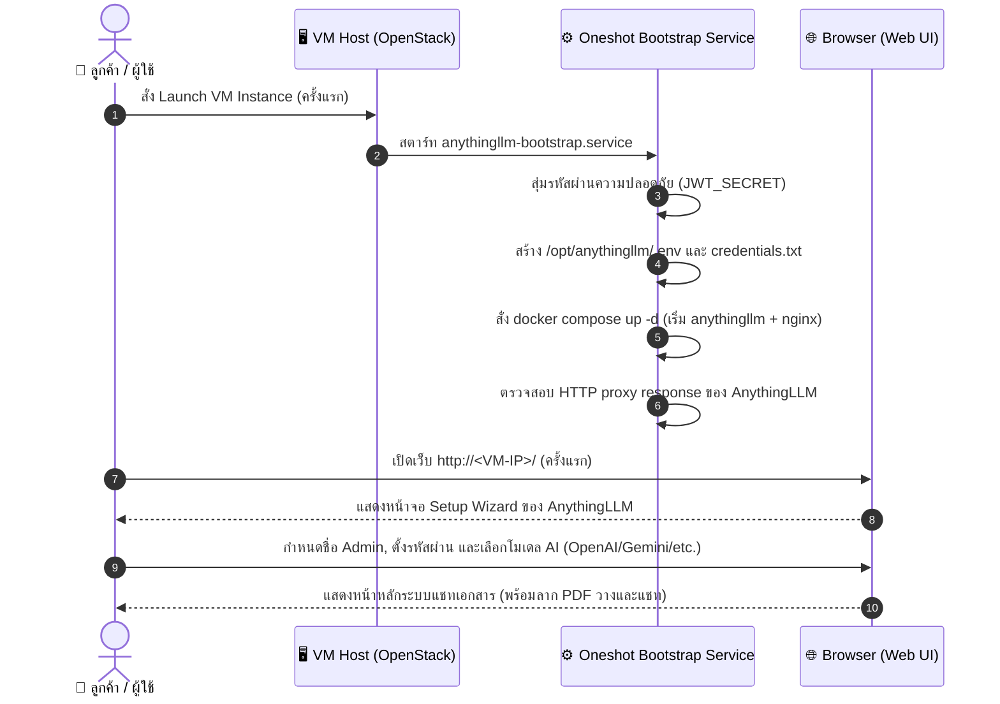
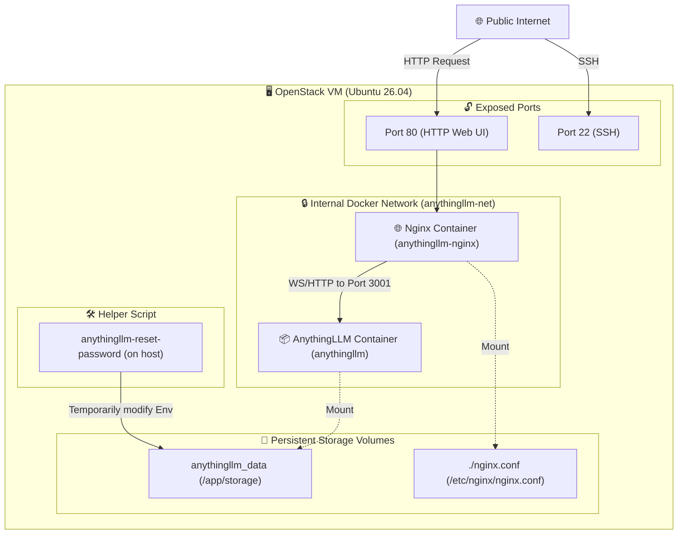
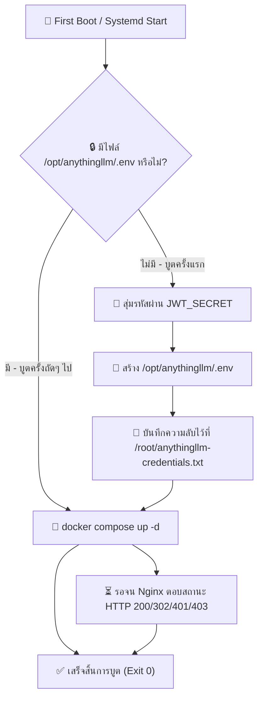
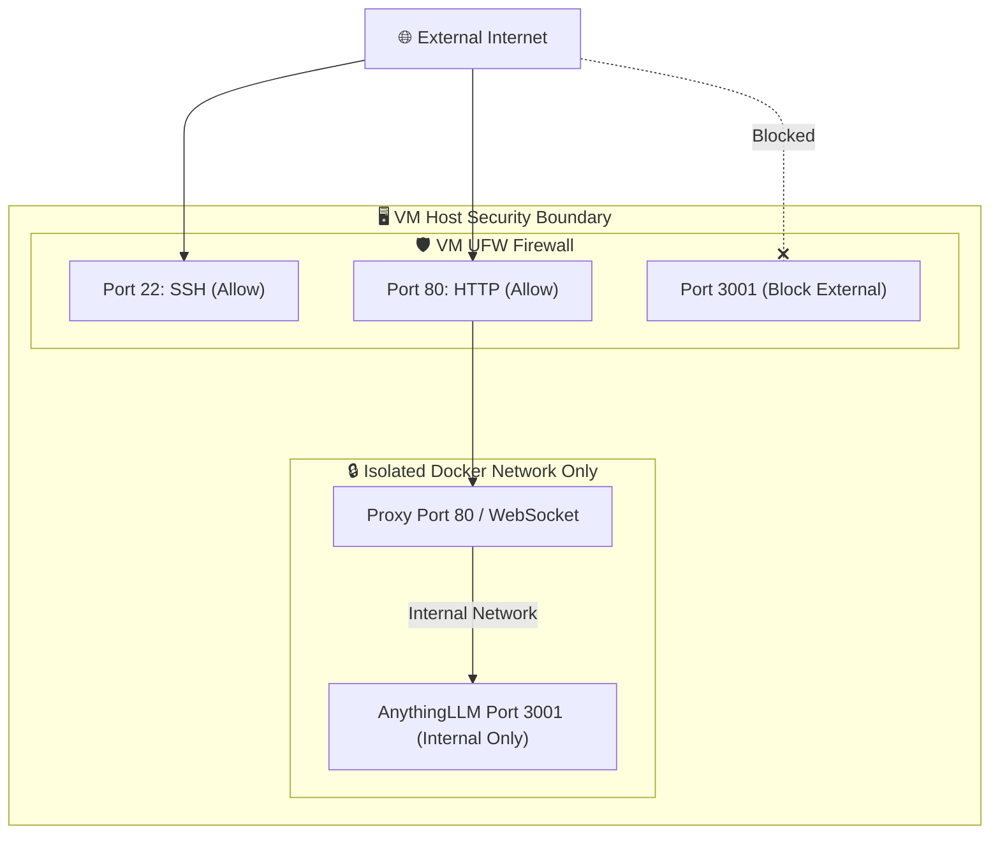

# AnythingLLM Research Review

> **แอปเป้าหมาย:** AnythingLLM (All-in-one local & cloud AI RAG app)
> **ขอบเขต:** Hardened Image บูต VM รันพอร์ต 80 (HTTP) พร้อมใช้งานโดยไม่ต้องการตั้งค่าทางเทคนิคเพิ่มเติม

---

## 1. Upstream & Docker Image Selection

| Component | Target Image | Tag / Version | Digest / Hash | Size | Role |
|---|---|---|---|---|---|
| Main App | `mintplexlabs/anythingllm` | `1.14.0` | `sha256:d82e11893c8a` | ~820MB | All-in-one RAG & Chat UI Server |
| Proxy | `library/nginx` | `1.27` | `sha256:32e76d2f32a7` | ~140MB | Reverse Proxy & WebSocket handler |

---

## 2. Technical Diagrams

### 2.1 User Journey Diagram (การใช้งานของลูกค้า)
ลำดับประสบการณ์ผู้ใช้ตั้งแต่รัน VM ครั้งแรกจนได้ระบบพร้อมแชท

---

### 2.2 System Architecture Diagram
แสดงโครงสร้าง Containers, Docker Network และจุดเชื่อมต่อข้อมูล

---

### 2.3 Bootstrap Execution Flow
สถาปัตยกรรมการรันสคริปต์บูตระบบในระดับ systemd

---

### 2.4 Port & Security Diagram (Security Boundaries)
สิทธิ์การแยกชั้นรักษาความปลอดภัยของพอร์ตบนเครือข่าย

---

## 3. Design Decisions & Rationale

| Topic | Decision | Rationale | Alternatives Considered |
|---|---|---|---|
| **Database** | SQLite + LanceDB (Embedded) | SQLite เก็บข้อมูล config และผู้ใช้ ส่วน LanceDB ทำหน้าที่เก็บ Vector database สำหรับทำ RAG ซึ่งเบาและรวดเร็วสำหรับ VM แบบ single-host | ติดตั้ง PostgreSQL หรือ Vector DB แยก (เช่น Milvus, Qdrant) — เพิ่มภาระแรมและระบบซับซ้อนเกินจำเป็น |
| **Proxy Limit** | Nginx `client_max_body_size 100M;` | AnythingLLM ใช้เป็นระบบจัดการเอกสาร RAG ผู้ใช้จึงมีโอกาสอัปโหลดเอกสาร PDF ขนาดใหญ่ ค่าเริ่มต้นของ nginx (1M) จึงไม่เพียงพอและทำให้เกิด HTTP 413 | ใช้ค่า nginx default — ผู้ใช้จะอัปโหลดหนังสือหรือเอกสารขนาดใหญ่ไม่ผ่าน |
| **WebSocket Routing** | เปิดใช้ WebSocket upgrade ใน Nginx | หน้าแชทของ AnythingLLM ส่งข้อมูลข้อความกลับมาแบบทีละคำ (Streaming) ผ่าน WebSocket และ EventStream จึงจำเป็นต้องเปิด WebSocket headers | การแชทแบบปกติที่รอข้อความจบทั้งหมด — ประสบการณ์แชทช้าและกระตุก |
| **Reset Password** | มี script ช่วยรีเซ็ตรหัสผ่านแบบ trap logic | หากแอดมินลืมรหัสผ่าน สามารถรัน `anythingllm-reset-password` บนโฮสต์เพื่อปิด auth ชั่วคราว เข้าไปเปลี่ยนรหัสผ่านในเบราว์เซอร์ แล้วคืนค่าความปลอดภัยเมื่อกด Enter | ไม่มีตัวช่วย — ผู้ใช้ลืมรหัสผ่านต้องทำลายข้อมูลและสร้างใหม่ทั้งหมด |

---

## 4. Community Signals & Known Issues

| Issue / Gotcha | Severity | Mitigation / Workaround | Source |
|---|---|---|---|
| **HTTP 413 Request Entity Too Large** | Must | แก้ไข nginx configuration ให้รับ `client_max_body_size 100M;` | Reddit r/selfhosted |
| **Streaming / WebSockets disconnected** | Must | เพิ่ม header `Upgrade $http_upgrade` และ `Connection "upgrade"` ใน proxy pass block | AnythingLLM Discord |
| **File Permission on Mounts** | Should | ใช้ Docker Named Volume `anythingllm_data` จัดการพื้นที่เก็บเอกสาร ช่วยขจัดปัญหา permission denied ในระดับโฟลเดอร์โฮสต์ | GitHub Issues |

---

## 5. User Needs

### 5.1 Beginner (พนักงานทั่วไปที่ต้องการระบบแชทเอกสาร)
*   **พร้อมใช้งานทันที:** บูตเครื่องแล้วลาก PDF วางเพื่อเริ่มแชทได้ทันที
*   **ใช้งานง่าย:** UI เข้าใจง่ายคล้ายระบบแชทสากล (ChatGPT)
*   **Workspace separation:** แบ่งส่วนโฟลเดอร์ข้อมูลแผนกบัญชีและทรัพยากรบุคคลแยกขาดจากกันได้

### 5.2 Intermediate (IT Admin ประจำสาขา)
*   **การจัดการโมเดล:** สามารถผูกระบบเข้ากับ API ภายนอก (เช่น Gemini, OpenAI) หรือต่อเข้ากับ Ollama โลคอลได้สะดวก
*   **การรีเซ็ตรหัสผ่าน:** สามารถจัดการสิทธิ์และรีเซ็ตรหัสผ่านแอดมินได้เมื่อพนักงานลืม

### 5.3 Advanced (ผู้ดูแลระบบความปลอดภัยองค์กร)
*   **ความปลอดภัยข้อมูล:** เอกสารทั้งหมดถูกแปลงเป็น Vector และเก็บอยู่ภายใน VM ลูกค้าโดยตรง ไม่มีทราฟฟิกไหลไปเซิร์ฟเวอร์อื่น
*   **Nginx ด่านหน้า:** มี nginx คอยกรองสิทธิ์และป้องกัน request แปลกปลอมก่อนเข้าถึงแอปพลิเคชันจริง

---

## 6. Verification & Acceptance Criteria

### 6.1 Unit Verification (ฝั่ง VM)
- [ ] ตรวจสอบว่าไม่มีไฟล์ `/opt/anythingllm/.env` หรือ credentials ถูกสร้างทิ้งไว้ใน Golden Image
- [ ] systemd service `anythingllm-bootstrap.service` เปิดทำงานในแบบ enabled
- [ ] สคริปต์ `/usr/local/sbin/anythingllm-reset-password.sh` มีอยู่จริงและมีสิทธิ์รัน

### 6.2 Browser Acceptance (E2E)
- [ ] บูต VM ขึ้นมาครั้งแรก สามารถเปิดเบราว์เซอร์เข้าสู่หน้า Setup Wizard ได้ปกติ
- [ ] สามารถสร้างโปรไฟล์ Admin และตั้งค่าร้านหรือโมเดล AI ผ่านหน้าจอ UI ได้สำเร็จ
- [ ] สามารถทดลองอัปโหลดไฟล์ทดสอบขนาด 5-10MB ได้ผ่านโดยไม่มี error
