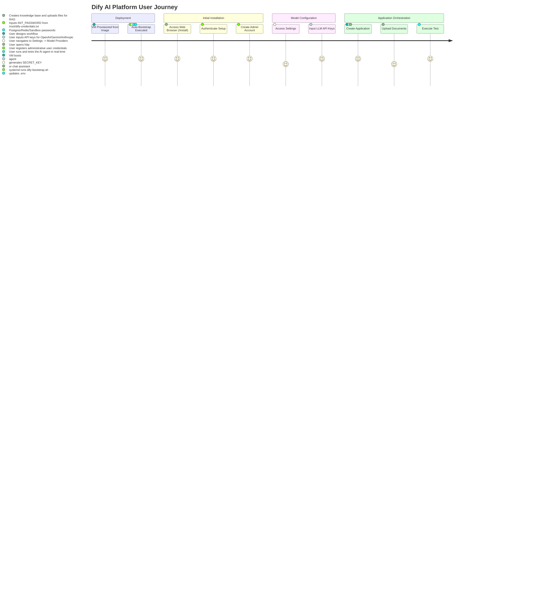

# Dify Research Review

> **แอปเป้าหมาย:** Dify CE (v1.14.2+)
> **ขอบเขต:** การทำ Golden Image สำหรับให้บริการคลาวด์บน Ubuntu 26.04 LTS (Docker-based)

---

## 1. Upstream & Docker Image Selection
| Component | Target Image | Tag / Version | Digest / Hash | Size | Role |
|---|---|---|---|---|---|
| Dify API | `langgenius/dify-api` | `1.14.2` | `sha256:...` (current tag default) | ~250 MB | Flask REST API & Celery background tasks |
| Dify Web | `langgenius/dify-web` | `1.14.2` | `sha256:...` (current tag default) | ~150 MB | Next.js Frontend Console |
| Sandbox | `langgenius/dify-sandbox` | `0.2.15` | `sha256:...` (current tag default) | ~80 MB | Code execution sandbox for JS/Python |
| Database | `postgres` | `15-alpine` | `sha256:...` (current tag default) | ~120 MB | Relational database (Dify standard choice) |
| Cache & Broker| `redis` | `6-alpine` | `sha256:...` (current tag default) | ~15 MB | Celery broker, cache, and session management |
| Vector DB | `weaviate` | `1.27.0` | `sha256:...` (current tag default) | ~180 MB | Default Vector database |
| SSRF Proxy | `ubuntu/squid` | `latest` | `sha256:...` (current tag default) | ~30 MB | Sandbox network egress control and proxy |
| Ingress | `nginx` | `stable-alpine` | `sha256:...` (current tag default) | ~10 MB | Reverse proxy routing web, API, and WebSockets |

---

## 2. Technical Diagrams

### 2.1 User Journey


### 2.2 System Architecture
```mermaid
graph TD
    User[User Web Browser] -->|Port 80| Nginx[Nginx Container]
    subgraph Docker Stack (11 Containers)
        Nginx -->|Route HTTP / Console| Web[dify-web Container: 3000]
        Nginx -->|Route API / WS| API[dify-api Container: 5001]
        Nginx -->|Route WebSockets| WS[dify-api-websocket Container: 5001]
        API -->|Celery Tasks| Worker[dify-worker Container]
        API -->|Celery Schedule| Beat[dify-worker-beat Container]
        API -->|Code Execution| Sandbox[dify-sandbox Container: 8194]
        Sandbox -->|Proxy Outbound| SSRF[ssrf_proxy Squid Container]
        API -->|Port 5432| DB[(dify-postgres Container)]
        API -->|Port 6379| Redis[(dify-redis Container)]
        API -->|Vector Queries| Weaviate[(weaviate Container: 8080)]
    end
    subgraph Host VM Volume Mounts
        API -.->|Bind Mount| Storage[./storage]
        Worker -.->|Bind Mount| Storage
        DB -.->|Named Volume| DBData[dify_db_data]
        Redis -.->|Named Volume| RedisData[dify_redis_data]
        Weaviate -.->|Named Volume| VectorData[dify_weaviate_data]
    end
```

### 2.3 Bootstrap Flow
```mermaid
sequenceDiagram
    autonumber
    systemd ->> dify-bootstrap.sh: ExecStart at First Boot
    dify-bootstrap.sh ->> dify-bootstrap.sh: Check if /opt/dify/.env exists
    alt First Boot (No .env)
        dify-bootstrap.sh ->> dify-bootstrap.sh: Generate SECRET_KEY & INIT_PASSWORD
        dify-bootstrap.sh ->> dify-bootstrap.sh: Generate alphanumeric-only PostgreSQL/Redis/Sandbox secrets
        dify-bootstrap.sh ->> /opt/dify/.env: Write secrets, passwords, and config parameters
        dify-bootstrap.sh ->> /root/dify-credentials.txt: Write admin setup credentials
    else Reboot (Existing .env)
        dify-bootstrap.sh ->> dify-bootstrap.sh: Load existing .env configuration
    end
    dify-bootstrap.sh ->> docker-compose: docker compose up -d
    docker-compose ->> Containers: Spin up 11 Dify stack containers
    dify-bootstrap.sh ->> dify-bootstrap.sh: Set up helper scripts & custom MOTD
```

### 2.4 Port & Security
```mermaid
graph TD
    subgraph Public Internet / Outside Network
        Internet[Web Request]
    end
    subgraph Host VM
        subgraph Open Ports
            Port80[Port 80: HTTP]
            Port22[Port 22: SSH / OpenStack]
        end
        subgraph Docker Internal Network (dify-net)
            Web[dify-web: 3000]
            API[dify-api: 5001]
            WS[dify-api-websocket: 5001]
            DB[dify-postgres: 5432]
            Redis[dify-redis: 6379]
            Weaviate[weaviate: 8080]
        end
        subgraph Sandboxed Docker Network (internal)
            Sandbox[dify-sandbox: 8194]
            SSRF[ssrf_proxy: Squid Proxy]
        end
    end
    Internet -->|Allow| Port80
    Internet -->|Restrict| Port22
    Port80 --> Nginx[Nginx Container]
    Nginx -->|Docker Network| Web
    Nginx -->|Docker Network| API
    Nginx -->|Docker Network| WS
    API --> DB
    API --> Redis
    API --> Weaviate
    API --> Sandbox
    Sandbox -->|Squid Only| SSRF
    style DB fill:#ffcccc,stroke:#ff3333,stroke-width:2px;
    style Redis fill:#ffcccc,stroke:#ff3333,stroke-width:2px;
    style Weaviate fill:#ffcccc,stroke:#ff3333,stroke-width:2px;
    style Sandbox fill:#fff9c4,stroke:#fbc02d,stroke-width:1px;
```

---

## 3. Design Decisions & Rationale
| Topic | Decision | Rationale | Alternatives Considered |
|---|---|---|---|
| Vector Storage | Weaviate 1.27.0 | Default vector store in Dify, single container setup, most widely tested in open-source. | Milvus, Qdrant, pgvector |
| Database | PostgreSQL 15 | Standard relational storage recommended for Dify core services. | MySQL, SQLite |
| Message Broker | Redis 6 Alpine | Required back-end for Celery task queuing and quick cache queries. | RabbitMQ |
| Ingress Proxy | Nginx Stable | Separates static Next.js frontend assets, routing API requests and web socket connections. | Traefik, Apache |
| Sandbox Egress Proxy | Squid Proxy | Protects the sandbox container from accessing internal host network while executing user scripts. | Direct host execution |
| Memory Optimization | Cap Workers (`CELERY_WORKER_AMOUNT=2`) | Capping the concurrent threads prevents Out of Memory (OOM) failures on smaller instances. | Default 4 workers |

---

## 4. Community Signals & Known Issues
| Topic / Gotcha | Severity (Must/Should/Could) | Mitigation / Workaround | Source |
|---|---|---|---|
| Out Of Memory (OOM) | Must | Set Celery concurrency limit and limit indexing threads (`INDEXING_MAX_WORKERS=2`). | GitHub issues |
| Weaviate Class Explosion | Should | Track memory metrics on Weaviate, clean up unused indexes periodically. | Community forums |
| SECRET_KEY modification | Must | Set the key during bootstrap and never change it to avoid breaking active sessions and secrets. | Dify docs |
| Plugin daemon upgrade errors | Should | Tune timeout parameter `PLUGIN_PYTHON_ENV_INIT_TIMEOUT=120` to prevent setup timeout. | GitHub issues |

---

## 5. User Needs

### 5.1 Beginner
- **Interactive UI Console**: Chat interface, flow canvas, and cognitive search configurations.
- **External APIs**: Quick connection with commercial models (OpenAI, Gemini).
- **Easy Deployment**: Running the prebuilt stack boots all essential containers directly.

### 5.2 Intermediate
- **Workflow Orchestration**: Creating custom nodes, setting conditional logic, and embedding loops.
- **RAG & Knowledge Base**: Uploading text files/PDFs to vector indexes.
- **SSRF Protections**: Built-in network isolation and safe execution environment.

### 5.3 Advanced
- **Real-Time Collaboration**: Multi-user editing of canvas assets.
- **Custom Tool Execution**: Loading bespoke plugins and executing sandboxed Python code.
- **Scalability**: Decoupling databases, upgrading Celery workers, and managing load balancing.

---

## 6. Verification & Acceptance Criteria

### 6.1 Unit Verification (ฝั่ง VM)
- [ ] systemd bootstrap service exists and runs fine on VM boot.
- [ ] Startup config `.env` and credential logs `/root/dify-credentials.txt` exist.
- [ ] 11 Docker containers boot up and show up in `docker compose ps`.
- [ ] Vector database Weaviate is healthy and listens on local requests.
- [ ] Sandbox executes Python/JS operations without escaping container network.

### 6.2 Browser Acceptance (E2E)
- [ ] Accessing `http://<VM_IP>/install` loads the initial initialization form.
- [ ] Administrator user can register and access the Dify Workspace Console.
- [ ] Workspace interface allows adding LLM providers and saves successfully.
- [ ] Creation of workflow templates and testing of sandboxed code execution runs successfully.
