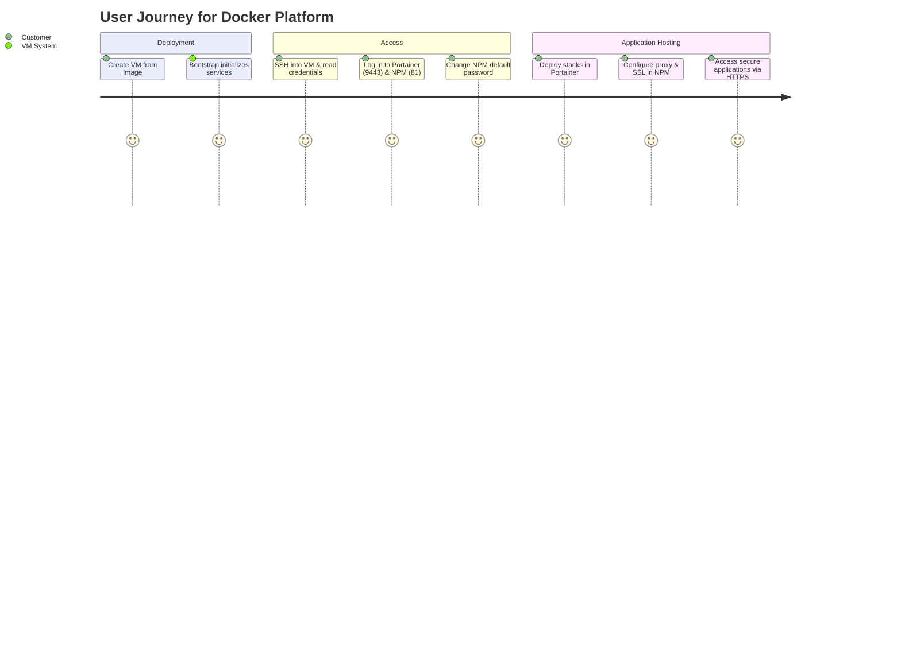
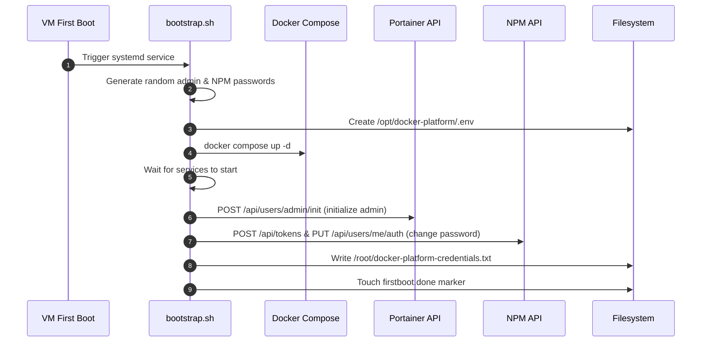
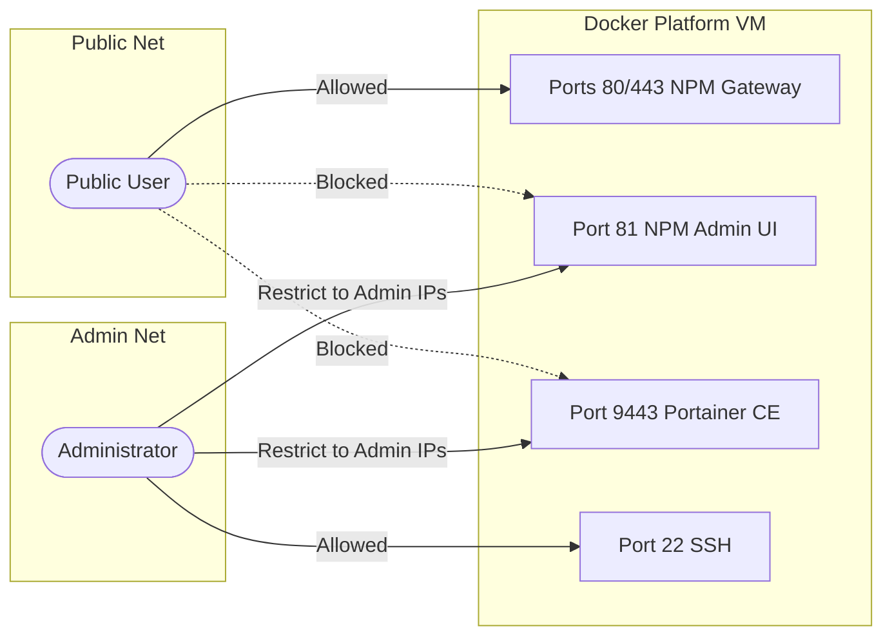

# Docker Platform Research Review

> **แอปเป้าหมาย:** Docker Platform Appliance (Docker CE + Portainer + Nginx Proxy Manager)
> **ขอบเขต:** ระบบบริหารจัดการ Docker Container ผ่านหน้าเว็บ (Portainer) และการจัดการโดเมน/ความปลอดภัย HTTPS (Nginx Proxy Manager)

---

## 1. Upstream & Docker Image Selection

| Component | Target Image | Tag / Version | Digest / Hash | Size | Role |
|---|---|---|---|---|---|
| **Portainer CE** | `portainer/portainer-ce` | `lts` | `sha256:7fada...` | ~300 MB | Container, stack, and volume manager visualizer |
| **Nginx Proxy Manager** | `jc21/nginx-proxy-manager` | `latest` | `sha256:2b92e...` | ~400 MB | Reverse proxy and Let's Encrypt SSL/TLS manager |

---

## 2. Technical Diagrams

### 2.1 User Journey


### 2.2 System Architecture
```mermaid
graph TD
    User([End User]) -- HTTPS:443 / HTTP:80 --> NPM[Nginx Proxy Manager]
    Admin([Administrator]) -- HTTPS:9443 --> Portainer[Portainer CE]
    Admin -- HTTP:81 --> NPM
    
    Portainer -- Manage --> Socket[(/var/run/docker.sock)]
    NPM -- Proxy Pass --> UserApps[User App Containers]
    
    subgraph Docker Network (platform)
        NPM
        Portainer
        UserApps
    end
    
    subgraph Volumes
        Portainer_Vol[(portainer_data)] ---> Portainer
        NPM_Vol[(npm_data)] ---> NPM
        NPM_SSL[(npm_letsencrypt)] ---> NPM
    end
```

### 2.3 Bootstrap Flow


### 2.4 Port & Security


---

## 3. Design Decisions & Rationale

| Topic | Decision | Rationale | Alternatives Considered |
|---|---|---|---|
| **OS Packages** | Official Docker Repository | ช่วยรับประกันความเข้ากันได้ ความยั่งยืน และช่องทางอัปเกรดความปลอดภัยของแพ็คเกจที่ทันสมัย | Snap/OS defaults (มีปัญหาความล่าช้าของอัปเกรดหรือข้อจำกัดด้าน AppArmor/App sandbox) |
| **Component Mix** | Portainer + NPM | การผสานรวมเครื่องมือจัดการ container (Portainer) และเครื่องมือจัดการ domain/HTTPS (NPM) ช่วยลด friction สูงสุดสำหรับผู้ใช้ทั่วไป | Traefik/Caddy (ไม่มี Web UI จัดการสำหรับผู้ใช้ทั่วไป), Portainer standalone (ไม่มี HTTPS/Reverse proxy มาพร้อมในตัว) |
| **Database Provision** | DB Templates on Disk | มอบตัวอย่าง Docker Compose (Postgres, MariaDB, Redis) ให้ลูกค้าก๊อปปี้ไปรันเองโดยไม่สตาร์ทอัตโนมัติ เพื่อประหยัด CPU/RAM | Run databases default (สิ้นเปลืองหน่วยความจำเกินความจำเป็นและสร้าง security surfaces เพิ่ม) |
| **Credential Auto-change** | API-based initialization and change | เปลี่ยนและตั้งค่ารหัสผ่านเริ่มต้นสำหรับ Portainer และ NPM ใน first boot เพื่อไม่ให้มีรหัสผ่านเริ่มต้นค้างอยู่ในระบบ | ปล่อยรหัสผ่านเริ่มต้นคงที่ไว้ (เสี่ยงต่อการโดน takeover เครื่องทันทีหลังสร้าง VM) |
| **Logging Guard** | Docker Log Rotation config | จำกัดปริมาณล็อกของ container ไว้ที่ 10m และ 3 ไฟล์เพื่อป้องกันปัญหา disk เต็มระยะยาว | Default logging (ไฟล์ล็อกของ container โตขึ้นเรื่อยๆ จนเต็มฮาร์ดดิสก์ทำให้เครื่องล่ม) |

---

## 4. Community Signals & Known Issues

| Issue / Gotcha | Severity (Must/Should/Could) | Mitigation / Workaround | Source |
|---|---|---|---|
| **Docker bypasses local firewall (UFW)** | 🔴 Must | ป้องกันการ expose พอร์ตตรงของ container สู่สาธารณะโดยระบุ IP binding `127.0.0.1:<host_port>:<container_port>` ใน Compose หรือตั้งค่า DOCKER-USER chain | Docker/Ubuntu Community |
| **NPM default credentials security risk** | 🔴 Must | ระบบ bootstrap พยายามล็อกอินเพื่อเปลี่ยนรหัสผ่านเริ่มต้นทันที หากผิดพลาด ผู้ใช้จำเป็นต้องเปลี่ยนรหัสผ่านทันทีหลังลงทะเบียนครั้งแรก | Nginx Proxy Manager Docs |
| **Mounting `/var/run/docker.sock` vulnerability** | 🔴 Must | พึงตระหนักว่า Portainer ที่ทำงานด้วยสิทธิ์เข้าถึง docker socket สามารถครอบครองสิทธิ์ root ของโฮสต์ได้ จึงจำกัดการเข้าพอร์ต `9443` เฉพาะ IP แอดมิน | Portainer Security Guide |
| **Daemon log option type error** | 🟠 Should | หลีกเลี่ยงข้อผิดพลาดประเภทข้อมูลใน `daemon.json` โดยเขียนค่า log-opts ทั้งหมดในลักษณะ String ตามข้อกำหนดของ Docker engine v24+ | ServerFault / GitHub Issues |
| **Let's Encrypt rate limits** | 🟡 Could | ระมัดระวังการทดลองขอใบรับรอง SSL จำนวนมากใน Nginx Proxy Manager ซึ่งอาจส่งผลให้โดนบล็อกชั่วคราวจาก Let's Encrypt | Let's Encrypt Community |

---

## 5. User Needs

### 5.1 General / SME
- **No-CLI management:** บริหารจัดการแอปพลิเคชันและหน้าเว็บได้ทั้งหมดผ่าน Web UI (Portainer)
- **Visual HTTPS/Domain setup:** จัดการโดเมนเนมและทำ HTTPS สำเร็จได้ด้วยการคลิกบนเบราว์เซอร์ (Nginx Proxy Manager)
- **Preconfigured templates:** มีตัวอย่างเทมเพลตพร้อมดึงไปวางรันแอปได้ทันที

### 5.2 Developer / DevOps
- **Standard compose syntax:** รองรับ docker compose v2 และเครื่องมือ Buildx
- **Environment isolation:** สามารถทดลอง deploy เทมเพลตที่แยกจาก stack หลักได้ง่าย
- **Troubleshooting tools:** สามารถเปิดดู Container logs และ Terminal shell ได้ง่ายผ่าน Portainer

### 5.3 Operator / Production
- **Fresh start first boot:** ภาพโฮสต์ Golden Image ที่สะอาด ไม่มีฐานข้อมูลหรือข้อมูลการทดสอบหลงเหลือ
- **Log rotation:** ระบบจัดการขนาดล็อกที่ทนทาน
- **Security Group hardening guidance:** คำแนะนำการแยกพอร์ตสาธารณะ (80/443) ออกจากพอร์ตแอดมิน (22/81/9443)

---

## 6. Verification & Acceptance Criteria

### 6.1 Unit Verification (ฝั่ง VM)
- [ ] Docker engine และ plugins ติดตั้งสำเร็จและอยู่ในสถานะเริ่มทำงาน (`systemctl is-active docker`)
- [ ] ไฟล์ตั้งค่าล็อก /etc/docker/daemon.json ตั้งค่า rotation สำเร็จและไม่มี syntax error
- [ ] บัญชี Admin ของ Portainer ได้รับการอัปเดตและเริ่มต้นรหัสผ่านด้วยรหัสสุ่มใน first boot สำเร็จ
- [ ] ไฟล์ตัวอย่างในโฟลเดอร์ `/opt/docker-platform/examples` วางเรียบร้อยครบทุกประเภท (postgres, mariadb, redis, nginx-demo)

### 6.2 Browser Acceptance (E2E)
- [ ] เข้าหน้าเว็บของ Portainer ผ่าน `https://<VM-IP>:9443` ได้สำเร็จ (ยอมรับ self-signed cert)
- [ ] เข้าหน้าเว็บของ Nginx Proxy Manager ผ่าน `http://<VM-IP>:81` ได้สำเร็จ
- [ ] ล็อกอินเข้า Portainer สำเร็จด้วยรหัสผ่านสุ่มที่อยู่ใน credentials file
- [ ] สามารถสร้าง Proxy Host บน NPM และขอใบรับรอง SSL Let's Encrypt ให้ทำงานได้จริง
