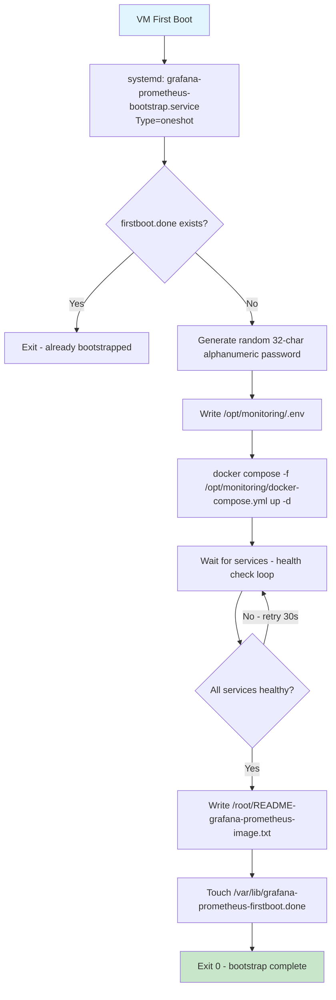
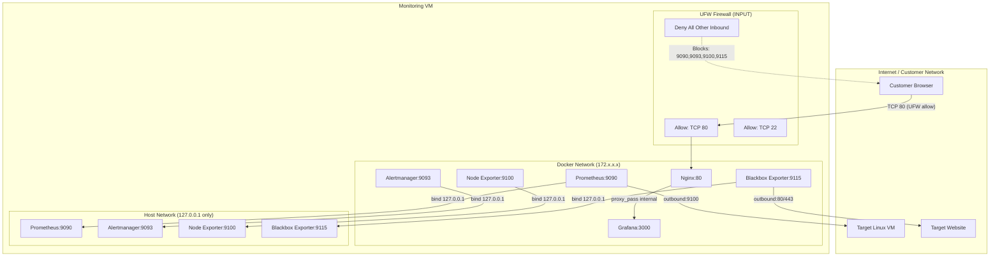

# Grafana + Prometheus Research Review

> **แอปเป้าหมาย:** Grafana OSS + Prometheus Monitoring Appliance (Model 2B Fully Auto)
> **ขอบเขต:** Customer-facing VM image — Grafana OSS 11.6.5 + Prometheus 3.13.1 LTS + Alertmanager 0.33.1 + node_exporter 1.12.0 + blackbox_exporter master-distroless + Nginx reverse proxy — พร้อมใช้ทันทีหลัง boot

---

## 1. Upstream & Docker Image Selection

### 1.1 Version Discovery Note

| Component | Docker Hub Latest Tag | GitHub Latest Release | หมายเหตุ |
|---|---|---|---|
| **Grafana OSS** | `11.6.5` (2025-08-15) | `11.6.16` (2026-06-23) | Docker Hub ตามหลัง GitHub ~11 patches — ต้อง verify ว่า `11.6.16` image มีบน Docker Hub หรือไม่ |
| **Prometheus** | `v3.2.1` (2025-02-25) | `v3.13.1` (2026-07-10) | **⚠️ 3.2.x ล้าสมัยมาก** — แนะนำอัปเกรดเป็น 3.13.x LTS |
| **Alertmanager** | `v0.33.1` (2026-07-04) | `v0.33.1` (2026-07-04) | ตรงกัน |
| **Node Exporter** | `v1.12.0` (2026-07-11) | `v1.12.0` (2026-07-11) | ตรงกัน |
| **Blackbox Exporter** | `v0.28.0` (2025-12-06) | `master` (2026-07-11) | Docker Hub ตามหลัง — `master` image มี distroless variant |
| **Nginx** | `alpine` (latest) | — | Official image, Alpine-based |

### 1.2 Image Selection Table (amd64)

| Component | Target Image | Tag / Version | Digest (amd64) | Size | Role |
|---|---|---|---|---|---|
| **Grafana OSS** | `grafana/grafana-oss` | `11.6.5` | `sha256:d552f949693c54d17c6f867ff6aeb128b021e54e923895dcf9cd6aa8176c0d74` | ~182 MB | Web-based metrics visualizer & dashboard UI |
| **Prometheus** | `prom/prometheus` | `v3.13.1` | (verify before build) | ~130 MB | Time-series monitoring & alerting engine |
| **Alertmanager** | `prom/alertmanager` | `v0.33.1` | `sha256:9e082985f56f4c8c9f724e18f2288c6708f472e56a5286b8863d080434ea065d` | ~40 MB | Alert routing, dedup, silencing |
| **Node Exporter** | `prom/node-exporter` | `v1.12.0` | `sha256:9b0ade5e607f9dbedb0a8e11151b6011ae5bd79304c261804cfdd2cadf200a80` | ~13 MB | Hardware & OS metrics exporter |
| **Blackbox Exporter** | `prom/blackbox-exporter` | `master-distroless` | (verify before build) | ~15 MB | HTTP/HTTPS/DNS/TCP/ICMP probing |
| **Nginx** | `nginx` | `alpine` | (latest Alpine digest) | ~40 MB | Reverse proxy (port 80 → Grafana 3000) |

### 1.3 Version Decision — Prometheus 3.13.1 LTS

**✅ เลือก Prometheus 3.13.1 LTS (Jul 2026)** แทน 3.2.1 (Feb 2025) ตามคำแนะนำของ Rikku:
- Native histograms stable (ไม่ต้องใช้ feature flag)
- Distroless image variant (security-enhanced)
- GHCR (GitHub Container Registry) support
- 3.13.x เป็น LTS release (3.13.1 = bugfix)
- Security patches ต่อเนื่อง (3.2.x ไม่มี patches ใหม่)

### 1.4 Grafana 11.6.x — Docker Hub Gap

Docker Hub มี `11.6.5` เป็น tag ล่าสุดของ 11.6.x (pushed 2025-08-15) แต่ GitHub Releases มี `11.6.16` (2026-06-23) ซึ่งมี security patches รวม CVE-2026-28374, CVE-2026-28376, CVE-2026-28383 และอื่นๆ อีก 10 รายการ

**✅ Decision:** ใช้ `grafana/grafana-oss:11.6.5` (Docker Hub) และ monitor `11.6.16` สำหรับ rebuild ครั้งถัดไป

---

## 2. Technical Diagrams

### 2.1 User Journey Diagram

```mermaid
sequenceDiagram
    participant C as Customer
    participant VM as VM (First Boot)
    participant BS as Bootstrap Service
    participant DC as Docker Compose
    participant UI as Grafana UI
    
    C->>VM: Create VM from Image
    VM->>BS: systemd triggers bootstrap.service
    BS->>BS: Generate random Grafana admin password
    BS->>BS: Create /opt/monitoring/.env
    BS->>DC: docker compose up -d
    DC->>DC: Pull images (cached from golden image)
    DC->>DC: Start Nginx → Grafana → Prometheus → Alertmanager → Exporters
    BS->>BS: Health check all services
    BS->>BS: Write /root/README-grafana-prometheus-image.txt
    BS->>BS: Touch /var/lib/grafana-prometheus-firstboot.done
    BS-->>C: (MOTD shows on SSH login)
    
    C->>UI: Open http://<VM-IP>/
    UI->>C: Grafana login page
    C->>C: sudo monitoring-info (get password)
    C->>UI: Login with admin + generated password
    UI->>C: Pre-provisioned dashboard with metrics
    
    C->>C: sudo monitoring-add-http https://example.com website
    C->>C: sudo monitoring-add-node 10.0.0.12:9100 web-01
    C->>UI: View new targets in dashboard
```



### 2.2 System Architecture Diagram

```mermaid
graph TD
    User([Customer Web Browser]) -- HTTP:80 --> Nginx[Nginx Proxy<br/>port 80]
    Nginx -- proxy_pass:3000 --> Grafana[Grafana OSS<br/>port 3000]
    Grafana -- Query:9090 --> Prometheus[Prometheus TSDB<br/>port 9090]
    
    Prometheus -- Scrape:9100 --> NodeExporter[Node Exporter<br/>port 9100]
    Prometheus -- Scrape:9115 --> BlackboxExporter[Blackbox Exporter<br/>port 9115]
    Prometheus -- Alert --> Alertmanager[Alertmanager<br/>port 9093]
    Alertmanager -- Webhook --> Notifications[Slack/Discord/LINE]
    
    Prometheus -- file_sd_configs --> Targets[Target Files<br/>/opt/monitoring/prometheus/targets/]
    
    subgraph Docker Network (monitoring-net)
        Nginx
        Grafana
        Prometheus
        NodeExporter
        BlackboxExporter
        Alertmanager
    end
    
    subgraph Volumes
        GrafanaData[grafana_data]
        PrometheusData[prometheus_data]
        AlertmanagerData[alertmanager_data]
    end
    
    Grafana --> GrafanaData
    Prometheus --> PrometheusData
    Alertmanager --> AlertmanagerData
    
    Prometheus -- Scrape:9100 --> ExtNode[Target Linux VM]
    BlackboxExporter -- Probe:80/443 --> ExtWeb[Target Website/API]
```

### 2.3 Bootstrap Execution Flow



### 2.4 Port & Security Diagram



---

## 3. Design Decisions & Rationale

| Topic | Decision | Rationale | Alternatives Considered |
|---|---|---|---|
| **Component Stack** | Grafana OSS + Prometheus + Alertmanager + Exporters | Standard stack ที่ community ใช้มากที่สุด, ecosystem กว้าง, documentation ครบ | Zabbix (UI ล้าสมัย, configuration ซับซ้อน), Netdata (ไม่เหมาะกับ multi-target ระยะยาว), VictoriaMetrics (ต้องเรียนรู้เพิ่ม) |
| **Reverse Proxy** | Nginx on port 80 → Grafana 3000 | ซ่อน internal port, ลด attack surface, รองรับ HTTPS upgrade ในอนาคต | Expose Grafana 3000 โดยตรง (เสี่ยง scan, ต้องระบุ port), Traefik (overkill สำหรับ use case นี้) |
| **Target Management** | file_sd_configs + helper scripts | Dynamic add/remove targets โดยไม่ต้อง restart Prometheus, ไม่พึ่งพา external service discovery | Consul (overhead สูง), API-based (ซับซ้อน), static config (ต้อง restart) |
| **Password Policy** | First-boot random generation (32 char alphanumeric) | ป้องกัน default credential attack, แต่ละ VM ได้ password ต่างกัน | Static default password (เสี่ยงสูง), cloud-init password (ต้องมี metadata service) |
| **Image Variant** | Busybox-based (default) สำหรับ Prometheus stack | เข้ากันได้ดีที่สุดกับ volume permissions, ไม่ต้อง chown เพิ่ม | Distroless (security ดีกว่า แต่ต้องจัดการ volume permission) |
| **Grafana Version** | 11.6.x LTS branch | Stable, security patches ต่อเนื่อง, community support แน่น | 13.x (latest, feature ใหม่ แต่ stability น้อยกว่า), 12.x (middle ground) |
| **Prometheus Version** | **3.13.1 LTS** (user approved) | 3.13.x = LTS release, native histograms stable, distroless support, security patches | 3.2.x (ล้าสมัย, missing features/security patches) |
| **Alertmanager Config** | File-based config + webhook routing | Simple, version-controllable, ไม่ต้องใช้ UI | Grafana Alerting (ต้องพึ่ง Grafana UI, migration complexity) |

---

## 4. Community Signals & Known Issues

| Issue / Gotcha | Severity (Must/Should/Could) | Mitigation / Workaround | Source |
|---|---|---|---|
| **Prometheus TSDB NFS Corruption** | 🔴 Must | ใช้ local disk (SSD) เท่านั้น — NFS/SMB ทำให้ data corruption | Prometheus Storage Docs, Reddit r/selfhosted |
| **Disk Exhaustion (No Retention Limit)** | 🔴 Must | ตั้ง `--storage.tsdb.retention.time=15d` และ `--storage.tsdb.retention.size=10GB` | Prometheus Community, GitHub Issues |
| **Accidental Public Port Exposure** | 🔴 Must | Bind containers ไปที่ `127.0.0.1` ใน docker-compose.yml สำหรับ Prometheus/Alertmanager/Exporters | Prometheus Security Policy, Reddit r/docker |
| **Grafana Provisioning UID Mismatch** | 🔴 Must | ตั้ง UID ของ datasource เป็น `prometheus` คงที่ — ป้องกัน dashboard ค้นหา datasource ไม่เจอ | Grafana Community Forum, StackOverflow |
| **Node Exporter Host Mount** | 🟠 Should | Mount host root filesystem read-only ที่ `/host` + `--path.rootfs=/host` | Node Exporter Docs, Reddit r/selfhosted |
| **Alertmanager Config Permission** | 🟠 Should | ตั้ง permission 644 (ไม่ใช่ 600) — container ไม่ได้ run as root | Grafana+Prometheus errors.md (build history) |
| **Grafana 11.6.x Security Patches** | 🔴 Must | Docker Hub มีแค่ 11.6.5 แต่ GitHub มี 11.6.16 — ต้อง verify ก่อน build | GitHub Releases, Docker Hub Tags |
| **Prometheus 3.2.x EOL Risk** | 🟠 Should | 3.2.x ไม่ได้รับ security patches ใหม่ — แนะนำ 3.13.x LTS | Prometheus Changelog, GitHub Releases |
| **Blackbox Exporter v0.28.0 vs master** | 🟡 Could | v0.28.0 (Dec 2025) เก่ากว่า master (Jul 2026) — ใช้ master-distroless ถ้าต้องการ security patch ล่าสุด | Docker Hub Tags |
| **Docker Hub Pull Timeout** | 🟡 Could | Transient TLS handshake timeout — retry per service | Grafana+Prometheus errors.md (build history) |
| **CRLF Line Endings** | 🔴 Must | Scripts จาก Windows ต้อง `sed -i 's/\r$//'` — ป้องกัน `bash\r` error | Grafana+Prometheus errors.md (build history) |
| **Grafana 13.x Breaking Changes** | 🟡 Could | 13.0.0 ลบ Zipkin core, Prometheus azure/sigv4 auth — ถ้าอัปเกรดต้องตรวจสอบ plugin | Grafana CHANGELOG 13.0.0 |
| **Prometheus 3.13.x Breaking Changes** | 🟡 Could | 3.13.0 เปลี่ยน SHA-1 → SHA-256 สำหรับ rule group pagination tokens, redirect credential forwarding | Prometheus CHANGELOG 3.13.0 |

---

## 5. User Needs

### 5.1 Beginner
- **Instant UI Access:** เข้า Grafana ผ่าน HTTP (port 80) ทันทีหลัง VM boot
- **Pre-configured Dashboard:** มี dashboard CPU, Memory, Disk, Network พร้อมใช้
- **Simple Target Addition:** คำสั่ง `monitoring-add-http`, `monitoring-add-node` สำหรับเพิ่ม target
- **Uptime Probing:** ตรวจสอบ website/API availability ผ่าน blackbox exporter
- **Password Recovery:** `monitoring-reset-grafana-password` เมื่อลืม password
- **Status Overview:** `monitoring-status` ดู container health, target summary, disk usage

### 5.2 Intermediate
- **Multiple Targets Management:** จัดการ Linux VM targets หลายสิบตัวผ่าน file-based discovery
- **Custom Alert Routing:** เชื่อมต่อ Slack/Discord/LINE webhook สำหรับ alert notification
- **Target Types:** HTTP, TCP, ICMP ping, Node metrics — ครอบคลุม use case ทั่วไป
- **Dashboard Customization:** ปรับแต่ง Grafana dashboard ตามความต้องการ
- **Retention Tuning:** ปรับ retention time/size ตามปริมาณ metrics

### 5.3 Advanced
- **Retention & Capacity Planning:** ปรับ `--storage.tsdb.retention.time` และ `--storage.tsdb.retention.size` ตาม scale
- **Ecosystem Expansion:** ต่อยอดไปยัง Thanos, Mimir, VictoriaMetrics สำหรับ long-term storage
- **Remote Write:** ส่ง metrics ไปยัง central Prometheus หรือ cloud backend
- **Grafana Upgrade Path:** วางแผนอัปเกรด Grafana 11.6.x → 12.x → 13.x โดยไม่เสีย data
- **Prometheus 3.13.x Migration:** ถ้าต้องการ native histograms, distroless image, GHCR support
- **SSL/HTTPS Termination:** เพิ่ม Let's Encrypt + certbot สำหรับ production deployment

---

## 6. Verification & Acceptance Criteria

### 6.1 Unit Verification (ฝั่ง VM)
- [ ] Docker service running (`systemctl is-active docker`)
- [ ] Docker Compose config valid (`docker compose -f /opt/monitoring/docker-compose.yml config`)
- [ ] Prometheus config valid (`promtool check config /opt/monitoring/prometheus/prometheus.yml`)
- [ ] Prometheus rules valid (`promtool check rules /opt/monitoring/prometheus/rules/alerts.yml`)
- [ ] Bootstrap script idempotent — รันซ้ำไม่พัง, มี firstboot.done gate
- [ ] Random password generated on first boot, stored in `/root/README-grafana-prometheus-image.txt`
- [ ] All containers healthy after bootstrap (`docker ps --format '{{.Names}} {{.Status}}'`)
- [ ] Nginx responds on port 80 (`curl -fsS http://127.0.0.1/ > /dev/null`)
- [ ] Prometheus healthy (`curl -fsS http://127.0.0.1:9090/-/healthy`)
- [ ] Alertmanager healthy (`curl -fsS http://127.0.0.1:9093/-/healthy`)
- [ ] Node Exporter metrics accessible (`curl -fsS http://127.0.0.1:9100/metrics > /dev/null`)
- [ ] Blackbox Exporter healthy (`curl -fsS http://127.0.0.1:9115/health`)
- [ ] Internal ports (9090, 9093, 9100, 9115) bound to 127.0.0.1 only
- [ ] MOTD shows on SSH login (`run-parts /etc/update-motd.d/`)
- [ ] Helper scripts executable and CRLF-free (`monitoring-info`, `monitoring-status`, etc.)
- [ ] Phase 1 cleanup: no running containers, no .env, no password file, no volumes
- [ ] Bootstrap service enabled (`systemctl is-enabled grafana-prometheus-bootstrap.service`)

### 6.2 Browser Acceptance (E2E)
- [ ] Grafana accessible via `http://<VM-IP>/` (Nginx proxy on port 80)
- [ ] Login successful with `admin` + generated password from README
- [ ] Pre-provisioned Prometheus datasource visible and connected
- [ ] Pre-provisioned dashboard(s) display metrics correctly
- [ ] `monitoring-reset-grafana-password` works — new password allows login
- [ ] `monitoring-add-http` creates new HTTP target — visible in Prometheus targets
- [ ] `monitoring-add-node` creates new node target — visible in Prometheus targets
- [ ] `monitoring-list-targets` shows all configured targets
- [ ] `monitoring-remove-target` removes target — reflected in Prometheus
- [ ] `monitoring-setup-webhook` configures alert notification channel
- [ ] Grafana alerting UI accessible and configured with Alertmanager

---

## 7. Security Considerations

| Concern | Mitigation | Priority |
|---|---|---|
| Default credentials | Random 32-char alphanumeric password on first boot | 🔴 Must |
| Port exposure | All internal services bound to 127.0.0.1; only port 80 public | 🔴 Must |
| No baked secrets | `.env` and password file created at runtime, not in image | 🔴 Must |
| Grafana CVE backlog | 11.6.x มี security patches 10+ รายการ (CVE-2026-28374 etc.) — ต้องใช้ latest patch | 🔴 Must |
| Prometheus 3.2.x EOL | ไม่ได้รับ security patches — แนะนำ 3.13.x LTS | 🟠 Should |
| Container isolation | Docker user-defined network, no `--privileged`, read-only rootfs where possible | 🟠 Should |
| Log rotation | Docker daemon.json จำกัด log size (max-size=10m, max-file=3) | 🟠 Should |
| Alertmanager config permission | 644 (ไม่ใช่ 600) — container ไม่ได้ run as root | 🟠 Should |
| Nginx security headers | เพิ่ม `X-Content-Type-Options`, `X-Frame-Options`, `X-XSS-Protection` | 🟡 Could |
| HTTPS termination | Nginx template สำหรับ Let's Encrypt ในอนาคต | 🟡 Could |

---

## 8. Upgrade Path Recommendations

### Short-term (Current Build)
- Grafana: `11.6.5` (Docker Hub latest 11.6.x) — monitor สำหรับ `11.6.16`
- Prometheus: **แนะนำ `v3.13.1`** แทน `v3.2.1` (LTS release, security patches)
- Alertmanager: `v0.33.1`
- Node Exporter: `v1.12.0`
- Blackbox Exporter: `v0.28.0` หรือ `master-distroless`

### Medium-term (3-6 months)
- Grafana: อัปเกรดเป็น 12.x LTS เมื่อ stable
- Prometheus: 3.13.x LTS series (patch updates)
- พิจารณา distroless image variants สำหรับ production hardening

### Long-term (6-12 months)
- Grafana: 13.x LTS (เมื่อมี)
- Prometheus: 3.14+ (ถ้ามี)
- พิจารณาเพิ่ม Thanos/Mimir สำหรับ long-term retention
- HTTPS termination ด้วย Let's Encrypt

---

## 9. Source Summary

| Source | What Was Found |
|---|---|
| **Docker Hub** | Verified all image tags, digests, sizes, update frequency |
| **GitHub Releases** | Grafana 11.6.16 (latest patch), Prometheus 3.13.1 LTS, changelogs, breaking changes |
| **Reddit (r/selfhosted, r/docker)** | Common patterns: port exposure, TSDB on NFS, retention limits, Grafana provisioning UID |
| **StackOverflow** | Grafana datasource provisioning, Prometheus config validation, Docker Compose networking |
| **Official Documentation** | Prometheus storage/security docs, Grafana provisioning, Node Exporter host mount |
| **Known Issues** | Grafana CVE backlog (10 CVEs in May 2026), Prometheus 3.2.x EOL, Alertmanager permission |
| **Security Advisories** | CVE-2026-28374/376/383/380/376/379/377/378/381/380 (Grafana), CVE-2026-44990 (Prometheus UI XSS) |
| **Docker Compose Examples** | Official Grafana + Prometheus compose examples, community patterns for file_sd_configs |

---

*Research conducted: 2026-07-12*
*Next review: 2026-10-12 หรือเมื่อมี major version release ใหม่*
