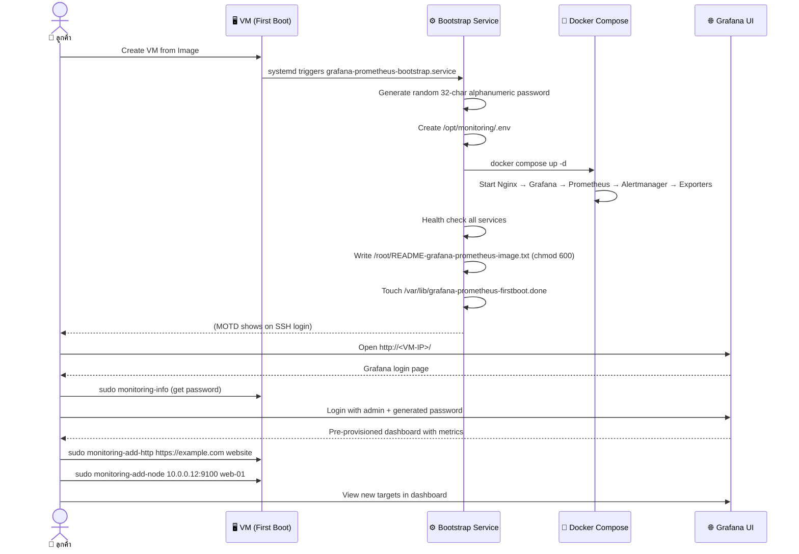
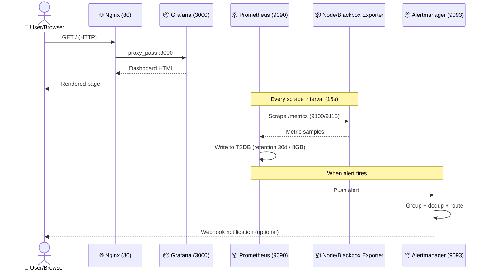
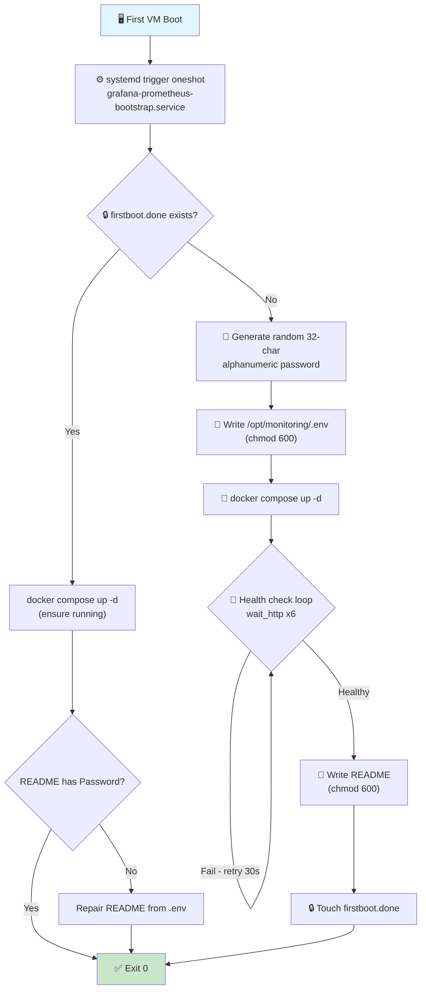

# Implementation Plan: Grafana+Prometheus Monitoring Appliance

> **Author:** Auron (Image Architect)
> **Date:** 2026-07-12
> **Source:** `apps/grafana-prometheus/docs/grafana-prometheus-review.md` (Rikku, 2026-07-12)
> **Status:** [พร้อม build]

---

## 1. Specifications

| Parameter | Value |
|-----------|-------|
| App Name | Grafana+Prometheus |
| Target Version | Grafana OSS 11.6.5, Prometheus 3.13.1 LTS, Alertmanager 0.33.1, Node Exporter 1.12.0, Blackbox Exporter master-distroless, Nginx stable-alpine |
| Deployment Stack | Docker Compose (6 core containers + 1 optional cAdvisor profile) + systemd oneshot bootstrap |
| Customer Service Model | **2B (Fully Auto — พร้อมใช้ทันทีหลัง boot)** |
| Base OS | Ubuntu 26.04 LTS |
| Minimum Flavor | 2 vCPU / 2GB RAM / 15GB disk |
| Public Exposure | TCP 80 only (Nginx reverse proxy) |
| Internal Services Bind | 127.0.0.1 (Prometheus 9090, Alertmanager 9093, Node Exporter 9100, Blackbox 9115) |

---

## 2. 5 Diagrams

### 2.1 User Journey Diagram



### 2.2 Architecture Diagram

```mermaid
graph TD
    User([👤 Customer Browser]) -- HTTP:80 --> Nginx[Nginx Proxy<br/>port 80]
    Nginx -- proxy_pass:3000 --> Grafana[Grafana OSS 11.6.5<br/>port 3000]
    Grafana -- Query:9090 --> Prometheus[Prometheus 3.13.1 LTS<br/>port 9090]

    Prometheus -- Scrape:9100 --> NodeExporter[Node Exporter 1.12.0<br/>port 9100]
    Prometheus -- Scrape:9115 --> BlackboxExporter[Blackbox Exporter<br/>port 9115]
    Prometheus -- Alert --> Alertmanager[Alertmanager 0.33.1<br/>port 9093]
    Alertmanager -- Webhook --> Notifications[Slack/Discord/LINE]

    Prometheus -- file_sd_configs --> Targets[Target Files<br/>/opt/monitoring/prometheus/targets/]

    subgraph Docker Network (monitoring-net)
        Nginx
        Grafana
        Prometheus
        NodeExporter
        BlackboxExporter
        Alertmanager
    end

    subgraph Named Volumes
        GrafanaData[grafana_data]
        PrometheusData[prometheus_data]
        AlertmanagerData[alertmanager_data]
    end

    Grafana --> GrafanaData
    Prometheus --> PrometheusData
    Alertmanager --> AlertmanagerData

    Prometheus -- Scrape:9100 outbound --> ExtNode[Target Linux VM]
    BlackboxExporter -- Probe:80/443 outbound --> ExtWeb[Target Website/API]
```

### 2.3 Data Flow Diagram



### 2.4 Bootstrap Flow Diagram



### 2.5 Security Diagram

```mermaid
graph TD
    subgraph VM_Security_Boundary ["🖥️ VM Security Boundary"]
        subgraph Exposed_Ports ["🔓 Exposed Ports (UFW allow)"]
            Port80["Port 80 (HTTP → Nginx)"]
            Port22["Port 22 (SSH admin)"]
        end
        subgraph Internal_Docker_Network ["🔒 monitoring-net (Docker bridge 172.x)"]
            Grafana3000["Grafana:3000<br/>(no host port)"]
            Nginx80["Nginx:80 → host:80"]
        end
        subgraph Localhost_Bind ["🔒 127.0.0.1 Only"]
            Prom9090["Prometheus:9090"]
            AM9093["Alertmanager:9093"]
            Node9100["Node Exporter:9100"]
            Blackbox9115["Blackbox:9115"]
        end
        subgraph Secrets ["🔑 Runtime Only (no baked secrets)"]
            EnvFile[".env (chmod 600)<br/>GRAFANA_ADMIN_PASSWORD"]
            Readme["README (chmod 600)<br/>generated password"]
        end
    end

    Internet["🌐 Public Internet"] --> Port80
    Internet --> Port22
    Port80 --> Nginx80
    Nginx80 --> Grafana3000
    Grafana3000 --> EnvFile

    UFW["🛡️ UFW Deny All<br/>except 80, 22"] -.->|Blocks 9090/9093/9100/9115| Internet

    Prom9090 -->|outbound scrape| ExtNode["Target VMs :9100"]
    Blackbox9115 -->|outbound probe| ExtWeb["Target URLs :80/443"]
```



---

## 3. Design Decisions

| Decision Point | Selection | Rationale | Ref |
|---|---|---|---|
| Customer Service Model | **2B Fully Auto** | พร้อมใช้ทันทีหลัง boot — generated password + pre-provisioned dashboard ลูกค้าเปิดเว็บใช้งานได้เลย | review.md §5.1, golden-rules #8 |
| Grafana Version | `grafana/grafana-oss:11.6.5` | Docker Hub latest 11.6.x tag (2025-08-15); GitHub มี 11.6.16 แต่ยังไม่มีบน Docker Hub — ใช้ 11.6.5 + monitor สำหรับ rebuild | review.md §1.4 |
| Prometheus Version | `prom/prometheus:v3.13.1` | LTS release (Jul 2026) — native histograms stable, distroless support, security patches; 3.2.x EOL | review.md §1.3 |
| Alertmanager Version | `prom/alertmanager:v0.33.1` | Docker Hub = GitHub release ตรงกัน (2026-07-04) | review.md §1.1 |
| Node Exporter Version | `prom/node-exporter:v1.12.0` | Docker Hub = GitHub release ตรงกัน (2026-07-11) | review.md §1.1 |
| Blackbox Exporter | `prom/blackbox-exporter:master-distroless` | master image มี security patch ล่าสุด + distroless variant; v0.28.0 เก่ากว่า | review.md §1.1, §4 |
| Nginx | `nginx:stable-alpine` | Official image, Alpine-based, ~40MB, stable channel | review.md §1.1 |
| Image Pinning | Pinned semver + digest ทุก image | Golden rule #2 — ห้าม `latest`; digest ป้องกัน supply-chain drift | golden-rules #2 |
| Healthchecks | เพิ่มให้ทุก container (6 core) | Golden rule #2 — healthcheck ทุก container สำคัญ; ช่วย bootstrap wait loop และ restart policy | golden-rules #2 |
| Logging Options | `json-file` max-size=10m max-file=3 | Golden rule #2 — กัน log ล้น disk; consistent ทุก container | golden-rules #2 |
| Network Name | `monitoring-net` (rename from `monitoring`) | ชื่อ clearer สื่อว่าเป็น Docker network; หลีก collision กับชื่ออื่น | — |
| Reverse Proxy | Nginx on port 80 → Grafana 3000 | ซ่อน internal port, ลด attack surface, รองรับ HTTPS upgrade | review.md §3 |
| Nginx HTTPS Template | `default.conf.template` สำหรับ HTTPS | Golden rule #3 — ไฟล์ template สำหรับปรับเป็น HTTPS ภายหลัง | golden-rules #3 |
| Nginx Security Headers | `X-Content-Type-Options`, `X-Frame-Options`, `X-XSS-Protection`, HSTS (HTTPS only) | review.md §7 — Could priority แต่ใส่ได้โดยไม่เพิ่ม complexity | review.md §7 |
| Password Policy | First-boot random 32-char alphanumeric | Golden rule #7 #8 — no baked secrets; แต่ละ VM ได้ password ต่างกัน; alphanumeric-only กันพัง conn string | golden-rules #7 #8, customer-app-playbook §5 |
| Internal Port Binding | 127.0.0.1 for 9090/9093/9100/9115 | Golden rule #7 — expose เฉพาะ 80/443 | review.md §4, golden-rules #7 |
| Target Management | file_sd_configs + helper scripts | Dynamic add/remove โดยไม่ restart Prometheus | review.md §3 |
| Helper Script Location | `/usr/local/sbin/` + symlink ไป `/usr/local/bin/` | Golden rule #6 — helpers ต้อง accessible จาก `/usr/local/bin/`; symlink ทำให้ `sudo monitoring-*` ทำงานได้ | golden-rules #6 |
| Bootstrap Pattern | systemd oneshot + idempotent + firstboot.done marker | Golden rule #1 — offline-safe, idempotent | golden-rules #1 |
| Prometheus Retention | 30d time / 8GB size (configurable via .env) | review.md §4 — กัน disk exhaustion | review.md §4 |
| Alertmanager Config Permission | 644 (ไม่ใช่ 600) | Container ไม่ได้ run as root — 600 พัง | errors.md 2026-06-15 |
| CRLF Prevention | `sed -i 's/\r$//'` หลัง copy scripts | Windows → VM CRLF พัง bash shebang | errors.md 2026-06-15 |
| cAdvisor | Optional profile (ไม่ start ปกติ) | review.md — nice-to-have สำหรับ Docker metrics | review.md §5.3 |
| Digest Verification | Prometheus, Blackbox, Nginx — verify ก่อน build | review.md ไม่มี digest สำหรับ 3 images นี้ — ต้อง `docker pull` แล้ว inspect | review.md §1.2 |

---

## 4. Proposed File Paths

| Action | Target Path | Purpose |
|--------|-------------|---------|
| [NEW] | `apps/grafana-prometheus/implementation_plan.md` | 5 diagrams + design decisions (ไฟล์นี้) |
| [MODIFY] | `apps/grafana-prometheus/grafana-prometheus.md` | Header tag → `[customer-service; model-2b]`, version table, model, manifest section |
| [MODIFY] | `apps/grafana-prometheus/source/docker-compose.yml` | Pin tags + digest, healthchecks, logging, network rename, version bump |
| [NEW] | `apps/grafana-prometheus/nginx/default.conf.template` | HTTPS template สำหรับปรับในอนาคต (golden rule #3) |
| [MODIFY] | `apps/grafana-prometheus/nginx/default.conf` | (ไม่เปลี่ยน — HTTP config เดิมใช้ได้) |
| [MODIFY] | `apps/grafana-prometheus/source/grafana-prometheus-bootstrap.sh` | เพิ่ม symlink logic สำหรับ helper commands |
| [MODIFY] | `apps/grafana-prometheus/docs/grafana-prometheus-build-manifest.md` | อัปเดต container image versions + digests |

---

## 5. Verification Checklist

### Unit Tests (SSH — รันบน golden-image VM ก่อน capture)

- [ ] Docker service running (`systemctl is-active docker`)
- [ ] Docker Compose config valid (`docker compose -f /opt/monitoring/docker-compose.yml config`)
- [ ] Prometheus config valid (`promtool check config`)
- [ ] Prometheus rules valid (`promtool check rules`)
- [ ] All 6 core images pulled with correct digest (`docker images --digests`)
- [ ] Bootstrap script idempotent — รันซ้ำไม่พัง, มี firstboot.done gate
- [ ] Random password generated (32-char alphanumeric, ไม่มี `+/=`) — verify with `sudo monitoring-info`
- [ ] Password stored in `/root/README-grafana-prometheus-image.txt` (chmod 600)
- [ ] All 6 containers healthy after bootstrap (`docker ps`)
- [ ] Nginx responds on port 80 (`curl -fsS http://127.0.0.1/`)
- [ ] Prometheus healthy (`curl -fsS http://127.0.0.1:9090/-/healthy`)
- [ ] Alertmanager healthy (`curl -fsS http://127.0.0.1:9093/-/healthy`)
- [ ] Node Exporter metrics accessible (`curl -fsS http://127.0.0.1:9100/metrics`)
- [ ] Blackbox Exporter healthy (`curl -fsS http://127.0.0.1:9115/health`)
- [ ] Internal ports (9090, 9093, 9100, 9115) bound to 127.0.0.1 only
- [ ] MOTD shows on SSH login (`run-parts /etc/update-motd.d/`)
- [ ] Helper scripts executable, CRLF-free, และ symlink ไป `/usr/local/bin/`
- [ ] `monitoring-info` แสดง URL, username, password, quick commands
- [ ] `monitoring-status` แสดง container, health, target, disk summary
- [ ] `monitoring-add-http` / `monitoring-add-node` / `monitoring-add-tcp` / `monitoring-add-ping` ทำงานได้
- [ ] `monitoring-reset-grafana-password` เปลี่ยน password โดยไม่ลบ targets/dashboards
- [ ] Phase 1 cleanup: no running containers, no .env, no password file, no volumes
- [ ] Bootstrap service enabled (`systemctl is-enabled grafana-prometheus-bootstrap.service`)
- [ ] No baked secrets in image (verify ไม่มี password จริงใน source)

### E2E Tests (Browser — รันหลัง deploy VM จาก image)

- [ ] Grafana accessible via `http://<VM-IP>/` (Nginx proxy on port 80)
- [ ] Login successful with `admin` + generated password จาก README
- [ ] Pre-provisioned Prometheus datasource visible and connected
- [ ] Pre-provisioned dashboard(s) display metrics correctly
- [ ] `monitoring-reset-grafana-password` works — new password login ได้, old password fail
- [ ] `monitoring-add-http` สร้าง HTTP target — visible ใน Prometheus targets
- [ ] `monitoring-add-node` สร้าง node target — visible ใน Prometheus targets
- [ ] `monitoring-list-targets` แสดง targets ทั้งหมด
- [ ] `monitoring-remove-target` ลบ target — reflected ใน Prometheus
- [ ] `monitoring-setup-webhook` ตั้งค่า alert notification channel
- [ ] Grafana alerting UI accessible and configured with Alertmanager

### Digest Verification (ก่อน build)

- [ ] `prom/prometheus:v3.13.1` — `docker pull` แล้ว `docker images --digests` เพื่อ verify amd64 digest
- [ ] `prom/blackbox-exporter:master-distroless` — verify digest (master tag อาจเปลี่ยน)
- [ ] `nginx:stable-alpine` — verify digest

### Stress Tests (optional — ถ้า user อนุมัติ)

- [ ] Reboot persistence: password, targets, dashboards ไม่หายหลัง reboot
- [ ] IP change: `monitoring-info` แสดง IP ใหม่ได้
- [ ] Docker restart: `systemctl restart docker` แล้ว containers กลับมา running
- [ ] Container kill: kill container แล้ว restart policy ดึงกลับมา

---

## 6. Digest Verification Required Before Build

| Image | Tag | Digest Status | Action |
|---|---|---|---|
| `grafana/grafana-oss` | `11.6.5` | ✅ Known: `sha256:d552f949693c54d17c6f867ff6aeb128b021e54e923895dcf9cd6aa8176c0d74` | ใส่ใน docker-compose.yml |
| `prom/prometheus` | `v3.13.1` | ⚠️ Verify before build | `docker pull` แล้ว inspect |
| `prom/alertmanager` | `v0.33.1` | ✅ Known: `sha256:9e082985f56f4c8c9f724e18f2288c6708f472e56a5286b8863d080434ea065d` | ใส่ใน docker-compose.yml |
| `prom/node-exporter` | `v1.12.0` | ✅ Known: `sha256:9b0ade5e607f9dbedb0a8e11151b6011ae5bd79304c261804cfdd2cadf200a80` | ใส่ใน docker-compose.yml |
| `prom/blackbox-exporter` | `master-distroless` | ⚠️ Verify before build | `docker pull` แล้ว inspect |
| `nginx` | `stable-alpine` | ⚠️ Verify before build | `docker pull` แล้ว inspect |

**คำสั่ง verify digest:**
```bash
docker pull prom/prometheus:v3.13.1
docker images --digests prom/prometheus:v3.13.1
# นำ digest ที่ได้มาใส่ใน docker-compose.yml แทน comment
```

---

*Plan นี้ออกแบบตาม review.md ของ Rikku (2026-07-12) และ golden-rules.md — พร้อมส่งต่อ Wakka สำหรับ build*