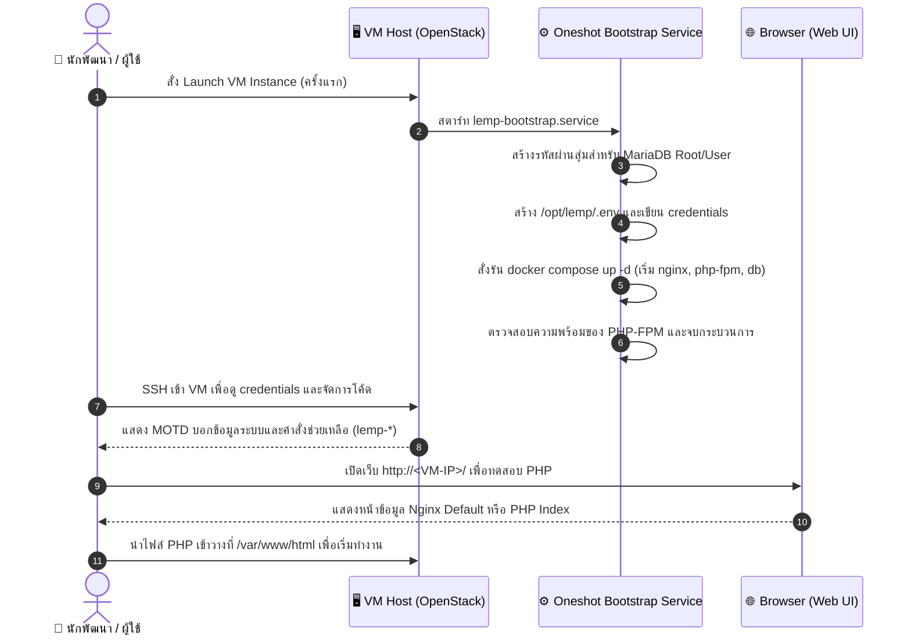
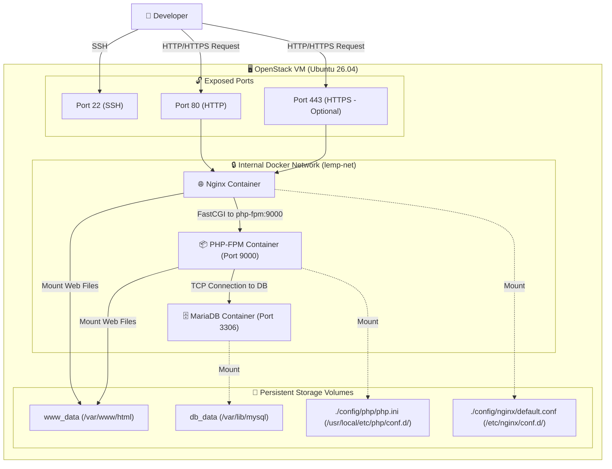
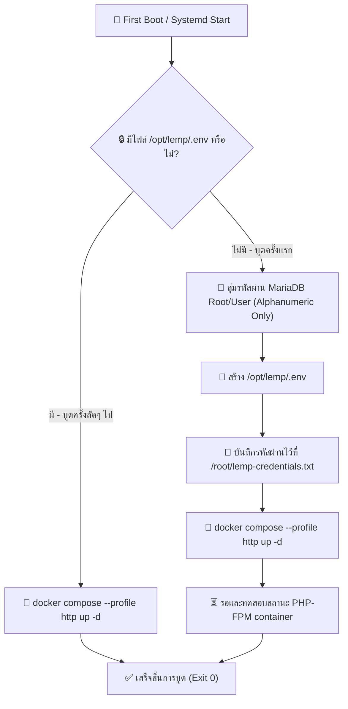
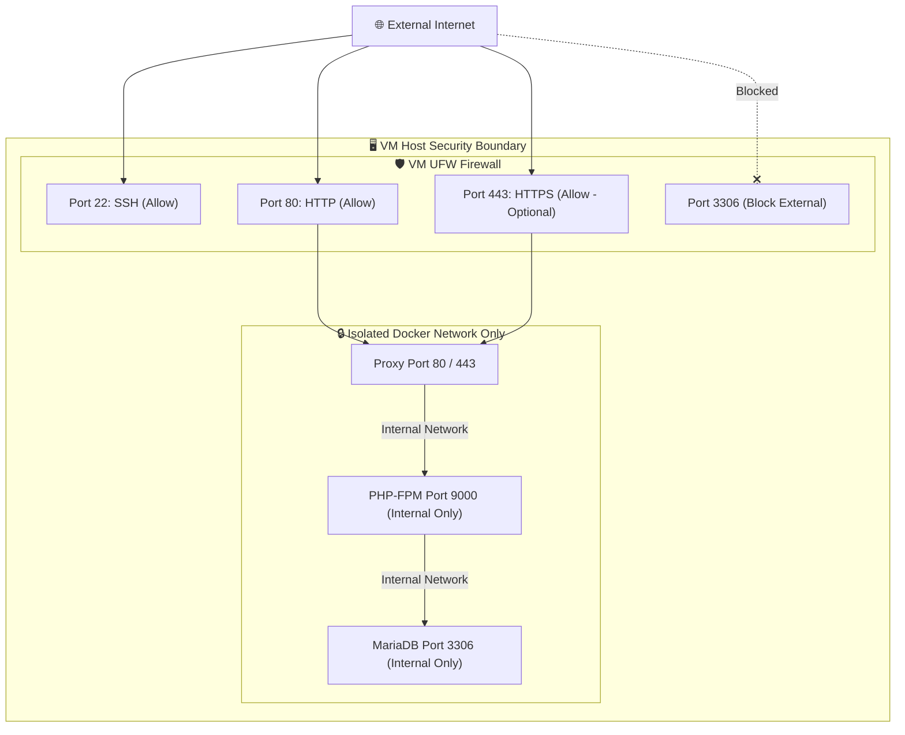

# LEMP Stack Research Review

> **แอปเป้าหมาย:** LEMP Stack Dev Base Image
> **ขอบเขต:** Hardened Image สำหรับนักพัฒนาซอฟต์แวร์ (Linux + Nginx + PHP-FPM + MariaDB) บูต VM แล้วรันระบบเว็บและฐานข้อมูลในตัวพร้อมใช้งานทันที

---

## 1. Upstream & Docker Image Selection

| Component | Target Image | Tag / Version | Digest / Hash | Size | Role |
|---|---|---|---|---|---|
| Web App / Proxy | `library/nginx` | `1.30.3` (stable) | `sha256:5825bde471b8` | ~63MB | Web Server (HTTP/HTTPS) |
| PHP Engine | `library/php` | `8.3-fpm` (8.3.31) | `sha256:efaea017a0c2` | ~172MB | PHP-FPM Processing Service |
| Database | `library/mariadb` | `11.4.12` (LTS) | `sha256:a794d9eb009e` | ~105MB | Relational Database |

---

## 2. Technical Diagrams

### 2.1 User Journey Diagram (การใช้งานของลูกค้า)
แผนภาพลำดับการทำงานและเข้าใช้งาน LEMP stack หลังจากผู้ใช้งานสั่งรัน VM

---

### 2.2 System Architecture Diagram
แสดงโครงสร้าง Container, Docker Networks, Volumes และการเชื่อมต่อภายใน VM

---

### 2.3 Bootstrap Execution Flow
แผนภาพแสดงการทำงานในระดับสคริปต์เมื่อมี VM บูตครั้งแรก เพื่อควบคุมความเป็น Idempotency

---

### 2.4 Port & Security Diagram (Security Boundaries)
แสดงการกักกันและสิทธิ์การเข้าถึงพอร์ตต่างๆ ของแต่ละ component

---

## 3. Design Decisions & Rationale

| Topic | Decision | Rationale | Alternatives Considered |
|---|---|---|---|
| **PHP Runtime** | `php:8.3-fpm` (Debian-based) | รองรับความเข้ากันได้ของปลั๊กอินและโมดูลสำหรับ PHP ยอดนิยม (WordPress, Laravel) ได้กว้างขวางที่สุด และมี tools ปรับแต่งง่าย | `php:8.3-fpm-alpine` — ขนาดเล็กแต่เสี่ยงกับการติดตั้ง PHP extensions บางตัว เช่น GD, zip, intl |
| **Shared Volume** | ใช้ Named Volume `www_data` สำหรับ `/var/www/html` | การที่ Nginx และ PHP-FPM ใช้ volume ร่วมกัน ณ พาธเดียวกัน ช่วยแก้ปัญหา "Primary script unknown" และเรื่องสิทธิ์การอ่านเขียนไฟล์ | ใช้ host bind mount — มักเกิดปัญหา permission mismatch ของ UID/GID ระหว่างโฮสต์และ container |
| **Image Freeze** | Pre-build local images ใน VM ระหว่างการสร้าง Golden Image | เพื่อการทำ Offline-safety บูตครั้งแรกจะไม่มีคำสั่ง `docker compose pull` ทำให้การสร้าง VM ใช้งานได้ทันทีแม้ไม่มีเน็ตภายนอก | โหลด container ออนไลน์ตอนบูตครั้งแรก — หากวันใด Docker Hub มีปัญหา VM จะสตาร์ทไม่ขึ้นทันที |
| **Helper Aliases** | มีคำสั่งช่วยจัดการ `lemp-*` บน Host OS | อำนวยความสะดวกให้นักพัฒนาสามารถดูสถานะ ดูล็อก หรือ SSH เข้าไปทดสอบใน container ได้ผ่านคำสั่งสั้นๆ เช่น `lemp-status` | รัน docker compose ยาวๆ — ยุ่งยากสำหรับผู้ใช้ที่ต้องการความเร็ว |

---

## 4. Community Signals & Known Issues

| Issue / Gotcha | Severity | Mitigation / Workaround | Source |
|---|---|---|---|
| **Primary script unknown** | Must | กำหนด `fastcgi_param SCRIPT_FILENAME $document_root$fastcgi_script_name;` ใน Nginx และ Mount directory `/var/www/html` ให้ตรงกันทั้งสองฝั่ง | StackOverflow (149 votes) |
| **Database starts after PHP** | Must | ใช้ Docker compose healthcheck บน MariaDB และระบุ `depends_on` แบบ `service_healthy` บนฝั่ง PHP-FPM เพื่อรอฐานข้อมูลพร้อมจริง | StackOverflow |
| **Information Disclosure** | Should | กำหนด `server_tokens off;` ใน Nginx และ `expose_php = Off` ใน php.ini เพื่อปิดการแสดงผลเวอร์ชันใน headers | Security best practices |

---

## 5. User Needs

### 5.1 Beginner (นักพัฒนาเว็บไซต์มือใหม่)
*   **เปิดใช้งานเร็ว:** บูตระบบแล้วสามารถทดสอบรันไฟล์ `.php` และเข้าหน้าเว็บทดสอบได้ทันที
*   **คำอธิบายชัดเจน:** มี MOTD บอกพอร์ต ข้อมูลการเข้าใช้ และ credentials ฐานข้อมูล

### 5.2 Intermediate (ผู้ดูแลระบบเว็บและ IT Ops)
*   **ปรับแต่งค่า PHP:** แก้ไขไฟล์ `/opt/lemp/config/php/php.ini` เพื่อปรับ `memory_limit` หรือ `upload_max_filesize` ได้สะดวก
*   **ความสะดวกของสคริปต์:** มีคำสั่งอำนวยความสะดวกเช่น `lemp-shell` และ `lemp-db` ช่วยทดสอบรันคำสั่งโดยตรง

### 5.3 Advanced (ผู้ดูแลระบบเซิร์ฟเวอร์สเกลใหญ่)
*   **ความปลอดภัยฐานข้อมูล:** พอร์ต MariaDB และ PHP-FPM ถูกจำกัดไว้ภายใน Docker Network เท่านั้น ไม่เปิดสาธารณะภายนอก
*   **SSL Support:** มี Nginx config template สำหรับเปิดใช้งาน HTTPS หลังติดตั้ง cert จริงเรียบร้อยแล้ว

---

## 6. Verification & Acceptance Criteria

### 6.1 Unit Verification (ฝั่ง VM)
- [ ] ตรวจสอบว่าไม่มีไฟล์ `/opt/lemp/.env` หรือ credentials ดั้งเดิมหลงเหลืออยู่ใน Golden Image
- [ ] systemd service `lemp-bootstrap.service` อยู่ในสถานะ enabled
- [ ] container images ท้องถิ่นถูกสร้างและตรวจเจอเรียบร้อย เช่น `lemp-local-php:8.3-fpm-tools`

### 6.2 Browser Acceptance (E2E)
- [ ] เมื่อบูต VM ใหม่ สามารถดึงข้อมูลหน้าเว็บ HTTP พอร์ต 80 ได้ผลลัพธ์ปกติ (HTTP 200)
- [ ] สามารถเชื่อมต่อและดึงข้อมูลจาก MariaDB ผ่าน PHP script ภายใน container ได้สำเร็จ
