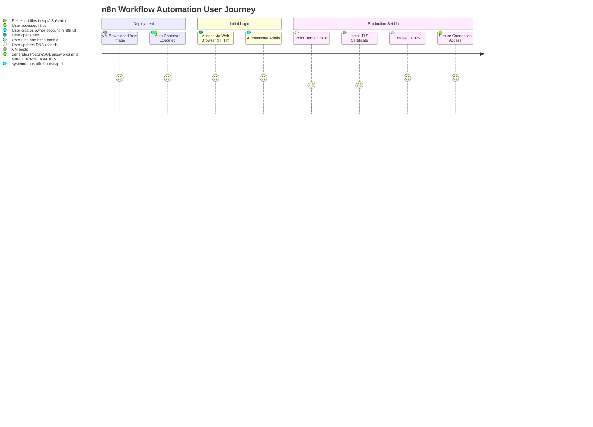
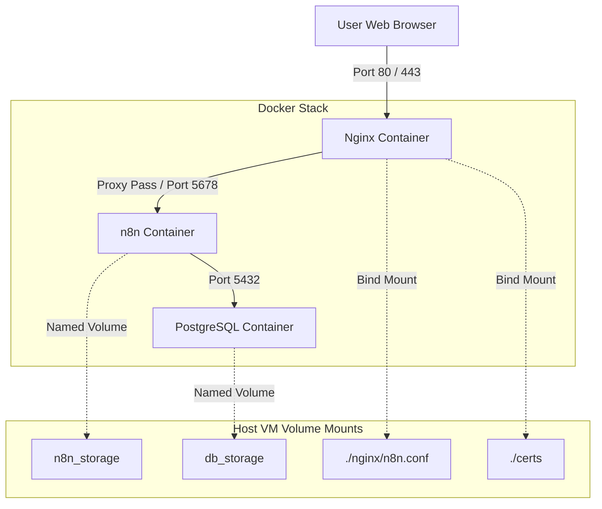
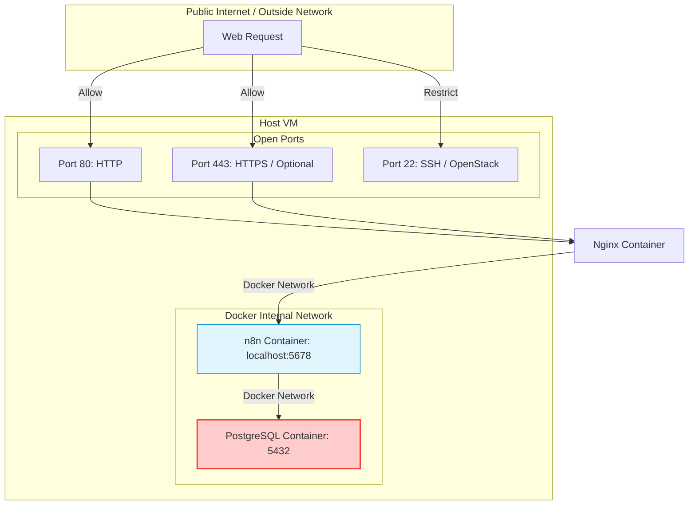

# n8n Research Review

> **แอปเป้าหมาย:** n8n Workflow Automation (v2.29.8+)
> **ขอบเขต:** การทำ Golden Image สำหรับให้บริการคลาวด์บน Ubuntu 26.04 LTS (Docker-based)

---

## 1. Upstream & Docker Image Selection
| Component | Target Image | Tag / Version | Digest / Hash | Size | Role |
|---|---|---|---|---|---|
| n8n Core | `n8nio/n8n` | `2.29.8` | `sha256:7f08b3...` (default current tag) | ~400 MB | Workflow automation application engine and UI |
| Database | `postgres` | `16` | `sha256:...` (current tag default) | ~140 MB | Relational database (essential production alternative to SQLite) |
| Reverse Proxy | `nginx` | `stable` | `sha256:...` (current tag default) | ~10 MB | HTTP/HTTPS ingress proxy and SSL/WebSocket termination |

---

## 2. Technical Diagrams

### 2.1 User Journey


### 2.2 System Architecture


### 2.3 Bootstrap Flow
```mermaid
sequenceDiagram
    autonumber
    systemd ->> n8n-bootstrap.sh: ExecStart at First Boot
    n8n-bootstrap.sh ->> n8n-bootstrap.sh: Check if /opt/n8n/.env exists
    alt First Boot (No .env)
        n8n-bootstrap.sh ->> n8n-bootstrap.sh: Detect primary global IP
        n8n-bootstrap.sh ->> n8n-bootstrap.sh: Generate alphanumeric-only passwords & N8N_ENCRYPTION_KEY
        n8n-bootstrap.sh ->> /opt/n8n/.env: Write credentials & environment config
        n8n-bootstrap.sh ->> /root/n8n-credentials.txt: Write user login details
    else Reboot (Existing .env)
        n8n-bootstrap.sh ->> n8n-bootstrap.sh: Load existing .env configuration
    end
    n8n-bootstrap.sh ->> n8n-bootstrap.sh: Check if certs/fullchain.pem exists
    alt Certs Present
        n8n-bootstrap.sh ->> /opt/n8n/nginx/n8n.conf: Link/Copy n8n-https.conf
    else Certs Absent
        n8n-bootstrap.sh ->> /opt/n8n/nginx/n8n.conf: Link/Copy n8n-http.conf
    end
    n8n-bootstrap.sh ->> docker-compose: docker compose up -d
    docker-compose ->> Containers: Spin up postgres, n8n, nginx
    n8n-bootstrap.sh ->> n8n-bootstrap.sh: Write VM MOTD and helper paths
```

### 2.4 Port & Security


---

## 3. Design Decisions & Rationale
| Topic | Decision | Rationale | Alternatives Considered |
|---|---|---|---|
| Database Engine | PostgreSQL 16 | SQLite is highly prone to database locks during concurrency; PostgreSQL is recommended by n8n for production stability. | SQLite |
| Reverse Proxy | Nginx Stable | Standardizes TLS termination, websocket upgrades, and HTTP redirects securely. | Caddy, Traefik |
| Local Ingress Binding | localhost:5678 | Prevents direct external access to n8n backend port, routing all traffic strictly through Nginx proxy. | Exposing port 5678 publicly |
| Data Persistence | Named Docker Volumes | Avoids folder permission mismatches inside n8n node processes when dealing with file systems. | Bind Mounts |
| Encryption Key | Auto-generate `N8N_ENCRYPTION_KEY` | Ensures each VM installation has a unique key for encrypting credentials. | Hardcoded default keys |
| Password Special Characters | Alphanumeric-only passwords | Prevents database/Redis connection string parsing errors from characters like `+`, `/`, `=`. | Fully random base64 passwords |

---

## 4. Community Signals & Known Issues
| Issue / Gotcha | Severity (Must/Should/Could) | Mitigation / Workaround | Source |
|---|---|---|---|
| WebSocket disconnection | Must | Nginx configuration must explicitly proxy Upgrade and Connection headers for `/rest/push` paths. | n8n Forums |
| Webhook URL mismatches | Must | `WEBHOOK_URL` must point to the public domain/IP with matching protocol (HTTP/HTTPS) or callback integrations fail. | Community FAQ |
| Database size bloat | Should | Enable auto-pruning via `EXECUTIONS_DATA_PRUNE=true` and limit max age `EXECUTIONS_DATA_MAX_AGE=168`. | GitHub Issues |
| Missing encryption key | Must | Backup the key securely in `/root/n8n-credentials.txt` to prevent credential recovery failure on upgrades. | Reddit / selfhosted |

---

## 5. User Needs

### 5.1 Beginner
- **Zapier Alternative**: Budget-friendly local workflow builder.
- **Easy Setup**: Zero configuration needed. Accessing `http://<IP>/` directly starts the n8n initial admin setup flow.
- **Templates Library**: One-click imports of prebuilt workflows.

### 5.2 Intermediate
- **External API Integrations**: Connecting external custom webhooks and REST endpoints.
- **Code Node Support**: Performing Python/JavaScript manipulations inside workflow executions.
- **Error Handling**: Setting up dedicated sub-workflows for error triggers.

### 5.3 Advanced
- **Queue Mode & Scaling**: Scaling workflow throughput using Redis and multiple worker nodes.
- **Git Sync & CI/CD**: Syncing workflows with remote repositories using Git.
- **Production Performance**: Custom environment tuning, security policy audits, and backup logs.

---

## 6. Verification & Acceptance Criteria

### 6.1 Unit Verification (ฝั่ง VM)
- [ ] Bootstrap service runs and is enabled (`systemctl is-enabled n8n-bootstrap.service`).
- [ ] Files `/opt/n8n/.env` and `/root/n8n-credentials.txt` are created on first boot.
- [ ] Docker containers (`postgres`, `n8n`, `nginx`) are active and healthy.
- [ ] Verification script checks that the PostgreSQL database credentials and encryption keys are alphanumeric.
- [ ] Helper tools (`n8n-status`, `n8n-logs`, `n8n-restart`, `n8n-upgrade`, `n8n-rollback`, `n8n-exec`, `n8n-https-enable`, `n8n-cert-status`, `n8n-https-disable`) are present and executable.

### 6.2 Browser Acceptance (E2E)
- [ ] Accessing `http://<VM_IP>/` redirects to the owner signup page, not an error.
- [ ] Initial owner profile can be created successfully.
- [ ] Standard HTTP node executions and simple cron trigger tests succeed.
- [ ] WebSocket connections (`/rest/push`) remain connected when running a manual workflow.
