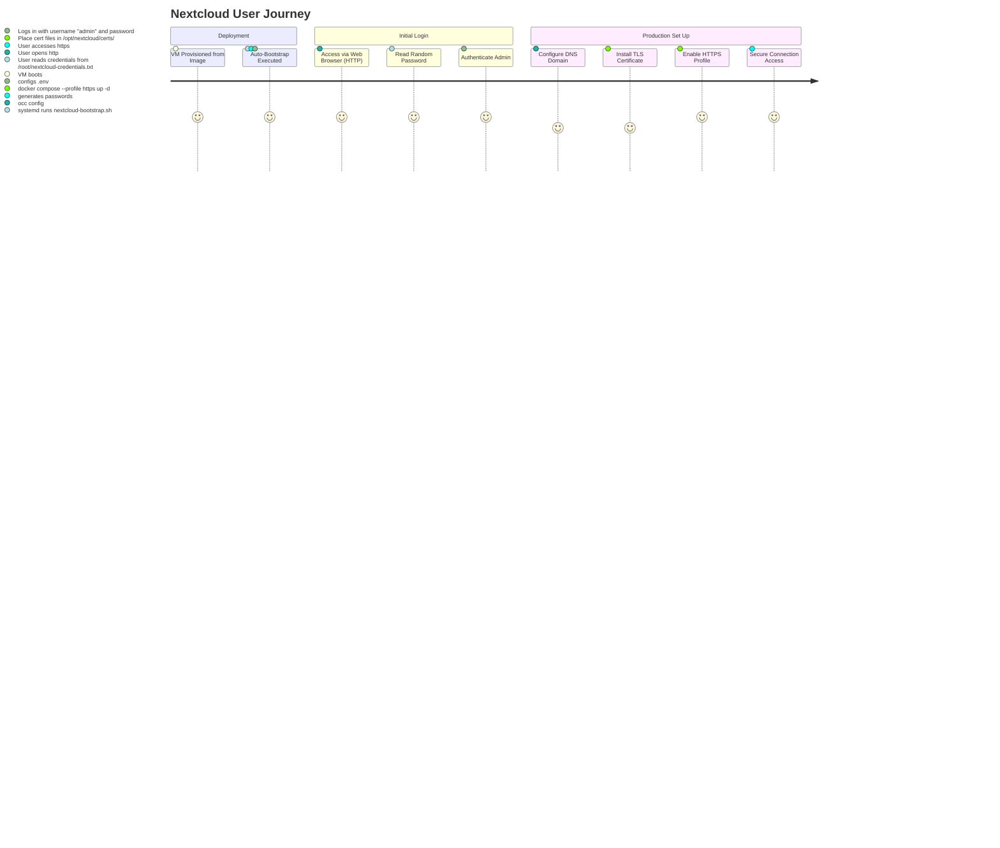

# Nextcloud Research Review

> **แอปเป้าหมาย:** Nextcloud Hub 30 (30.0.17+)
> **ขอบเขต:** การทำ Golden Image สำหรับให้บริการคลาวด์บน Ubuntu 26.04 LTS (Docker-based)

---

## 1. Upstream & Docker Image Selection
| Component | Target Image | Tag / Version | Digest / Hash | Size | Role |
|---|---|---|---|---|---|
| Nextcloud | `nextcloud` | `30.0-apache` | `sha256:fb966733647ea03f0446b0c22eac9733c8eb616d37b960caca9d4c3010e14a08` | ~350 MB | Core application & Apache web server |
| Database | `postgres` | `16.9` | `sha256:ddfe3e8713e3ee5b8f286082cb12512488dfbf3f5a1ecb0b74a42e6055af0a5f` | ~140 MB | Relational database (recommended choice for Nextcloud 30+) |
| Cache & Session | `redis` | `7.4-alpine` | `sha256:6ab0b6e7381779332f97b8ca76193e45b0756f38d4c0dcda72dbb3c32061ab99` | ~12 MB | Cache, Session storage, and transactional file locking |
| Reverse Proxy | `nginx` | `1.27-alpine` | `sha256:65645c7bb6a0661892a8b03b89d0743208a18dd2f3f17a54ef4b76fb8e2f2a10` | ~10 MB | HTTP/HTTPS ingress proxy and SSL termination |

---

## 2. Technical Diagrams

### 2.1 User Journey


### 2.2 System Architecture
```mermaid
graph TD
    User[User Web Browser] -->|Port 80 / 443| Nginx[Nginx Container]
    subgraph Docker Stack
        Nginx -->|Proxy Pass / Port 80| NC[Nextcloud Apache Container]
        NC -->|Port 5432| DB[PostgreSQL Container]
        NC -->|Port 6379| Redis[Redis Container]
    end
    subgraph Host VM Directory Mounts
        NC -.->|Bind Mount| AppData[/var/lib/nextcloud/app]
        DB -.->|Bind Mount| DBData[/var/lib/nextcloud/db]
        Redis -.->|Bind Mount| RedisData[/var/lib/nextcloud/redis]
        Nginx -.->|ReadOnly Mount| AppData
        Nginx -.->|Bind Mount| NginxConfig[./nginx/*.conf]
        Nginx -.->|Bind Mount| Certs[./certs/*.pem]
    end
```

### 2.3 Bootstrap Flow
```mermaid
sequenceDiagram
    autonumber
    systemd ->> nextcloud-bootstrap.sh: ExecStart at First Boot
    nextcloud-bootstrap.sh ->> nextcloud-bootstrap.sh: Check if /opt/nextcloud/.env exists
    alt First Boot (No .env)
        nextcloud-bootstrap.sh ->> nextcloud-bootstrap.sh: Detect all global IPs (ens4/ens3)
        nextcloud-bootstrap.sh ->> nextcloud-bootstrap.sh: Generate alphanumeric-only passwords
        nextcloud-bootstrap.sh ->> /opt/nextcloud/.env: Write credentials & database config
        nextcloud-bootstrap.sh ->> /root/nextcloud-credentials.txt: Write user login details
    else Reboot (Existing .env)
        nextcloud-bootstrap.sh ->> nextcloud-bootstrap.sh: Load existing .env configuration
    end
    nextcloud-bootstrap.sh ->> docker-compose: docker compose --profile http up -d (or https if certs exist)
    docker-compose ->> Containers: Spin up postgres, redis, nextcloud, nginx
    nextcloud-bootstrap.sh ->> Nextcloud (Container): wait_for_install (loops 'occ status')
    nextcloud-bootstrap.sh ->> Nextcloud (Container): append_trusted_domains (add VM IPs, localhost)
    nextcloud-bootstrap.sh ->> Nextcloud (Container): configure_redis (memcache settings)
    nextcloud-bootstrap.sh ->> Nextcloud (Container): configure_opcache (PHP tuning)
    nextcloud-bootstrap.sh ->> Host Cron: Setup system cron job for cron.php every 5m
    nextcloud-bootstrap.sh ->> Host Binaries: Install helper scripts (nc-occ, nc-status, nc-logs, etc.)
```

### 2.4 Port & Security
```mermaid
graph TD
    subgraph Public Internet / Outside Network
        Internet[Web Request]
    end
    subgraph Host VM
        subgraph Open Ports
            Port80[Port 80: HTTP]
            Port443[Port 443: HTTPS / Optional]
            Port22[Port 22: SSH / OpenStack]
        end
        subgraph Docker Internal Network (Bridge)
            NC[Nextcloud Container: 80]
            DB[PostgreSQL Container: 5432]
            Redis[Redis Container: 6379]
        end
    end
    Internet -->|Allow| Port80
    Internet -->|Allow| Port443
    Internet -->|Restrict| Port22
    Port80 --> Nginx[Nginx Container]
    Port443 --> Nginx
    Nginx -->|Docker Network| NC
    NC -->|Docker Network| DB
    NC -->|Docker Network| Redis
    style DB fill:#ffcccc,stroke:#ff3333,stroke-width:2px;
    style Redis fill:#ffcccc,stroke:#ff3333,stroke-width:2px;
```

---

## 3. Design Decisions & Rationale
| Topic | Decision | Rationale | Alternatives Considered |
|---|---|---|---|
| Database Engine | PostgreSQL 16.9 | Nextcloud 30+ recommendation, better performance and concurrency compared to MySQL/MariaDB. | MariaDB, SQLite |
| Cache & Session Storage | Redis 7.4-alpine | Essential for distributed caching and transactional file locking, preventing locking errors. | APCu only, Memcached |
| Web Server & SSL | Nginx reverse proxy + Nextcloud Apache | Decouples SSL termination and routing from application server. Nextcloud auto-detects HTTPS via X-Forwarded-Proto. | Apache only with mod_ssl |
| Deployment Layout | Bind mount `/var/lib/nextcloud/` | Exposes data directories on VM host for easy backup, migration, and attaching external storage volumes. | Named Docker Volumes |
| First-Boot Internet | Pre-pulled Docker Images | Zero internet required for runtime setup. golden-image has all images pre-pulled. | docker compose pull during first boot |
| Password Special Characters | Alphanumeric-only passwords | Prevents database/Redis connection string parsing errors from characters like `+`, `/`, `=`. | Fully random base64 passwords |

---

## 4. Community Signals & Known Issues
| Issue / Gotcha | Severity (Must/Should/Could) | Mitigation / Workaround | Source |
|---|---|---|---|
| Access through untrusted domain | Must | Bootstrap automatically adds VM global IPs to `trusted_domains`. Users can add domains via `nc-occ`. | Nextcloud Discourse, Reddit |
| Memory limits for upload | Should | Pre-configure PHP memory limit and upload limit to 512M in Compose config. | GitHub issues |
| AJAX Cron slow execution | Should | Bootstrap installs system crontab on host VM executing `cron.php` inside Nextcloud container every 5 minutes. | Nextcloud Admin Manual |
| OCC Permission Issues | Should | Host helper scripts run `docker compose exec -T -u www-data nextcloud php occ` to avoid root file ownership corruption. | Community forums |
| nginx proxy timeout | Should | Set `proxy_read_timeout` and `proxy_send_timeout` to 300s to prevent gateway timeouts on large uploads. | r/Nextcloud |

---

## 5. User Needs

### 5.1 Beginner
- **GDrive/Dropbox Replacement**: Automatic folder sync via Nextcloud desktop and mobile clients.
- **Easy Setup**: Zero configuration needed. Accessing `http://<IP>` immediately redirects to the dashboard after reading the auto-generated password in `/root/nextcloud-credentials.txt`.
- **Change Password**: Easy password reset using the pre-installed `nc-occ` helper tool.

### 5.2 Intermediate
- **External Storage**: Ability to mount external SMB/CIFS, WebDAV, or NFS shares easily.
- **System Integration**: Basic LDAP/AD setup and SMTP integration for user registration notifications.
- **Performance Optimizations**: Redis caching configured by default, enabling faster file previews and responsive loading.

### 5.3 Advanced
- **High Concurrency Database**: PostgreSQL back-end configured with proper connection pooling.
- **Automated Backup & Upgrades**: Step-by-step guides and helper commands (`nc-upgrade`, `nc-rollback`) for frictionless updates.
- **HTTPS Custom Certificates**: Drop-in certificate installation in `/opt/nextcloud/certs/` followed by activation using the standard compose profiles.

---

## 6. Verification & Acceptance Criteria

### 6.1 Unit Verification (ฝั่ง VM)
- [ ] Service `nextcloud-bootstrap.service` exists and is enabled (`systemctl is-enabled`).
- [ ] Bootstrap runs successfully without exit errors on first boot.
- [ ] Target configuration file `/opt/nextcloud/.env` and credential list `/root/nextcloud-credentials.txt` exist and are populated.
- [ ] Docker containers (`db`, `redis`, `nextcloud`, `nginx`) are active and report healthy/healthy-started states.
- [ ] Database credentials in `.env` are verified as alphanumeric-only.
- [ ] Helper utilities (`nc-occ`, `nc-status`, `nc-logs`, `nc-restart`, `nc-upgrade`, `nc-rollback`) are installed in `/usr/local/bin/` and executable.

### 6.2 Browser Acceptance (E2E)
- [ ] Accessing `http://<VM_IP>` redirects to the login screen without showing the installation wizard.
- [ ] Logging in with the generated admin username and password successful, loading `/apps/dashboard/`.
- [ ] File uploads and downloads via WebDAV client pass successfully.
- [ ] Standard operations (uploading, previewing thumbnails, and deleting test files) do not generate backend error logs.
