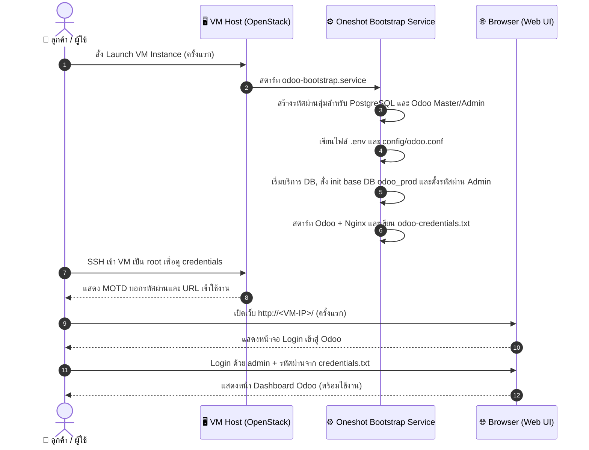
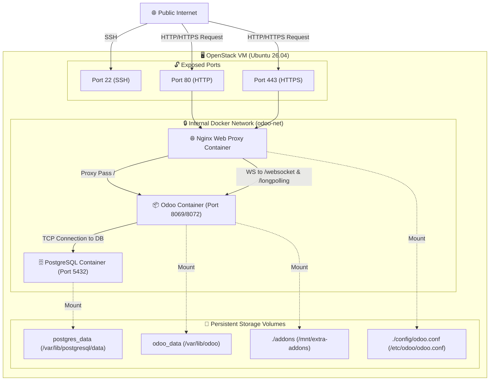
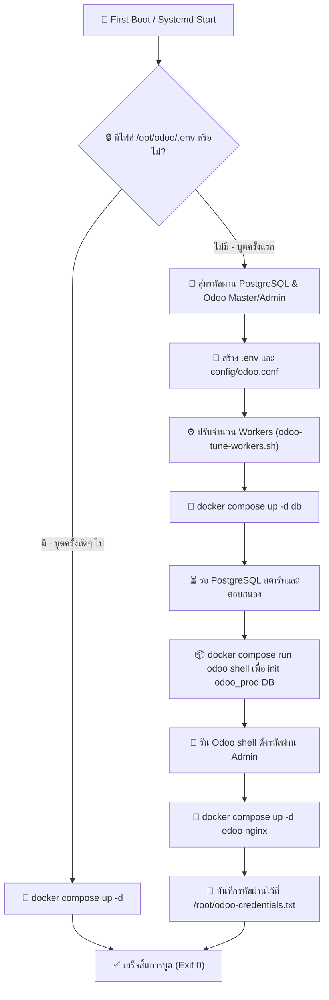
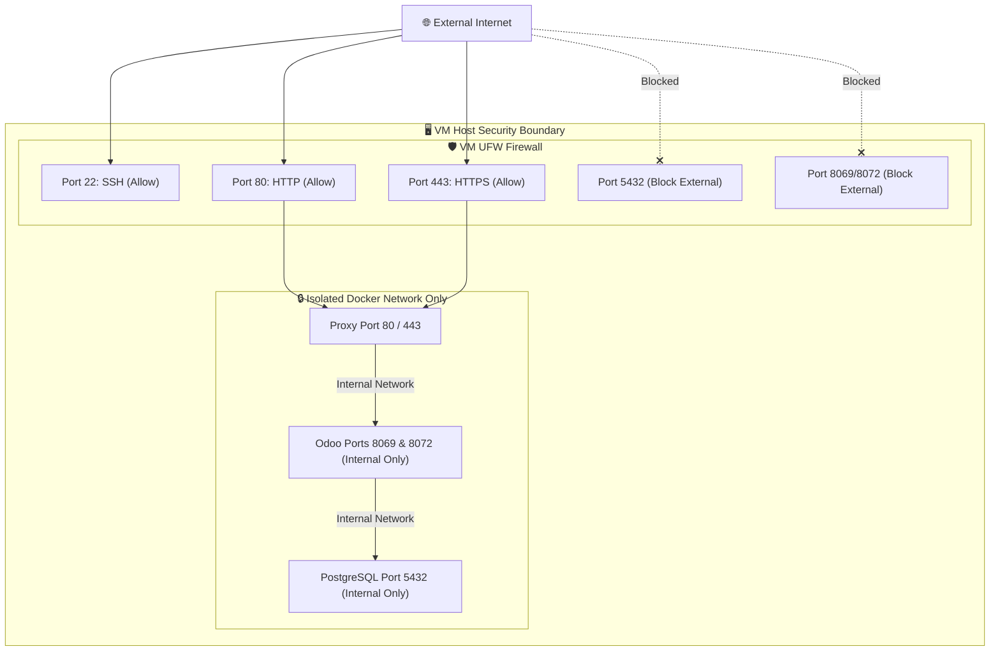

# Odoo Research Review

> **แอปเป้าหมาย:** Odoo 18 Customer Service Image
> **ขอบเขต:** Hardened Image สำหรับลูกค้าเริ่มต้นระบบ ERP/CRM สำเร็จรูป บูต VM แล้วพร้อมใช้งานทันที

---

## 1. Upstream & Docker Image Selection

| Component | Target Image | Tag / Version | Digest / Hash | Size | Role |
|---|---|---|---|---|---|
| Web App | `library/odoo` | `18.0` | `sha256:d8c5f5bc2f11` | ~1.1GB | Odoo ERP Application Server |
| Database | `library/postgres` | `16` | `sha256:bc31abfc9e21` | ~290MB | Relational Database |
| Proxy | `library/nginx` | `1.27` | `sha256:32e76d2f32a7` | ~140MB | Reverse Proxy & WebSocket Router |

---

## 2. Technical Diagrams

### 2.1 User Journey Diagram (การใช้งานของลูกค้า)
แผนภาพนี้แสดงลำดับการเข้าใช้บริการของลูกค้าตั้งแต่สั่ง Launch VM ไปจนถึงเข้าใช้งานหน้าเว็บสำเร็จ

---

### 2.2 System Architecture Diagram
แสดงโครงสร้าง Container, Docker Networks, Volumes และการเชื่อมต่อภายใน VM

---

### 2.3 Bootstrap Execution Flow
แผนภาพแสดงการทำงานในระดับสคริปต์เมื่อมี VM บูตครั้งแรก เพื่อควบคุมความเป็น Idempotency

---

### 2.4 Port & Security Diagram (Security Boundaries)
แสดงการกักกันเน็ตเวิร์กของ Container ไม่ให้ถูกเข้าถึงโดยตรงจากภายนอก

---

## 3. Design Decisions & Rationale

| Topic | Decision | Rationale | Alternatives Considered |
|---|---|---|---|
| **Runtime Variant** | Official Odoo Image + Nginx Reverse Proxy | Nginx รับภาระกรองทราฟฟิก จัดการ SSL Termination และทำ routing สำหรับ websocket/longpolling ได้มีประสิทธิภาพกว่า Odoo รันเดี่ยวๆ | รัน Odoo ตรงๆ โดยเปิดพอร์ต 8069 — ขาดความปลอดภัยระดับ HTTP filter และตั้งค่า SSL ยาก |
| **Database Variant** | PostgreSQL 16 | เวอร์ชันเสถียรและแนะนำตาม upstream requirement รองรับการทำดัชนีและการค้นหาข้อมูลระดับองค์กรได้ดี | PostgreSQL 15/17 — เวอร์ชัน 16 เป็นจุดสมดุลระหว่างฟีเจอร์ใหม่ความเสถียรสำหรับ Odoo 18 |
| **Secret Management** | First-boot random alphanumeric passwords | หลีกเลี่ยงอักขระพิเศษอย่าง `&`, `=`, `/` ที่อาจทำลายโครงสร้างการ parse ตัวแปรสภาพแวดล้อม และป้องกันข้อมูลรั่วไหลจาก Golden Image | ใช้รหัสผ่านเริ่มต้นร่วมกัน — ไม่ปลอดภัยต่อลูกค้า |
| **Air-gapped Readiness** | ดาวน์โหลด Docker Images ทั้งหมดไว้ใน VM ระหว่างสร้าง Golden Image | ป้องกันปัญหาดาวน์โหลดไม่ได้เมื่อลูกค้านำ VM ไปรันในเครือข่ายจำกัดสิทธิ์ (Private Cloud/LAN) | โหลดออนดีมานด์ตอนบูตครั้งแรก — จะพังทันทีหากเครือข่ายไม่มีอินเทอร์เน็ต |
| **Worker Sizing** | Adaptive workers (odoo-tune-workers.sh) | Odoo กินทรัพยากรสูงตามจำนวน worker การคำนวณ worker ตามแรม/vCPU ของ VM ช่วยป้องกันปัญหา Out-of-Memory (OOM) | ตั้งค่า workers ฟิกซ์ — มีความเสี่ยงระบบล่มบน VM สเปกต่ำ หรือใช้แรมไม่คุ้มค่าบน VM สเปกสูง |

---

## 4. Community Signals & Known Issues

| Issue / Gotcha | Severity | Mitigation / Workaround | Source |
|---|---|---|---|
| **Websocket / Live Chat Mismatch** | Must | กำหนด Nginx upstream แยกสำหรับ `/websocket` และ `/longpolling` ชี้ไปยังพอร์ต 8072 (gevent) ของ Odoo | GitHub Issues & SO community |
| **Odoo starts before DB is ready** | Must | ใช้ Docker compose healthcheck บน PostgreSQL และสั่ง `depends_on` แบบ `service_healthy` ใน Odoo service | StackOverflow |
| **Permission denied on filestore** | Should | กำหนดสิทธิ์โฟลเดอร์ของ addons และ config ในโฮสต์ให้ตรงกับ UID 101 (odoo user) ใน container | Odoo deployment guide |
| **PDF Thai Fonts blank/broken** | Should | ตรวจสอบว่าใน official Odoo image มี package `wkhtmltopdf` ติดตั้งสำเร็จ และมี Noto/Thai Fonts ติดตั้งอยู่ด้านใน | Thai localization threads |

---

## 5. User Needs

### 5.1 Beginner (ผู้ประกอบการทั่วไป)
*   **ต้องการแชท/ใช้งานด่วน:** เปิด URL แล้วเจอปุ่ม Login เพื่อใช้งานได้ทันที ไม่ต้องมีหน้า Setup Wizard ให้สับสน
*   **ปราศจาก Demo Data:** ฐานข้อมูลเริ่มต้นสะอาด พร้อมให้บันทึกข้อมูลจริงได้เลย
*   **รองรับฟอนต์ไทย:** ออกเอกสารและพิมพ์ PDF รายงานภาษีเป็นภาษาไทยได้ไม่เพี้ยน

### 5.2 Intermediate (ผู้ดูแลระบบไอที)
*   **ติดตั้ง Addons เพิ่มเติม:** สามารถอัปโหลดโมเดลหรือโมดูลปรับแต่งของบริษัทลงโฟลเดอร์ `/opt/odoo/addons` ได้สะดวก
*   **ระบบ Backup ที่ครบถ้วน:** มีสคริปต์สำรองข้อมูล PostgreSQL พร้อมกับ Odoo filestore (ไฟล์แนบ/รูปภาพสินค้า) ในชุดเดียวกัน
*   **HTTPS Setup:** วาง Cert/Key แล้วเปลี่ยนโปรไฟล์เพื่อรัน HTTPS ได้ทันที

### 5.3 Advanced (ผู้พัฒนา Odoo / ผู้ให้บริการ SaaS)
*   **ปรับจูนประสิทธิภาพ:** คำนวณขนาด workers และหน่วยความจำตามกำลังแรมของระบบจริง
*   **ปิดตัวช่วยจัดการฐานข้อมูล:** ตั้งค่า `list_db = False` และ `dbfilter` เพื่อป้องกันความปลอดภัยของข้อมูล

---

## 6. Verification & Acceptance Criteria

### 6.1 Unit Verification (ฝั่ง VM)
- [ ] ตรวจสอบว่า `/opt/odoo/.env` และ `/root/odoo-credentials.txt` ไม่มีอยู่ใน Golden Image ก่อนการ capture
- [ ] ตรวจสอบว่า systemd `odoo-bootstrap.service` เปิดใช้งานอยู่ (`systemctl is-enabled`)
- [ ] ทดลองรันสคริปต์ `odoo-bootstrap.sh` แล้ว Odoo + PostgreSQL + Nginx ต้องเริ่มทำงานและตอบสนองถูกต้อง

### 6.2 Browser Acceptance (E2E)
- [ ] เมื่อเรียกเปิด `http://<VM-IP>/web/login` ต้องแสดงหน้า Login ของ Odoo
- [ ] สามารถเข้าใช้ระบบด้วยบัญชีแอดมินที่สุ่มรหัสผ่านได้ถูกต้อง
- [ ] สามารถสร้างผู้ใช้ใหม่ และบันทึกข้อมูลทดสอบสำเร็จโดยไม่พบข้อผิดพลาด HTTP 500
