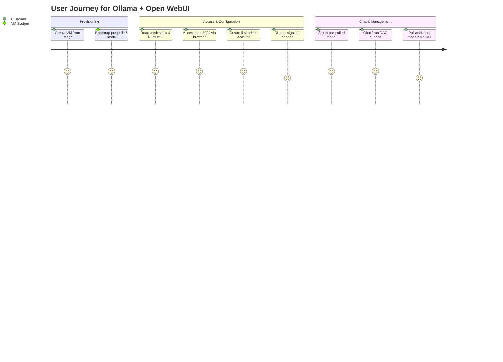
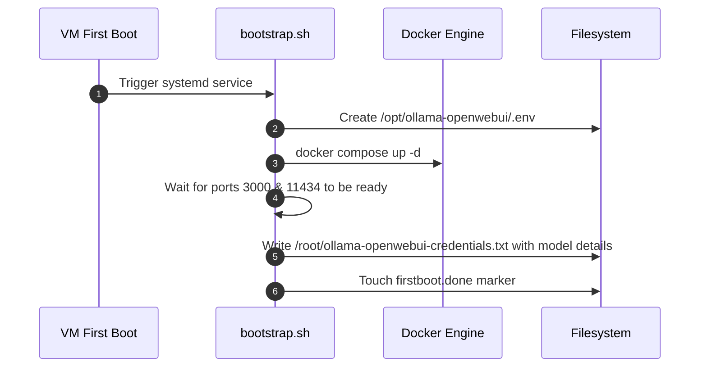
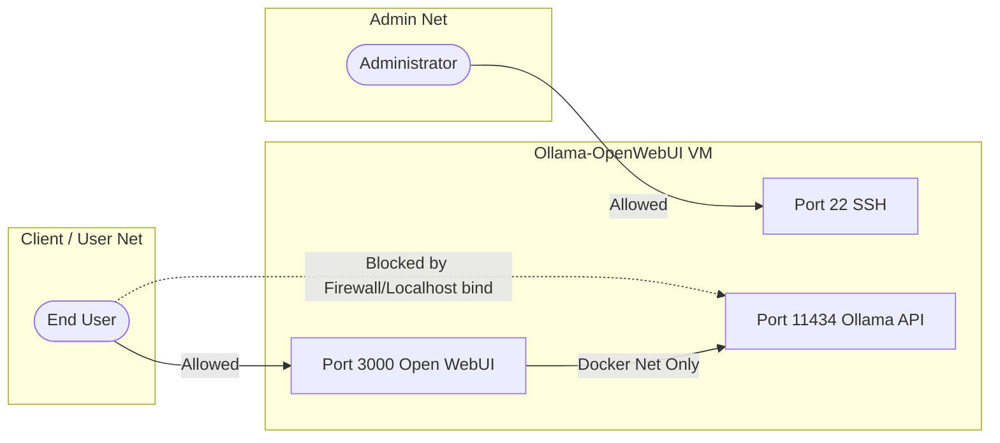

# Ollama + Open WebUI Research Review

> **แอปเป้าหมาย:** Ollama + Open WebUI Chatbot Appliance
> **ขอบเขต:** ระบบแชทบอท LLM ท้องถิ่น (Local LLM) บนฐาน CPU-only พร้อมตัวเลือกโมเดลและหน้าเว็บสำหรับผู้ใช้หลายคน

---

## 1. Upstream & Docker Image Selection

| Component | Target Image | Tag / Version | Digest / Hash | Size | Role |
|---|---|---|---|---|---|
| **Ollama** | `ollama/ollama` | `latest` (v0.30.10) | `sha256:568ad...` | ~1.4 GB | Local LLM model runner / inference engine |
| **Open WebUI** | `ghcr.io/open-webui/open-webui` | `main` (v0.9.6) | `sha256:db592...` | ~900 MB | Feature-rich Web UI & RAG interface for LLMs |

---

## 2. Technical Diagrams

### 2.1 User Journey


### 2.2 System Architecture
```mermaid
graph TD
    User([User Browser]) -- HTTP:3000 --> OpenWebUI[Open WebUI Container]
    OpenWebUI -- API:11434 --> Ollama[Ollama Container]
    
    subgraph Docker Network (ollama-net)
        OpenWebUI
        Ollama
    end
    
    subgraph Persistent Storage
        OpenWebUI_Vol[(open-webui_data Volume)] ---> OpenWebUI
        Ollama_Vol[(ollama_models Volume)] ---> Ollama
    end
    
    subgraph VM Host
        Ollama
        OpenWebUI
    end
```

### 2.3 Bootstrap Flow


### 2.4 Port & Security


---

## 3. Design Decisions & Rationale

| Topic | Decision | Rationale | Alternatives Considered |
|---|---|---|---|
| **Service Architecture** | Separate containers (`ollama` + `open-webui`) | ช่วยให้สามารถอัปเกรดรุ่นอิสระจากกัน, แยก Resource Isolation และชี้ Open WebUI ไปหา Ollama ภายนอกได้ง่าย | Bundled Image `open-webui:ollama` (จัดการยากเรื่องการทำ persistence และการตั้งค่า GPU/CPU แยก) |
| **Hardware Baseline** | CPU-only by default | เพื่อให้พร้อมทำงานได้ทันทีบนระบบคลาวด์ทั่วไปโดยไม่ต้องพึ่งพาการ์ดจอพิเศษ และจัดทำ GPU support เป็น optional | GPU-Only by default (ทำให้ image มีขอบเขตใช้งานแคบลงและเสียค่าเช่า VM สูงมาก) |
| **Model Pre-pulling** | Pre-load `gemma3:4b` + `llama3.2:1b` | เพื่อลดปัญหาเครือข่ายของลูกค้าระหว่างการเริ่มใช้งานครั้งแรก ทำให้ระบบสามารถแชทบอทได้ตั้งแต่นาทีแรก | ไม่ดาวน์โหลดโมเดลเลย (ลูกค้าเข้าหน้าเว็บแล้วจะใช้งานไม่ได้ทันทีและต้องดาวน์โหลดเป็นกิกะไบต์ผ่านเครือข่ายช้า) |
| **Memory Release** | `OLLAMA_KEEP_ALIVE=5m` | ช่วยให้โมเดลถูก unload จากหน่วยความจำ RAM ของเครื่องกลับคืนสู่ระบบปฏิบัติการหลังจากไม่มีการถาม-ตอบ เกิน 5 นาที | Keep alive forever (ทำให้ RAM ตกค้างและไม่สามารถคืนพื้นที่สำหรับ Container หรือ OS ทำงานอื่น) |
| **User Sign-up** | `ENABLE_SIGNUP=true` (Default) | บังคับสิทธิ์ของบัญชีแรกที่เข้ามาลงทะเบียนให้กลายเป็น Admin ของระบบโดยอัตโนมัติ เพื่อการตั้งค่าผ่าน GUI | ปิดลงทะเบียนตั้งแต่แรก (ทำให้การเข้าใช้งานเว็บครั้งแรกทำไม่ได้เนื่องจากไม่มี user) |

---

## 4. Community Signals & Known Issues

| Issue / Gotcha | Severity (Must/Should/Could) | Mitigation / Workaround | Source |
|---|---|---|---|
| **RAM Memory Bottleneck on CPU** | 🔴 Must | สื่อสารกับลูกค้าเรื่องขนาดโมเดลและ RAM เสมอ (โมเดล 1B-3B ต้องการ RAM 8GB+, โมเดล 4B-8B ต้องการ 16GB+) | r/ollama & Community Reports |
| **ChromaDB / SQLite Storage Expansion** | 🟠 Should | ตรวจสอบขนาดฐานข้อมูลสม่ำเสมอ และใช้การตั้งค่า pruning system endpoint (`/api/v1/prune`) เพื่อล้างข้อมูลที่ไม่ใช้ | GitHub Issue #12249 / #16520 |
| **Branding Restriction in License** | 🔴 Must | คงโลโก้และชื่อ "Open WebUI" ไว้ ห้ามลบหรือทำ White-label สำหรับ deployment ที่ผู้ใช้เกิน 50 คน ยกเว้นขอ Enterprise License | Open WebUI License Section 4 |
| **Ollama Network Bandwidth Hogging** | 🟠 Should | หลีกเลี่ยงการ pull โมเดลพร้อมกันหลายตัว เนื่องจากไม่มีการจำกัดอัตราความเร็วการดาวน์โหลด (Rate Limit) ใน Ollama | Ollama Issue #2006 |
| **Docker Compose DNS Resolution Failures** | 🟡 Could | หาก Compose DNS ตรวจสอบ hostname ไม่สำเร็จ ให้สับเปลี่ยนไปใช้ host gateway mode หรือ `extra_hosts` | GitHub Issue #19376 |

---

## 5. User Needs

### 5.1 Beginner
- **One-click Chat:** เข้าหน้าเว็บลงทะเบียนแล้วเลือกโมเดลพร้อมแชทได้ทันที
- **Pre-pulled light models:** มีโมเดลภาษาขนาดเบา เช่น Llama 3.2 1B หรือ Gemma3 4B พร้อมให้เลือกใช้งาน
- **Simple setup guidance:** มี README ชัดเจนบอกที่อยู่หน้าเว็บและพอร์ตการเชื่อมต่อ

### 5.2 Intermediate
- **Multiple Models:** ความสามารถในการติดตั้งและสลับโมเดลในการตอบคำถามได้
- **Custom System Prompts:** ตั้งค่า system prompts หรือ RAG ความรู้เฉพาะกลุ่มของตัวเองได้
- **Multi-user Support:** เพิ่มบัญชีทีมหรือเพื่อนร่วมงานเข้ามาแบ่งปันการทดสอบโมเดล

### 5.3 Advanced
- **External API Integrations:** ต่อเชื่อมกับ API ข้างนอก เช่น OpenAI API หรือ external Ollama
- **RAG Tuning:** ตั้งค่าขอบเขตความรู้เฉพาะทาง ดึงเอาเอกสาร PDF/Text เข้ามาเป็น Knowledge base ในการให้ความรู้บอท
- **GPU Acceleration configuration:** เข้ามาเปิดใช้ GPU (เช่น CUDA) เพื่อเพิ่มความเร็วในการประมวลผลคำตอบ (Inference)

---

## 6. Verification & Acceptance Criteria

### 6.1 Unit Verification (ฝั่ง VM)
- [ ] สิทธิ์การเข้าถึงโฟลเดอร์ `/opt/ollama-openwebui` ถูกตั้งไว้เป็น 755
- [ ] โมเดลเริ่มต้นถูกดาวน์โหลดเข้าสู่ Named Volume อย่างถูกต้อง (`docker exec ollama ollama list` แสดง `gemma3:4b` และ `llama3.2:1b`)
- [ ] Bootstrap touch marker file สร้างรหัสผ่านและ README สำเร็จที่ `/root/ollama-openwebui-credentials.txt`
- [ ] Docker engine เปิดทำงานและ autostart สำเร็จ (`systemctl is-active docker`)

### 6.2 Browser Acceptance (E2E)
- [ ] เข้าหน้าเว็บของระบบได้สำเร็จผ่าน URL `http://<VM-IP>:3000`
- [ ] สามารถสร้างบัญชีแรกและยืนยันสิทธิ์ Admin บนหน้าเว็บได้
- [ ] หน้า Dashboard ของ Open WebUI เชื่อมต่อ API หลังบ้านของ Ollama สำเร็จและแสดงรายชื่อโมเดล pre-pulled ใน Dropdown
- [ ] สามารถส่งคำถามและรับคำตอบตอบกลับจากโมเดลผ่านหน้าเว็บได้สำเร็จ
