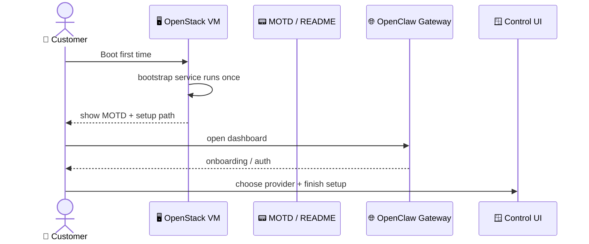
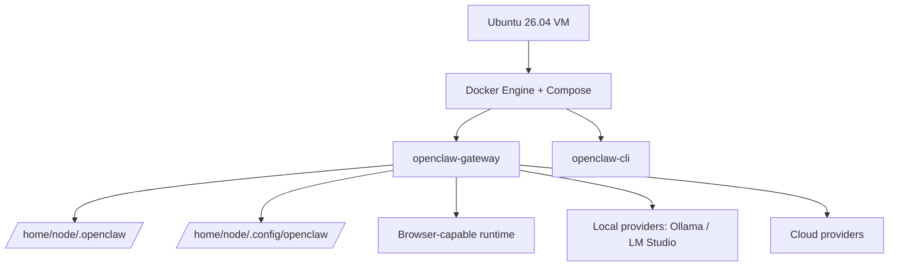
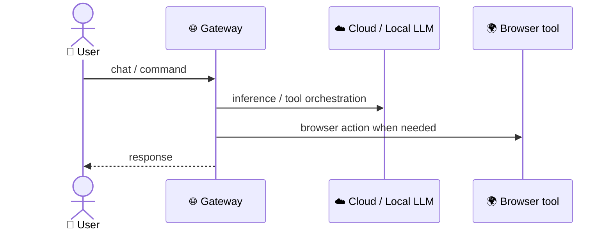
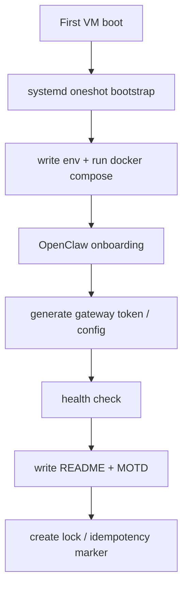
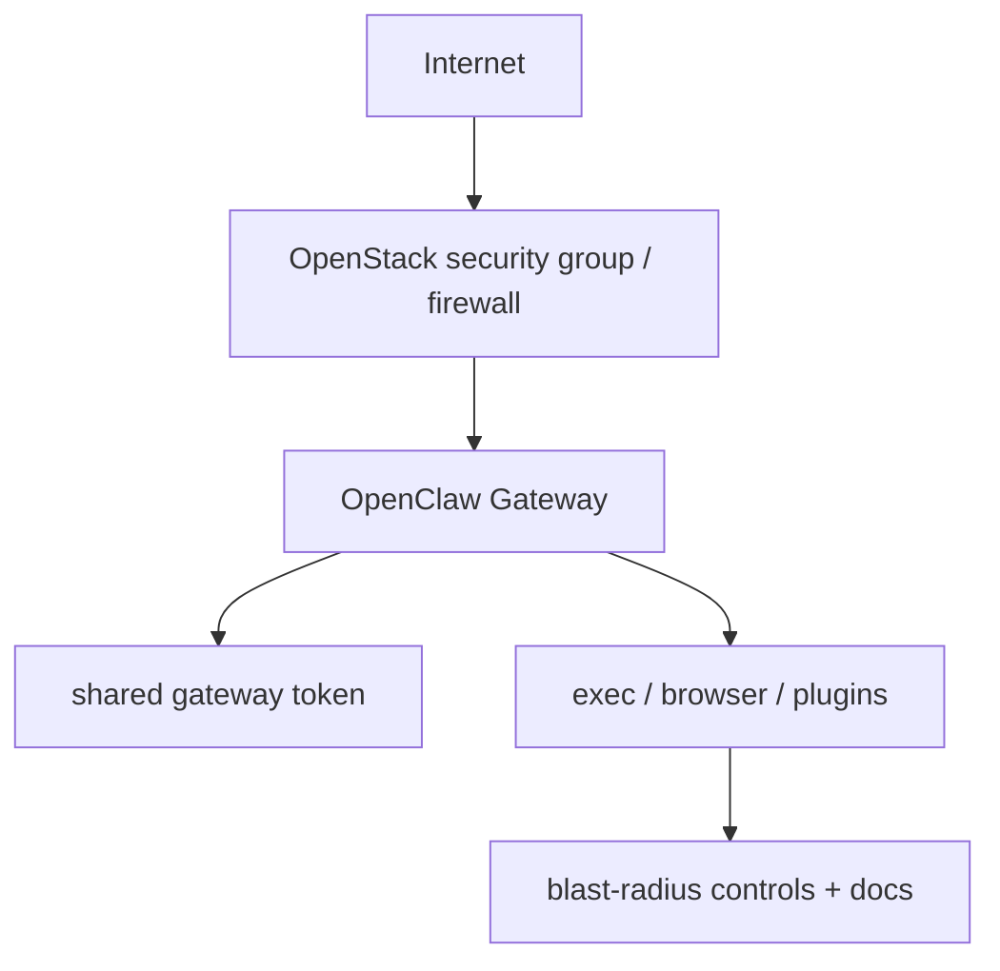

# Implementation Plan: OpenClaw

## 1. Specifications
| Parameter | Value |
|---|---|
| App Name | OpenClaw |
| Target Version | `v2026.7.1` (specific release pin) |
| Deployment Stack | OpenClaw gateway + CLI + Docker Compose + systemd bootstrap |
| Customer Service Model | 2A |
| Target OS | Ubuntu 26.04 |
| Access Model | Dashboard + SSH/CLI |
| Provider Baseline | Cloud providers + local providers |
| Network Baseline | Direct gateway first |
| Image Flavor | Browser variant (baked Chromium only) |

## 2. 5 Diagrams

### 2.1 User Journey Diagram

### 2.2 Architecture Diagram

### 2.3 Data Flow Diagram

### 2.4 Bootstrap Flow Diagram

### 2.5 Security Diagram

## 3. Design Decisions
| Decision Point | Selection | Rationale | Ref |
|---|---|---|---|
| Version pin | Specific release `v2026.7.1` | Avoid floating tag drift | Review |
| OS baseline | Ubuntu 26.04 | Repo baseline and current image family | Catalog |
| Customer model | 2A | Operator image, not shared SaaS | Playbook |
| Fronting | Direct gateway first | Keep scope simple for initial image | User choice |
| Browser | Baked Chromium only | Enough for tool/browser flow without expanding scope too far | User choice |
| Providers | Cloud + local | Covers API-backed and local LLM setups | User choice |
| Local examples | Ollama + LM Studio | Common local provider paths in docs | User choice |
| Secrets | Generated at first boot | Keep credentials out of image | Playbook |
| Access docs | README + MOTD + dashboard | Make customer handoff explicit | Playbook |

## 4. Proposed File Paths
| Action | Target Path | Purpose |
|---|---|---|
| [NEW] | `apps/openclaw/openclaw-review.md` | Research + suitability + risk baseline |
| [NEW] | `apps/openclaw/implementation_plan.md` | Approval-ready plan before build |
| [NEW] | `apps/openclaw/openclaw.md` | Final build guide (later) |
| [NEW] | `apps/openclaw/bootstrap.sh` | First-boot bootstrap (later) |
| [NEW] | `apps/openclaw/docker-compose.yml` | Service definition (later) |
| [NEW] | `apps/openclaw/README-openclaw-image.txt` | Customer handoff doc (later) |
| [NEW] | `apps/openclaw/99-openclaw-image` | MOTD (later) |
| [NEW] | `apps/openclaw/docs/openclaw-post-check.md` | Post-test checklist (later) |

## 5. Verification Checklist
- Gateway starts and reports healthy
- Dashboard reachable
- First-boot onboarding completes
- Specific release pin is documented and used
- Browser-capable variant works
- Cloud provider path documented
- Local provider paths documented for Ollama and LM Studio
- No secret is baked into the image
- Customer 2A boundaries are explicit
