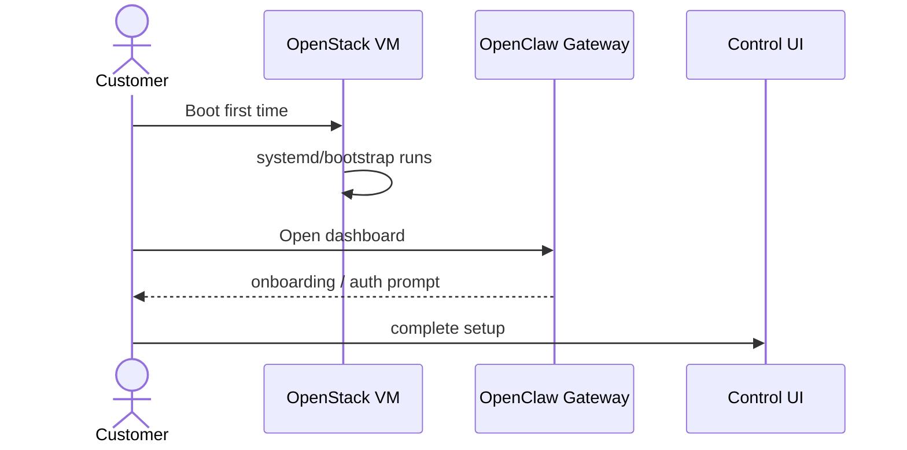
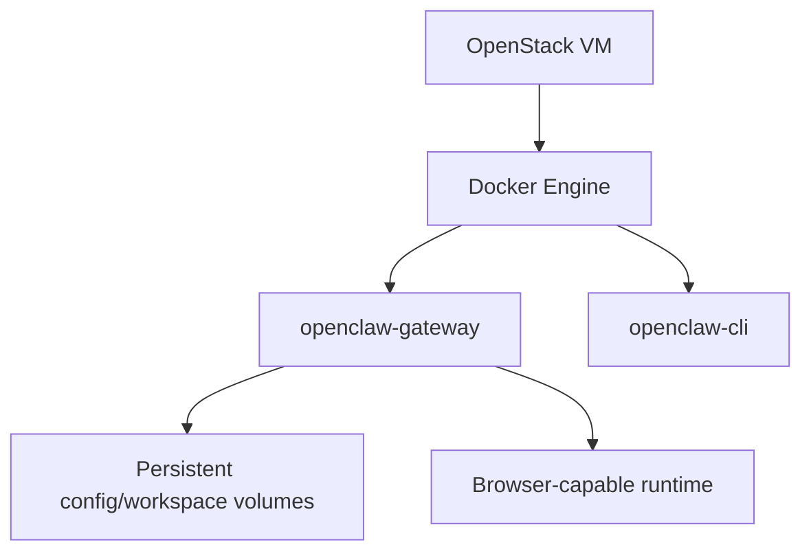
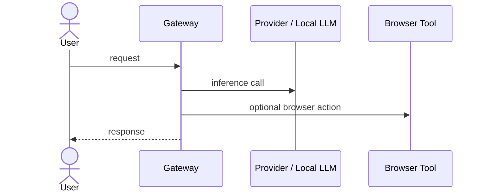
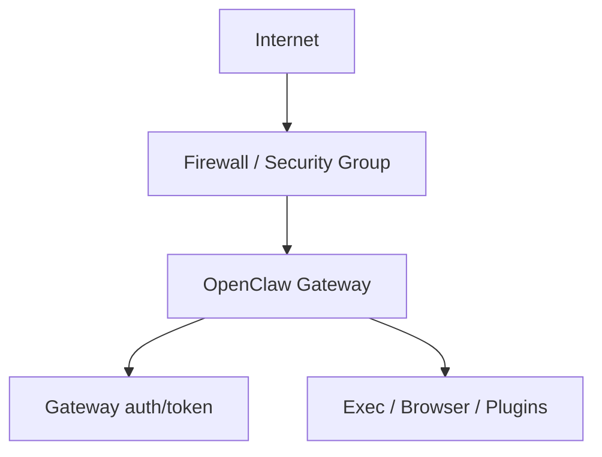

# OpenClaw Review

## 1. App summary
- **App:** OpenClaw
- **Type:** AI gateway / personal-assistant platform
- **Customer model:** **2A only**
- **Goal:** ship a customer-usable VM image with OpenClaw preinstalled, then let the operator finish first-boot onboarding.

## 2. Suitability
- **Fits:** single trusted operator, one VM per customer, browser/dashboard + SSH/CLI access
- **Does not fit:** shared multi-tenant customer service or adversarial users on one gateway
- **Conclusion:** candidate for customer image **only** when framed as a private operator image, not a shared SaaS

## 3. Upstream source of truth
- GitHub repo: `openclaw/openclaw`
- Official docs: `https://docs.openclaw.ai`
- Official release flow: GitHub releases + GHCR primary registry
- Docker Hub mirror exists, but GHCR is the primary deployment target

## 4. Release / pin strategy
- **Pin strategy:** specific release pin
- **Target pin:** `v2026.7.1`
- **Browser variant:** use the pinned browser-capable image/tag, exact tag name **need to verify** against registry
- Avoid floating `latest` in the final image guide

## 5. Packaging / deployment options
- Official Docker path exists
- Official compose uses `openclaw-gateway` + `openclaw-cli`
- Browser-capable build is supported upstream
- Runtime is Docker-first, with onboarding handled by the gateway setup flow

## 6. Runtime requirements
- Node.js: `22.22.3+`, `24.15+` recommended, or `25.9+`
- Docker Engine / Docker Desktop + Compose v2
- At least **2 GB RAM** for Docker build; browser variant should assume more headroom
- Disk: budget for image layers, workspace, logs, browser assets, and persistent config

## 7. Required stack/components
- OpenClaw gateway container
- OpenClaw CLI container / helper path
- Persistent config and workspace volumes
- Auth/profile secret storage
- Optional: browser-capable image variant
- Optional: local providers such as **Ollama** and **LM Studio**

## 8. Customer-service fit
- **2A:** yes
- **2B:** no
- Reason: the image needs first-boot onboarding, credentials, and operator trust boundaries; it is not a finished public shared service

## 9. Security posture
- Treat the gateway as trusted-operator infrastructure
- Keep the gateway loopback-first or tightly firewalled when exposed
- Do not model it as multi-tenant
- Keep secrets out of the image
- Browser, exec, plugin, and channel features widen blast radius and must be documented explicitly

## 10. Key risks / gotchas
- Shared-user / shared-room use is outside the trust model
- Floating tags can drift quickly
- Browser variant increases resource and attack surface
- Provider onboarding depends on external API keys or local model endpoints
- Exposing gateway broadly without auth/firewall is unsafe

## 11. Recommended next route
- Proceed to `implementation_plan.md`
- Keep the plan centered on: Ubuntu 26.04, direct gateway first, browser baked only, dashboard + SSH/CLI, cloud + local providers

## 12. Review diagram outline

### 12.1 User Journey

### 12.2 Architecture

### 12.3 Data flow

### 12.4 Security

## 13. Review-ready notes for planning
- Need exact registry tag verification for the pinned release
- Need explicit bind/auth policy in the plan
- Need provider setup examples for Ollama and LM Studio
- Need browser variant choice documented as baked Chromium only
