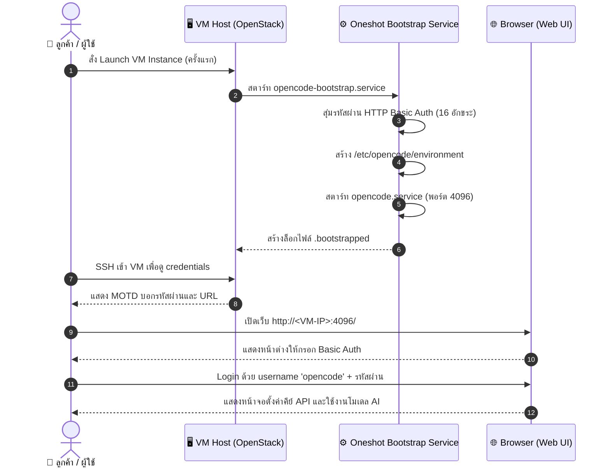
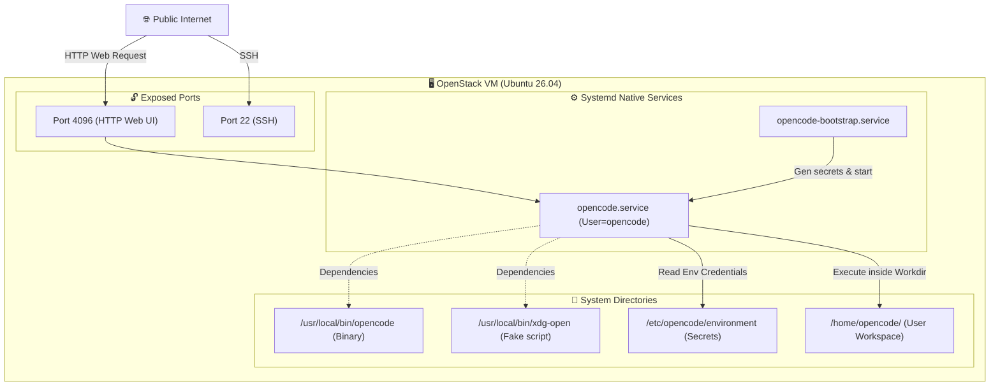
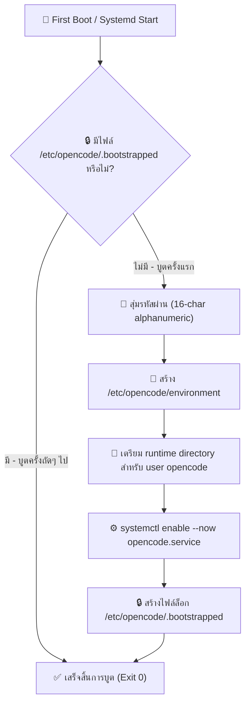
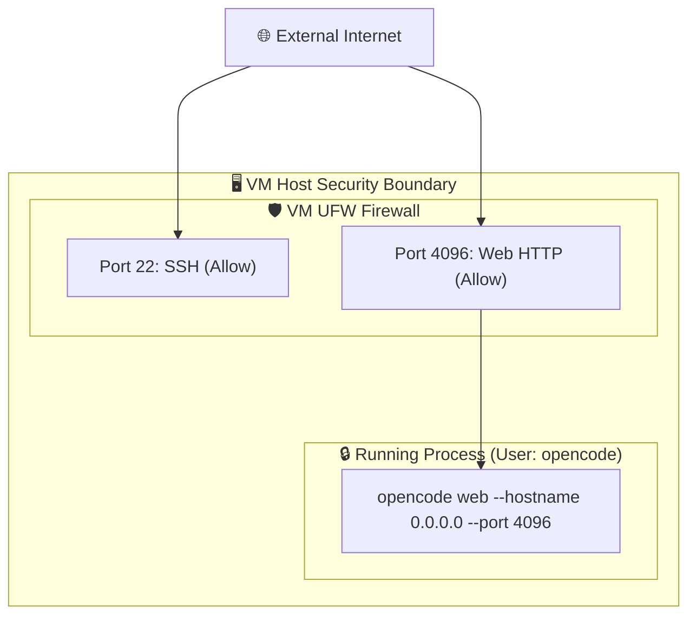

# OpenCode Research Review

> **แอปเป้าหมาย:** OpenCode AI Coding Agent (Standalone Binary)
> **ขอบเขต:** Hardened Image สำหรับนักพัฒนา บูต VM รันเว็บเซอร์วิส พอร์ต 4096 พร้อมใช้งานทันที

---

## 1. Upstream & Docker Image Selection

| Component | Target Image / Source | Tag / Version | Digest / Hash | Size | Role |
|---|---|---|---|---|---|
| Main App | Standalone Binary (compiled via Bun) | `1.17.9` | [Download from GitHub Releases] | ~80MB | OpenCode AI Coding Agent Server |
| Base OS | Ubuntu Server | `24.04 / 26.04` | - | - | Host Operating System |

---

## 2. Technical Diagrams

### 2.1 User Journey Diagram (การใช้งานของลูกค้า)
แผนภาพลำดับการทำงานและเข้าใช้หน้าเว็บเมื่อลูกค้าบูต VM

---

### 2.2 System Architecture Diagram
โครงสร้างและตำแหน่งไฟล์ระบบภายใน VM ของ OpenCode

---

### 2.3 Bootstrap Execution Flow
แผนภาพแสดงกระบวนการบูตครั้งแรกเพื่อควบคุมความเป็น Idempotency

---

### 2.4 Port & Security Diagram (Security Boundaries)
สิทธิ์และขอบเขตเน็ตเวิร์กของระบบ OpenCode

---

## 3. Design Decisions & Rationale

| Topic | Decision | Rationale | Alternatives Considered |
|---|---|---|---|
| **Runtime** | Native Systemd Service (ไม่ใช่ Docker) | OpenCode แจกจ่ายเป็น Bun-compiled binary ขนาดเล็ก การรันแบบ native ช่วยลด overhead และเข้าถึงไฟล์โฮสต์ได้ง่ายกว่า | รันด้วย Docker Container — เกิดปัญหา dependency กับระบบ terminal pty ของ Alpine (musl compatibility) |
| **User Isolation** | รันด้วยสิทธิ์ผู้ใช้ `opencode` (ไม่ใช่ root) | ป้องกันปัญหาความปลอดภัยในกรณีมีช่องโหว่ RCE (Remote Code Execution) บล็อกผู้บุกรุกไม่ให้ยึดสิทธิ์เครื่องโฮสต์ได้โดยตรง | รันด้วย Root — สะดวกแต่มีความเสี่ยงด้านความปลอดภัยสูงเกินไป |
| **Autoupdate** | ปิดการอัปเดตอัตโนมัติ (`"autoupdate": false`) | หลีกเลี่ยงปัญหาระบบพังในภายหลังจากการอัปเดตแบบอัตโนมัติที่ผู้ดูแลระบบยังไม่ได้เตรียมตัว | เปิดอัปเดตอัตโนมัติ — เสี่ยงกับ API change และความเข้ากันได้ของระบบ |
| **Fake xdg-open** | สร้างสคริปต์ Fake `/usr/local/bin/xdg-open` | OpenCode web พยายามเรียก `xdg-open` เพื่อเปิดเบราว์เซอร์ ซึ่งจะส่งผลให้ระบบ crash และหยุดทำงานบนสภาพแวดล้อมที่เป็น headless server | ติดตั้ง desktop GUI — สิ้นเปลืองหน่วยความจำและ CPU โดยใช่เหตุ |

---

## 4. Community Signals & Known Issues

| Issue / Gotcha | Severity | Mitigation / Workaround | Source |
|---|---|---|---|
| **xdg-open: ENOENT** | Must | สร้างสคริปต์ fake `/usr/local/bin/xdg-open` เพื่อแก้ปัญหาเว็บล่มเมื่อเปิดใช้งานบน headless server | GitHub Issues #31815 |
| **Reverse Proxy SSE Crash** | Must | หากใช้ Nginx เป็น Proxy ด้านหน้า ต้องปิด buffering (`proxy_buffering off`) และเพิ่ม timeouts เพื่อรองรับ Server-Sent Events | GitHub Issues #28928 |
| **OAuth Callback behind Proxy** | Should | ระบบ OAuth บังคับเรียกใช้งาน localhost หากใช้งานผ่าน proxy แนะนำให้ข้ามการเข้าสู่ระบบผ่าน OAuth และหันมาใช้งานคีย์ API แทน | GitHub Issues #24455 |

---

## 5. User Needs

### 5.1 Beginner (นักพัฒนาเริ่มหัดใช้ AI coding)
*   **ไม่ต้องตั้งค่าเยอะ:** บูตระบบแล้วเข้าหน้าแชทได้ทันที
*   **คำอธิบายชัดเจน:** ทราบลิงก์และรหัสผ่านเข้าหน้าเว็บทันทีเมื่อ SSH สำเร็จ

### 5.2 Intermediate (ผู้ดูแลระบบทีมงานพัฒนา)
*   **ความเสถียรของบริการ:** ตรวจสอบและ restart การทำงานผ่าน systemctl ได้ปกติ
*   **การเปลี่ยนรหัสผ่าน:** มีคำแนะนำและสคริปต์ช่วยแก้ไขรหัสผ่าน Basic Auth ได้

### 5.3 Advanced (ระดับองค์กรและซอฟต์แวร์สเกล)
*   **ความปลอดภัยข้อมูล:** คีย์ API และ sessions ที่ผู้ใช้อัปโหลดจะถูกเก็บไว้ใต้ไดเรกทอรีส่วนตัวของผู้ใช้ `opencode` เท่านั้น
*   **ตัวเลือก HTTPS:** มีการแนะนำ config ของ Nginx สำหรับตั้งค่าทำ SSL subdomain

---

## 6. Verification & Acceptance Criteria

### 6.1 Unit Verification (ฝั่ง VM)
- [ ] ตรวจสอบว่า `/etc/opencode/environment` และล็อกไฟล์ดั้งเดิมถูกลบออกจาก Golden Image
- [ ] ไฟล์ fake `/usr/local/bin/xdg-open` มีอยู่จริงและมีสิทธิ์รัน
- [ ] systemd service `opencode-bootstrap.service` อยู่ในสถานะ enabled

### 6.2 Browser Acceptance (E2E)
- [ ] เมื่อบูตเครื่องเสร็จแล้วสามารถเรียกหน้าเว็บพอร์ต 4096 ได้และขึ้นหน้ากล่องล็อกอิน
- [ ] ล็อกอินด้วย username `opencode` และรหัสผ่านที่สุ่มขึ้นใหม่ได้สำเร็จ
- [ ] หน้าเว็บโหลดองค์ประกอบครบถ้วนและตอบสนองการพิมพ์ prompt ของผู้ใช้ได้ปกติ
