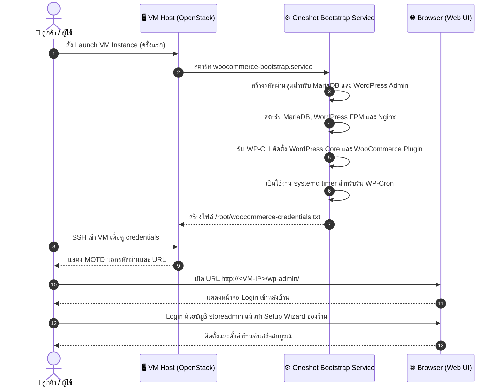
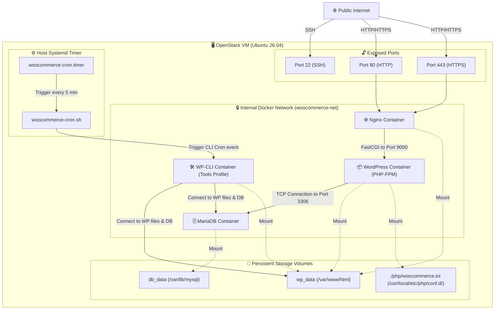
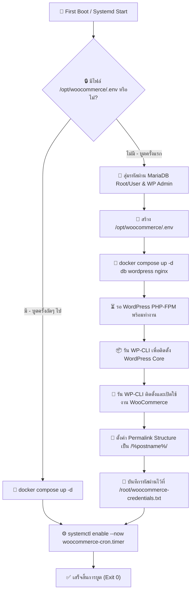
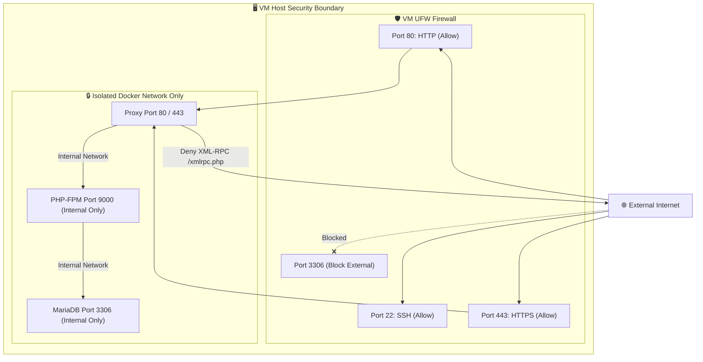

# WooCommerce Research Review

> **แอปเป้าหมาย:** WooCommerce Customer Service Image
> **ขอบเขต:** Hardened Image สำหรับร้านค้าออนไลน์ (WordPress + WooCommerce) บูต VM แล้วพร้อมทำ Setup Wizard ผ่านเบราว์เซอร์ได้ทันที

---

## 1. Upstream & Docker Image Selection

| Component | Target Image | Tag / Version | Digest / Hash | Size | Role |
|---|---|---|---|---|---|
| Web App | `library/wordpress` | `php8.3-fpm` | `sha256:efaea017a0c2` | ~240MB | PHP-FPM Web Service |
| Database | `library/mariadb` | `lts` (11.4) | `sha256:a794d9eb009e` | ~310MB | Relational Database |
| Proxy | `library/nginx` | `1.27` | `sha256:32e76d2f32a7` | ~140MB | Web Proxy / Static Assets Handler |
| CLI Tool | `library/wordpress` | `cli-php8.3` | `sha256:acbe715c0e18` | ~180MB | WordPress CLI Management Utility |

---

## 2. Technical Diagrams

### 2.1 User Journey Diagram (การใช้งานของลูกค้า)
แผนภาพแสดงกระบวนการตั้งแต่เริ่มสร้าง VM จนกระทั่งตั้งค่า WooCommerce เสร็จสิ้น

---

### 2.2 System Architecture Diagram
แสดงโครงสร้างส่วนประกอบการทำงาน ฐานข้อมูล เน็ตเวิร์ก และระบบ Mount Volumes ใน VM

---

### 2.3 Bootstrap Execution Flow
แผนภาพแสดงการตัดสินใจและการทำงานของสคริปต์บูตระบบครั้งแรก

---

### 2.4 Port & Security Diagram (Security Boundaries)
ขอบเขตการกักกันสิทธิ์ในการเชื่อมต่อของพอร์ตและ API

---

## 3. Design Decisions & Rationale

| Topic | Decision | Rationale | Alternatives Considered |
|---|---|---|---|
| **Base Image** | `wordpress:php8.3-fpm` + `nginx` (ไม่ใช่ Apache) | แยก Nginx เพื่อเสิร์ฟไฟล์ Static ได้เร็วขึ้น และส่งต่อไปยัง PHP-FPM ทำให้ลดการใช้แรมได้มากกว่า Apache | `wordpress:latest` (Apache) — บูตง่ายแต่กินทรัพยากรสูงเมื่อทราฟฟิกขึ้น |
| **Database** | MariaDB 11.4 LTS | LTS มีการบำรุงรักษายาวนานและเบากว่า MySQL 8.0/8.4 ในสเปกแรมที่จำกัด | PostgreSQL — WordPress ไม่รองรับ Postgres แบบเนทีฟ ต้องผ่านปลั๊กอินแปลง |
| **Cron Runner** | Host Systemd Timer + WP-CLI | ปิดการทำงานของ page-load WP-Cron เพื่อหลีกเลี่ยงผลกระทบต่อประสิทธิภาพเว็บ และใช้ระบบ cron ของโฮสต์สั่งการทุก 5 นาทีแทนเพื่อความแน่นอน | พึ่งพา WP-Cron ปกติ — หากไม่มีคนเปิดหน้าเว็บ งานเบื้องหลังจะไม่รัน (เช่น ส่งอีเมลยืนยันการสั่งซื้อ) |
| **Secrets** | First-boot generated alphanumeric secrets | ป้องกันการใช้ความลับร่วมกันในระบบและป้องกันการพังของ config จากอักขระพิเศษ | ใช้รหัสผ่านเริ่มต้นทั่วไป — เสี่ยงต่อความปลอดภัยของข้อมูลลูกค้าอย่างรุนแรง |
| **Air-gapped Readiness** | Pre-pull images ระหว่างการทำ build และ freeze ไว้ใน VM | การสร้าง VM ใหม่แบบไม่มีเครือข่ายภายนอก (หรือติด Firewall) จะสามารถเริ่มระบบได้อย่างสมบูรณ์ | ดาวน์โหลด Image ออนไลน์เมื่อรันบูตครั้งแรก — จะพังทันทีถ้าไม่มีเน็ตออกนอก |

---

## 4. Community Signals & Known Issues

| Issue / Gotcha | Severity | Mitigation / Workaround | Source |
|---|---|---|---|
| **WP-Cron & Action Scheduler delay** | Must | ใช้ระบบ Systemd timer ดึงคำสั่งรัน Action Scheduler ทุก 5 นาทีช่วยแบ่งเบาภาระฐานข้อมูล | SO & WP-CLI docs |
| **Redirect loop / Mixed Content** | Must | ส่งค่า `HTTPS on` และ `HTTP_X_FORWARDED_PROTO` จาก Nginx ไปยัง WordPress FPM เสมอ | Nginx configuration threads |
| **HPOS Plugin Compatibility** | Should | แจ้งเตือนผู้ใช้ในการเลือกใช้งานปลั๊กอินเก่า เนื่องจาก WooCommerce 8.2+ บังคับใช้ High-Performance Order Storage (HPOS) เป็นค่าเริ่มต้น | WooCommerce developer docs |
| **XML-RPC Attacks** | Should | บล็อกไฟล์ `/xmlrpc.php` ใน nginx config เพื่อป้องกันการทำ Brute-force/DDoS โจมตีเว็บ | WordPress security practices |

---

## 5. User Needs

### 5.1 Beginner (ผู้เริ่มต้นเปิดร้านค้าออนไลน์)
*   **เปิดร้านค้าสะดวก:** เข้าลิงก์พร้อมเริ่ม Wizard สำหรับสร้างสินค้า ตั้งราคา และตั้งค่าการชำระเงินได้ทันที
*   **รหัสผ่านอัตโนมัติ:** ไม่ต้องการยุ่งยากเรื่องการตั้งค่าคอนฟิกฐานข้อมูล
*   **มีคำอธิบายที่ชัดเจน:** มี MOTD และไฟล์ README บอกขั้นตอนถัดไปสำหรับการใช้งานและการผูกโดเมน

### 5.2 Intermediate (ผู้ดูแลระบบร้านค้า)
*   **สำรองข้อมูลที่สมบูรณ์:** มีระบบสำรองข้อมูลทั้งรูปสินค้าใน `wp-content` และรายการสั่งซื้อในฐานข้อมูลคู่กัน
*   **ความเร็วในการโหลด:** การตั้งค่า PHP limits เช่น `memory_limit = 512M` เพื่อไม่ให้การบันทึกภาพสินค้าขนาดใหญ่ล้มเหลว
*   **การเชื่อมต่อ HTTPS:** มีขั้นตอนและเทมเพลตสำหรับแก้ไขเปิดใช้งาน SSL เพื่อเปิดระบบชำระเงินแบบจริง

### 5.3 Advanced (ผู้เชี่ยวชาญ / Agency)
*   **WP-CLI Support:** เรียกใช้คำสั่งบำรุงรักษา อัปเดตและเช็คสถานะผ่าน Terminal ได้ทันที
*   **HPOS Active:** เพิ่มความเร็วในการประมวลผลตารางสั่งซื้อด้วยการเปิดตาราง HPOS ตั้งแต่ติดตั้ง

---

## 6. Verification & Acceptance Criteria

### 6.1 Unit Verification (ฝั่ง VM)
- [ ] ตรวจสอบว่าไฟล์ `/opt/woocommerce/.env` และ credentials ดั้งเดิมถูกลบออกจาก Golden Image ก่อนการ capture
- [ ] ตรวจสอบว่า systemd timer `woocommerce-cron.timer` ถูกสั่งเปิดการทำงาน
- [ ] ตรวจสอบว่า Docker stack สามารถทำงานได้ครบทั้ง Nginx, WordPress FPM และ MariaDB

### 6.2 Browser Acceptance (E2E)
- [ ] เมื่อเปิดหน้าเว็บ `http://<VM-IP>/wp-admin/` ครั้งแรก ต้องแสดงหน้าเข้าสู่ระบบของ WordPress
- [ ] สามารถ Login และเห็นปลั๊กอิน WooCommerce ถูกเปิดใช้งานเรียบร้อยแล้ว
- [ ] ตรวจสอบว่าระบบสั่งซื้อทดสอบสามารถดำเนินการได้จนจบโดยไม่ติดปัญหา Gateway Timeout
