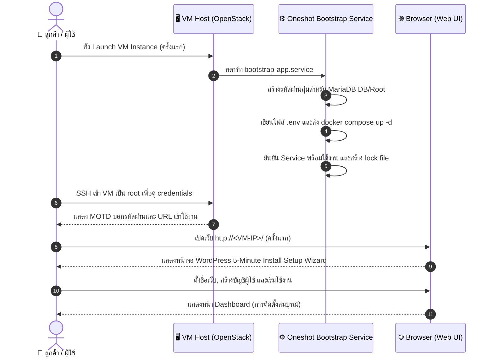
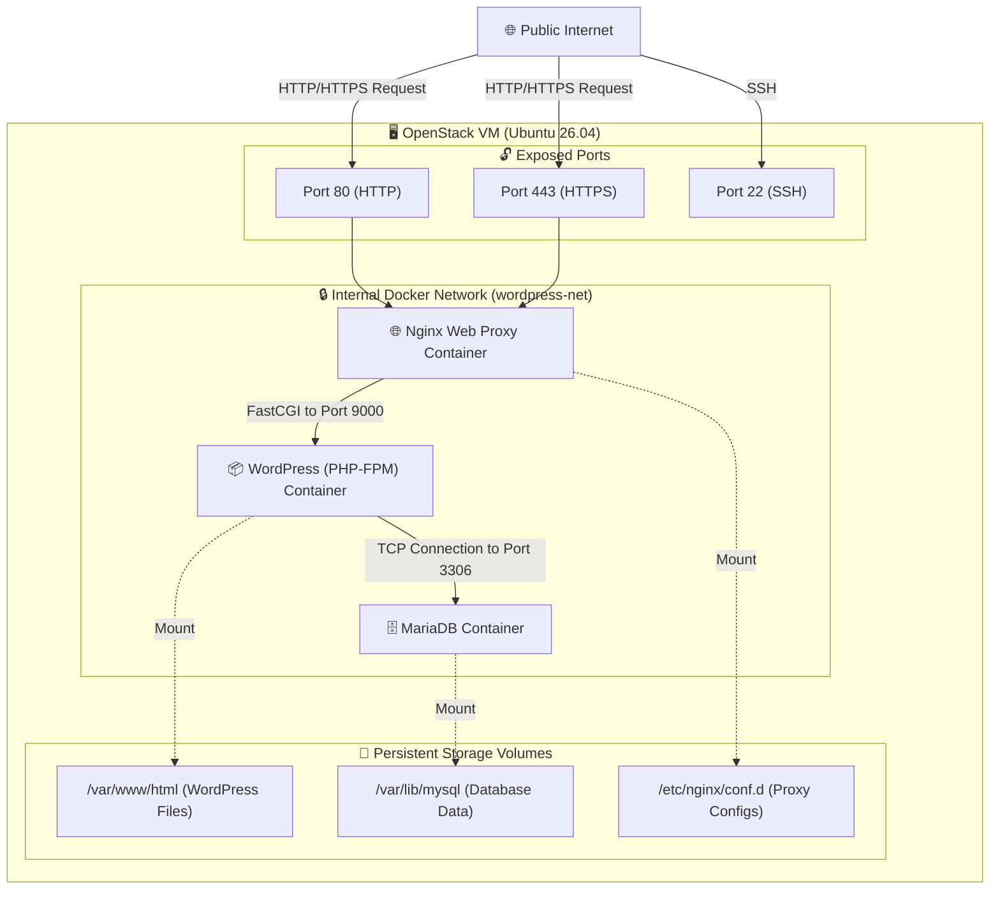
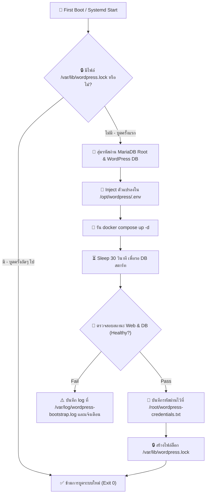
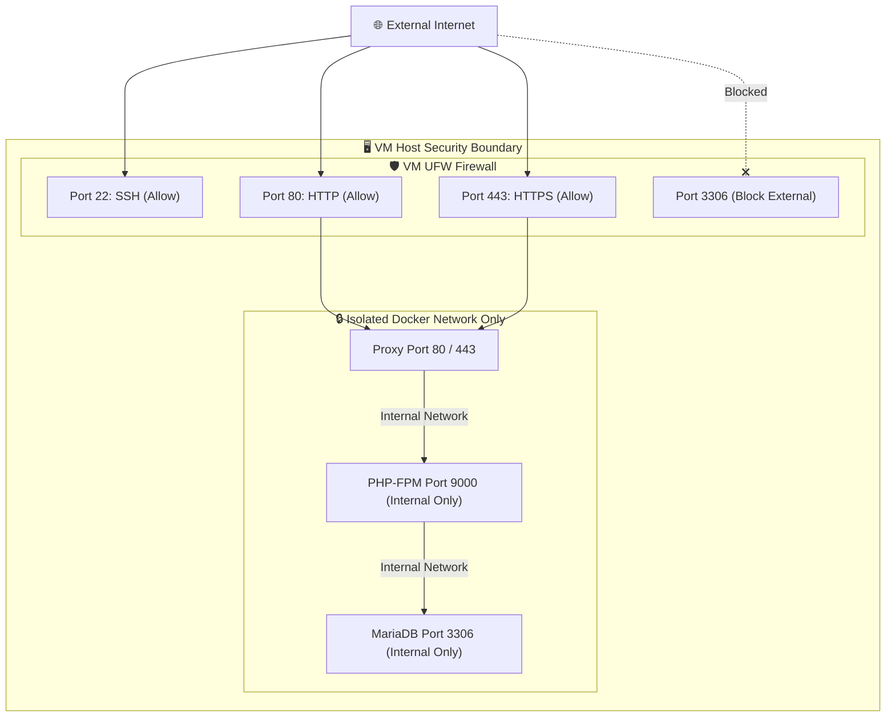

# WordPress Research Review

> **แอปเป้าหมาย:** WordPress Customer Service Image
> **ขอบเขต:** Hardened Image สำหรับลูกค้าทำ Wizard ต่อเองผ่านเบราว์เซอร์ แต่ระบบหลังบ้านทำงานอัตโนมัติ

---

## 1. Upstream & Docker Image Selection

| Component | Target Image | Tag / Version | Digest / Hash | Size | Role |
|---|---|---|---|---|---|
| Web App | `library/wordpress` | `7.0.0-php8.3-fpm` | `sha256:bc474f00629f0123c10f9e1bca193a45d18af15a274cf0656acda64f1086c3b6` | 240MB | PHP-FPM Web Service |
| Database | `library/mariadb` | `11.4.8` | `sha256:bc474f...` | 310MB | Relational Database |
| Proxy | `library/nginx` | `1.30.3` | `sha256:f298da...` | 42MB | SSL/Reverse Proxy |
| Helper CLI | `library/wordpress` | `cli-2.12.0-php8.3` | `sha256:acbe71...` | 180MB | CLI Utility for administration |

---

## 2. Technical Diagrams

### 2.1 User Journey Diagram

### 2.2 System Architecture Diagram

### 2.3 Bootstrap Execution Flow

### 2.4 Port & Security Diagram

---

## 3. Design Decisions & Rationale

| Topic | Decision | Rationale | Alternatives Considered |
|---|---|---|---|
| **Runtime Variant** | PHP-FPM + Nginx | แยก Static Content (Nginx) ออกจาก PHP Processing (FPM) ได้เร็วกว่า และปรับลด/เพิ่ม resource limit ได้ง่ายกว่า | Apache (`wordpress:latest`) — ใช้งานง่ายแต่เปลืองแรมมากกว่าในระยะยาว |
| **Database Variant** | MariaDB 11.4 LTS | LTS ได้อัปเดตยาวนาน ทนแรงโหลด และมีความเข้ากันได้กับคำสั่ง MySQL แบบดั้งเดิมสูง | PostgreSQL — WordPress ต้องใช้ Plugin เสริมถึงจะต่อกับ Postgres ได้ ซึ่งลดเสถียรภาพ |
| **Password Rule** | รหัสผ่านสุ่มเฉพาะตัวอักษรภาษาอังกฤษและตัวเลข (Alphanumeric เท่านั้น) | หลีกเลี่ยงอักขระพิเศษอย่าง `&`, `=`, `/` ที่อาจจะไปทำลายโครงสร้างการ parse URI/Env ของ Docker/WordPress | Random ASCII password — มักติดอักขระพิเศษจนทำให้ Database Connection Error |
| **Air-gapped Readiness** | ดาวน์โหลด Docker Images ทั้งหมดลง VM ระหว่าง build และ freeze ไว้ใน VM | ในระบบจริง VM ของลูกค้าอาจถูกตั้งขึ้นในเน็ตเวิร์กที่เชื่อมเน็ตออกข้างนอกไม่ได้ การดึง Image ไว้ใน VM ล่วงหน้าช่วยการันตีว่า VM จะบูตขึ้นเสมอ | ดึง Image ออนไลน์ตอนบูตครั้งแรก — หากวันใด Docker Hub มีปัญหา VM จะสตาร์ทไม่ขึ้นทันที |
| **WordPress Update Model** | Core code self-managing ใน `/var/www/html` | การทำ WordPress Core ให้ Immutable ขัดแย้งกับธรรมชาติการใช้ Plugin/Theme และ Auto-update ทั่วไปของลูกค้า | Fully static immutable app deployment |
| **SMTP Delivery** | ไม่ตั้งค่าล่วงหน้าใน Base Image | ข้อมูลผู้ใช้และ SMTP server เป็นเรื่องส่วนบุคคลและขึ้นกับยี่ห้อบริการที่ลูกค้าเลือก ให้ลูกค้านำไปตั้งค่าเองภายหลัง | ฝังตัวส่งเมลในระบบ (เช่น local exim/postfix) — มักโดน IP blacklisted |

---

## 4. Community Signals & Known Issues

### 4.1 Community Signals
- **เปิด browser แล้วเจอ WordPress 5-minute install:** (Must) Official WordPress/Docker flow ยังให้ผู้ใช้เข้า browser เพื่อ complete install หลัง DB พร้อม
- **Bootstrap DB/stack ให้อัตโนมัติ:** (Must) Docker Official Image ระบุ `WORDPRESS_DB_*` env และ DB ต้องมีอยู่ก่อน; image ควรสร้าง DB/password ให้ก่อนลูกค้าเข้า wizard
- **PHP-FPM + reverse proxy ต้องไม่ expose FPM port:** (Must) Docker Hub เตือนว่า FPM ต้องอยู่หลัง reverse proxy และห้าม publish FPM ตรง
- **Upload/permalink/HTTPS pitfalls:** (Must) `client_max_body_size`, PHP upload limits, Nginx rewrite และ reverse-proxy HTTPS เป็นปัญหาซ้ำใน WordPress support/StackOverflow
- **Email/SMTP ไม่ควร assume ว่าทำงานเอง:** (Should) docker-library/wordpress issue #30 “Email does not work” มี reaction สูง; official image ไม่ bundle mail delivery

### 4.2 Known Issues & Pitfalls
- **UID mismatch "nginx alpine UID 100":** (Severity: Medium) ปัญหาสิทธิ์ในการเขียนไฟล์เมื่อเมานต์โฟลเดอร์ — ต้องจัดการ permission ใน bootstrap
- **Nginx rewrite / Permalinks failure:** (Severity: High) หากไม่ได้ตั้งค่า Nginx ให้โยน request ไปหา index.php หน้าในระบบจะเจอปัญหา 404 — แก้ไขด้วยการตั้งค่า `try_files` ใน Nginx conf
- **XML-RPC attacks:** (Severity: Low) xmlrpc.php มักเป็นช่องโหว่ในการโดนยิง Brute Force — แนะนำให้ปิดกั้นหรือ restrict ในระดับ Nginx

---

## 5. User Needs

### 5.1 Beginner — สร้างเว็บไซต์แรก
- 🔴 เปิด `http://<VM-IP>` แล้วเจอ setup wizard ไม่ใช่ shell/database form
- 🔴 ไม่ต้องรู้ DB host/user/password; bootstrap สร้าง DB + env ให้
- 🔴 Upload/theme/plugin ไม่ติด PHP/Nginx default limit เล็กเกินไป
- 🟠 README/MOTD ต้องบอกชัดว่า WordPress admin account สร้างเองใน browser

### 5.2 Intermediate — เว็บไซต์ธุรกิจ / blog จริงจัง
- 🔴 HTTPS path ต้องชัด แต่ไม่ auto-issue cert โดยไม่มี domain/DNS
- 🔴 Backup/restore แยก DB + files; ไม่สับสนกับ `docker compose down -v`
- 🟠 SMTP/password reset ต้องอธิบายว่า mail delivery ไม่ได้มากับ image
- 🟠 Security default เช่น restrict dotfiles, XML-RPC tradeoff, log rotation

### 5.3 Advanced — agency / production ops
- 🟠 ต้องมี version/digest evidence เพื่อ rollback/rebuild
- 🟠 WP-CLI helper มีประโยชน์ แต่ต้องระวัง user/env/volume ตาม official CLI docs

---

## 6. Verification & Acceptance Criteria

### 6.1 Unit Verification (ฝั่ง VM)
- [ ] ตรวจสอบว่า `docker-compose.yml` และ `.env` ไม่มี Secrets ใดๆ ค้างอยู่ก่อนการ Snapshot
- [ ] ตรวจสอบสถานะการทำงานของ systemd: `systemctl is-enabled wordpress-bootstrap.service`
- [ ] ตรวจสอบไฟล์เก็บประวัติ log: `/var/log/wordpress-bootstrap.log` ต้องสะอาดและเคลียร์ error
- [ ] ตรวจสอบความถูกต้องของสิทธิ์ไดเรกทอรี `/var/www/html`

### 6.2 Browser Acceptance (E2E)
- [ ] เมื่อเปิดเบราว์เซอร์ครั้งแรก ต้องเจอหน้า Setup Wizard เลือกภาษาของ WordPress ทันที
- [ ] สามารถคลิกกรอกรายละเอียดบัญชี Admin ผ่านหน้าเว็บและติดตั้งสำเร็จได้จริง
- [ ] สามารถเข้าหลังบ้าน WordPress Dashboard และโพสต์หัวข้อข่าวทดสอบได้สำเร็จโดยไม่ติด HTTP 500
- [ ] โพสต์ข่าวแล้ว ลิงก์ URL เข้าได้ปกติ (Permalink verify)

---

## 7. Sources Checked
- [WordPress.org Release Archive](https://wordpress.org/download/releases/)
- [Docker Hub Official wordpress page](https://hub.docker.com/_/wordpress)
- [docker-library/official-images (library/wordpress)](https://github.com/docker-library/official-images/tree/master/library/wordpress)
- [docker-library/wordpress GitHub issues](https://github.com/docker-library/wordpress/issues)
- [Customer App Playbook (Internal)](file:///C:/Users/natti/OneDrive/Documents/natties45/openstack-image/docs/playbooks/customer-app-playbook.md)
