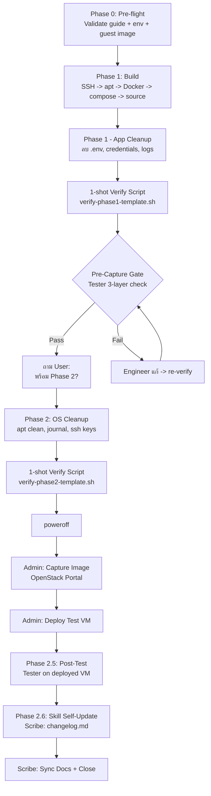
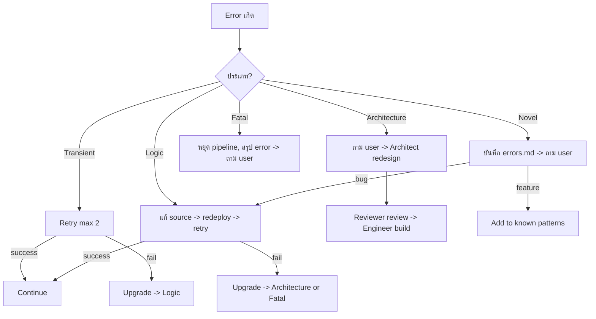

# AI Pipeline — App Image Build

> **Version:** 2026-07-10
> **ใช้กับ:** ทุก app image build (WordPress, Nextcloud, Odoo, n8n, etc.)
> **Pattern:** Pre-flight → SSH → Build → Verify (&& chain + 1-shot script) → Sleep → Error Recovery → Post-build

---

## หลักการ

| สิ่ง | ใช้ซ้ำได้ | ต้องคิดใหม่ |
|---|---|---|
| Pre-flight checks | ✅ | ❌ |
| SSH MCP tool (`@fangjunjie/ssh-mcp-server`) | ✅ | ❌ |
| Verification pattern | ✅ | ❌ |
| Post-build doc updates | ✅ | ❌ |
| Build steps (per app) | ❌ | ✅ ตาม app |
| Docker images | ❌ | ✅ ตาม app |
| Bootstrap logic | ❌ | ✅ ตาม app |

---

## Part 1: Reusable Framework

### Trigger

```
เมื่อ user บอก "build [app] image" หรือ "สร้าง [app] image"
```



### Phase 0: Pre-flight — อ่าน docs ก่อน ห้ามถาม user

> **กฎ:** ทุกเรื่องที่หาคำตอบได้จาก docs → อ่านก่อน

**AI ต้องอ่านก่อน:**

| เรื่อง | หาได้จาก | ถ้ายังไม่พร้อม |
|---|---|---|
| Guest image พร้อมหรือยัง | `apps/_guest-images.md` → OS นั้น ✅ เสร็จ? | สร้าง guest image ก่อน |
| VM IP, user, OS | `<app>-build.env` (temp, gitignored) หรือ output ที่ user ส่งมา | ให้ user ยืนยันก่อนเข้า VM |
| SSH/OpenStack credentials | `<app>-build.env` (temp, gitignored) | เติมเป็น temp env แล้วลบทิ้งหลังจบ |
| Build guide พร้อมหรือยัง | `<app>.md` → header tag `[พร้อม build]`? | สร้าง guide ก่อน |

**Env ownership:** image build เป็น standalone workflow ใช้ temp env ใต้ `tmp/<app>-build.env` ได้เท่านั้นระหว่างทำงาน ไฟล์นี้ต้อง gitignored และลบทิ้งหลัง build ห้าม commit IP, ID, password, token หรือ private key

**Temp env contract:** ใช้เป็นไฟล์ชั่วคราวเฉพาะรอบ build ห้าม commit และต้องลบหลังจบงาน

```text
IMAGE_BUILD_HOST=—
IMAGE_BUILD_USER=—
IMAGE_BUILD_PASSWORD=—
IMAGE_BUILD_SSH_PORT=22
IMAGE_BUILD_SERVER_ID=—
IMAGE_BUILD_IMAGE_NAME=ubuntu-26.04-{APP_NAME}-YYYYMMDD
```

ถ้าต้องใช้ OpenStack CLI ในรอบ build ให้ใส่ `OS_*` ใน temp env เดียวกัน และห้ามบันทึกค่า auth, server ID, image ID หรือ floating IP ลง docs กลาง

**บน VM เมื่อ SSH เข้าแล้ว — verify 4 ข้อ:**

```bash
lsb_release -a | grep Release          # OS version
grep URIs /etc/apt/sources.list.d/ubuntu.sources  # Mirror ไทย
curl -sI https://download.docker.com | head -1    # DNS OK
df -h /                                   # Disk > 5G
```

### Phase 1: Build

> **Verify strategy:** ใน Build phase ใช้ `&&` chain (ไม่ใช่ 1-shot script) เพราะแต่ละ step สั้นและ fail ต้องหยุดทันที ดู [Verify Strategy](#verify-strategy--chain-vs-one-shot-script)

**Step 1:** Install base packages — verify via `&&` chain
**Step 2:** Install Docker + Compose — verify via `&&` chain
**Step 3:** Create directories — verify `test -d` หลังสร้าง
**Step 4:** Deploy static files — AI build mode ใช้ MCP `upload` tool; manual self-contained guide อนุญาต heredoc เพื่อให้ user copy/run เองได้. verify `test -f` ทุกไฟล์หลัง deploy
**Step 5:** Enable systemd service — verify `systemctl is-enabled`
**Step 6:** Test bootstrap + pre-pull images — `sleep 30` + verify `docker compose ps`
**Step 7a:** Phase 1 — App Cleanup (use 1-shot verify script — see below)
**Step 7b:** Pre-Capture Gate — use 1-shot verify script (see below)
**Step 8:** Phase 2 — OS Cleanup + remove SSH access + poweroff (final/irreversible — use 1-shot verify script)

> ดูรายละเอียดแต่ละ step ใน `<app>.md` ของแต่ละ app

### Phase 1 — App Cleanup (SSH ยังใช้ได้)

[golden-image VM]

> **Verify:** ใช้ 1-shot script `scripts/verify-phase1-template.sh` — AI upload + run ครั้งเดียว แทน 10 คำสั่งแยก
> **ทำไม:** ประหยัด token ~80% (10 connections → 2 connections: upload + execute)
> **ดูเพิ่ม:** [Verify Strategy — && chain vs one-shot script](#verify-strategy--chain-vs-one-shot-script)

AI ต้อง execute cleanup commands แล้ว verify ผ่าน 1-shot script. ห้ามข้าม verify.

| # | Cleanup | Verify method |
|---|---|---|
| 1 | Stop services: `docker compose --profile http --profile https down --remove-orphans` | ✅ 1-shot script |
| 2 | Remove runtime volumes: `docker compose -f /opt/{APP_NAME}/docker-compose.yml down -v` | ✅ 1-shot script |
| 3 | Remove `.env`: `rm -f /opt/{APP_NAME}/.env` | ✅ 1-shot script |
| 4 | Remove credentials: `rm -f /root/{APP_NAME}-credentials.txt` | ✅ 1-shot script |
| 5 | Remove bootstrap log: `rm -f /var/log/{APP_NAME}-bootstrap.log` | ✅ 1-shot script |
| 6 | Remove runtime data: `rm -rf /var/lib/{APP_NAME}/*` | ✅ 1-shot script |
| 7 | Prune unused volumes only: `docker volume prune -f` | ✅ 1-shot script |
| 8 | Purge unlisted artifacts | ✅ 1-shot script (warns only) |
| 9 | Preserve images — ห้าม `docker image prune -a` | ✅ 1-shot script |
| 10 | Verify bootstrap service | ✅ 1-shot script |

**AI execution flow:**
```bash
# Step A: Upload verify script
upload --localPath "scripts/verify-phase1-template.sh" --remotePath "/tmp/verify-phase1.sh"
# Step B: Run cleanup commands per app guide (ssh-destructive)
# ...
# Step C: Run verify once
execute-command "bash /tmp/verify-phase1.sh ${APP_NAME}"
```
**Expected output:** `VERIFY:PASS` หรือ `VERIFY:FAIL <error_tags>`

หลัง Phase 1 ผ่าน → AI ต้องถาม user ก่อนเข้า Phase 2 เพราะ Phase 2 จะลบ SSH access และ poweroff.

### Pre-Capture Gate — ต้องผ่านก่อน Phase 2/poweroff/capture

[golden-image VM]

> **Verify:** ใช้ 1-shot script `verify-phase1.sh` (ตัวเดียวกับ Phase 1) — ถ้า Phase 1 ผ่านแล้ว แปลว่า gate ผ่าน
> **ถ้ายังไม่ได้รัน Phase 1:** ให้รัน script ก่อนตัดสินใจ capture

AI รัน `bash /tmp/verify-phase1.sh ${APP_NAME}` → ต้องได้ `VERIFY:PASS`

**ห้าม capture ถ้า:** service disabled, containers ยังรัน, images หาย, `.env`/credentials/log จาก test bootstrap ยังอยู่, หรือ Docker volumes ยังมี runtime data จากการทดสอบ

**หลักการ:** VM ใหม่จาก image ต้องเป็น fresh first boot และสร้าง `.env`/credentials ชุดใหม่เอง ห้ามเก็บ runtime data จาก golden-image VM เข้า image

### Phase 2 — OS Cleanup + Poweroff (final/irreversible)

[golden-image VM]

> **Verify:** ใช้ 1-shot script `scripts/verify-phase2-template.sh` — upload + run after OS cleanup commands
> **Note:** `authorized_keys` จะถูกลบหลัง verify (verify จะแจ้ง note ว่า authorized_keys ยังอยู่ — เป็น expected)

Phase 2 ทำเป็นขั้นตอนสุดท้ายเท่านั้น. AI ต้อง verify ก่อน execute destructive final steps และหลังลบ `authorized_keys` จะ SSH เข้าใหม่ไม่ได้.

| # | Cleanup | Verify method |
|---|---|---|
| 1 | `rm -f /root/.bash_history /home/*/.bash_history` | ✅ 1-shot script |
| 2 | `rm -rf /tmp/* /var/tmp/*` | ✅ 1-shot script |
| 3 | `find /var/log -type f -name '*.log' -exec truncate -s 0 {} +` | ✅ 1-shot script |
| 4 | `truncate -s 0 /var/log/wtmp /var/log/btmp /var/log/lastlog` | ✅ 1-shot script |
| 5 | `cloud-init clean --logs --seed` + `rm -rf /var/lib/cloud/instances/* /var/lib/cloud/instance /var/lib/cloud/sem/*` | ✅ 1-shot script |
| 6 | `rm -f /etc/netplan/50-cloud-init.yaml 2>/dev/null || true` | ✅ 1-shot script |
| 7 | `truncate -s 0 /etc/machine-id`; `rm -f /var/lib/dbus/machine-id`; for Debian/Ubuntu `ln -sf /etc/machine-id /var/lib/dbus/machine-id` | ✅ 1-shot script |
| 8 | `rm -f /etc/ssh/ssh_host_*` | ✅ 1-shot script |
| 9 | `find /etc/ssh/sshd_config.d -maxdepth 1 -type f -name '*.conf' ! -name '00-image-build.conf' -delete` | ✅ 1-shot script |
| 10 | `rm -rf /var/backups/image-build/repos` | ✅ 1-shot script |
| 11 | `fstrim -av` then `sync` | ✅ 1-shot script (after flush) |
| 12 | **LAST:** `rm -f /root/.ssh/authorized_keys /home/*/.ssh/authorized_keys` | command success; หลังนี้ SSH ใหม่เข้าไม่ได้ |
| 13 | `poweroff` | VM ต้องเข้าสู่ SHUTOFF แล้ว admin capture ผ่าน OpenStack portal |

**AI execution flow:**
```bash
# Step A: Upload verify script
upload --localPath "scripts/verify-phase2-template.sh" --remotePath "/tmp/verify-phase2.sh"
# Step B: Run OS cleanup commands (steps 1-11)
# ...
# Step C: Run verify (before authorized_keys removal)
execute-command "bash /tmp/verify-phase2.sh"
# Expected: VERIFY:PASS (note: authorized_keys still present — expected)
# Step D: Remove authorized_keys + poweroff
execute-command "rm -f /root/.ssh/authorized_keys /home/*/.ssh/authorized_keys && sleep 2 && poweroff"
# Step E: Controller-side wait for SHUTOFF
sleep 15
```

### Phase 2: Post-build

**ทุก build ต้องอัปเดต:**

| ไฟล์ | อัปเดตอะไร |
|---|---|
| `apps/{app}/docs/{app}-build-manifest.md` | latest golden-image build versions, container image tag+digest, notes แบบไม่มี IP/ID/secret |
| `_app-catalog.md` | สถานะ build |
| `<app>.md` header tag | `[พร้อม build]` → `[built: standalone]` |
| `tmp/<app>-build.env` | ลบทิ้งหลังจบงาน |

### Record Build Manifest

หลัง pre-capture gate ผ่าน และก่อนปิดงาน ให้สร้าง/อัปเดต `apps/{app}/docs/{app}-build-manifest.md` จาก `apps/_build-manifest-template.md`

บันทึกเฉพาะข้อมูล non-secret ที่ช่วย reproduce/version history:

```bash
lsb_release -ds
docker version
docker compose version
docker buildx version
dpkg-query -W docker-ce docker-ce-cli containerd.io docker-buildx-plugin docker-compose-plugin
docker images --digests --format '{{.Repository}}:{{.Tag}} {{.Digest}}'
```

กฎสำคัญ:
- Base OS เก็บระดับ distribution เช่น `Ubuntu 26.04` พอ ไม่ต้องเก็บ hostname หรือ machine identity
- Host packages เก็บแบบ minimal เฉพาะ Docker stack packages
- Container images ต้องเก็บ tag + digest ถ้ามีจริงจาก build VM
- ห้ามเก็บ image name, Glance ID, server ID, floating IP, VM IP, hostname, OpenStack project/user/auth context, credentials หรือ runtime secrets
- ถ้า build ล้มเหลว ไม่สร้าง manifest ใหม่ ให้ใช้ `{app}-errors.md`
- Post-test หลังสร้าง VM จาก image ไม่เขียนทับ manifest

### Phase 2.5: Post-Test VM From Image

Trigger: user/admin สร้าง VM ใหม่จาก image แล้วให้ AI ตรวจว่าภาพใช้งานได้จริง

**ก่อน SSH ต้องถาม cleanup mode:**

| Mode | หลัง post-test ทำอะไร | ใช้เมื่อ |
|---|---|---|
| `no-cleanup` | ทิ้ง containers, volumes, `.env`, README, marker, logs, test targets, password state ไว้ | user/admin จะเข้าไป inspect ต่อ |
| `cleanup-test-targets` | ลบเฉพาะ target ทดสอบที่ checklist เพิ่ม แล้ว reload app | VM จะส่งต่อให้ลูกค้า/ผู้ใช้หลัง test |

**Reboot test policy:**
- Reboot test เป็น optional final gate เท่านั้น
- ต้องถาม user/admin ก่อน reboot ทุกครั้ง
- ห้าม reboot ระหว่าง checklist กลาง เพราะทำให้การ inspect สะดุด
- ถ้า user/admin อนุมัติ ให้ verify หลัง reboot ว่า service/container/health/password state/targets ยังอยู่
- ถ้า user/admin ไม่อนุมัติ ให้สรุปว่าไม่ได้ทำ reboot persistence test

**Post-check file ทุก app image ต้องมี:**

| Section | เนื้อหา |
|---|---|
| Overview checklist table | step, pipeline phase, command หลัก, expected, failure action |
| Pipeline scope | ทดสอบ pipeline ไหน และไม่ครอบคลุมอะไร |
| Detailed checklist | commands รายข้อที่ run ได้จริง |
| Failure routing | ถ้าพังต้องแก้ source/guide/post-check/pipeline docs จุดไหน |
| Cleanup/no-cleanup policy | ระบุ behavior หลัง test ให้ชัด |
| Expected exceptions | optional component หรือ repeated no-cleanup behavior ที่ไม่ควรนับ fail |
| Optional final reboot gate | วิธีถามก่อน reboot และ verify persistence หลัง reboot |

**Bug classification:**

| Type | ตัวอย่าง | Default action |
|---|---|---|
| App source bug | container restart, permission denied, bad config | แก้ source files + `{app}.md`/deploy guide ทันที |
| Build guide bug | command ใน guide ใช้ไม่ได้ | แก้ `{app}.md` และบันทึก `{app}-errors.md` ถ้า AI รันพังจริง |
| Post-check bug | checklist นับ optional component เป็น fail | แก้ `{app}-post-check.md` |
| Generic pipeline bug | ทุก app ต้องถาม cleanup mode, ต้อง redact password | แก้ `docs/AI-PIPELINE.md` + `docs/DEPENDENCIES.md` |
| Reboot persistence bug | reboot แล้ว password/targets/state หาย | แก้ source/bootstrap idempotency และ post-check |
| Expected exception | optional cAdvisor down ถ้า profile ไม่เปิด | ระบุใน post-check ไม่ต้องแก้ source |

หลักการ: post-test error ที่เป็น bug จริงต้อง feedback กลับไปแก้ build/source/docs ในรอบเดียวกัน ไม่ใช่รายงานอย่างเดียว.

### Phase 2.6: Skill Self-Update (Part 6)

ในขั้นสุดท้ายของการทำงาน (รันโดย Scribe) ให้ตรวจสอบความรู้ใหม่ที่เกิดขึ้น:
1. ตรวจสอบว่ามีบทเรียนรู้ใหม่ที่ตรงกับ 5 Triggers หรือไม่ (เช่น error รูปแบบใหม่, pattern การติดตั้งใหม่, best practices)
2. หากมี ให้เขียนรายการความรู้ใหม่ลงใน `references/changelog.md` ของ `app-for-customer` Skill เสมอ เพื่อเป็น staging area รอการตรวจสอบและอนุมัติจากผู้ใช้ (User Approval) ก่อนนำไปควบรวมเข้ากับตัว Skill หลัก

---

### Verify Strategy — `&&` chain vs one-shot script

เลือก verify method ตามลักษณะงาน:

| Method | ใช้เมื่อ | ทำไม | ตัวอย่าง |
|---|---|---|---|
| **`&&` chain** | Build phase (Step 1-6) | แต่ละ step สั้น (1-2 checks). ถ้า fail ต้องหยุดทันที ไม่ waste token ต่อ | `apt install -y docker.io && docker version && systemctl is-active docker` |
| **1-shot script** | Phase 1 Cleanup, Phase 2 OS Cleanup | หลาย checks (10-12). ต้องเห็น output ครบใน 1 round-trip. Error สะสมในตัวแปร | `upload verify-phase1.sh → bash verify-phase1.sh {app}` |
| **แยกคำสั่ง** | Post-test (12 ข้อ) | แต่ละข้อต้องเห็น output ชัดเจน (MOTD, browser, .env content) ไม่ใช่แค่ pass/fail | `execute-command "cat /etc/motd"` → `execute-command "docker compose ps"` |

**กฎ:**
- `&&` chain: ใช้ `set -e` behavior โดยธรรมชาติ (ถ้า fail → chain หยุด)
- 1-shot script: ใช้ `set -uo pipefail` **ไม่ใช้ `set -e`** — error สะสมในตัวแปร `ERR`
- Post-test: แยกคำสั่ง — ต้องการ human-readable output แต่ละข้อ

**Script templates:**
| Template | Path | ใช้กับ |
|---|---|---|
| verify-phase1 | `docs/references/verify-phase1-template.sh` | Phase 1 App Cleanup + Pre-Capture Gate |
| verify-phase2 | `docs/references/verify-phase2-template.sh` | Phase 2 OS Cleanup |

**AI execution pattern (1-shot script):**
```bash
# 1. Upload script (1 connection)
upload --localPath "scripts/verify-phase1-template.sh" --remotePath "/tmp/verify-phase1.sh"
# 2. Execute cleanup commands (N connections)
# ...
# 3. Run verify (1 connection)
execute-command "bash /tmp/verify-phase1.sh ${APP_NAME}"
# Total: 2+N → vs 10+N ถ้า verify แต่ละข้อแยก
```

---

### Sleep Policy — ใช้แทน poll ถี่ ๆ

| จุด | sleep | ทำไม |
|---|---|---|
| หลัง `docker compose up -d` | `sleep 30` | container startup + health check (ไม่ต้อง poll ทุก 5 วิ x 6 รอบ) |
| หลัง `systemctl restart` | `sleep 5` | systemd settle (ไม่ต้อง retry 3 รอบ) |
| หลัง `apt install -y` | ไม่ต้อง (blocking) | apt จะรอจนจบอยู่แล้ว |
| หลัง `cloud-init clean` | `sleep 3` | flush disk writes |
| หลัง `fstrim -av` | `sleep 2` | รอ filesystem ทำงานเสร็จ |
| หลัง `poweroff` | `sleep 15` | + เช็ค connection drop ครั้งเดียว แทน poll VM status |
| ระหว่าง verify (ไม่มี race) | ไม่ต้อง | — |
| `rm -rf` ใหญ่ | `sleep 1` | flush fs (เฉพาะ directory เยอะ) |

**กฎ:**
- **รอ user inspect** → ไม่ sleep, ถามแล้วรอ user ตอบ
- **รอเครื่องทำงาน** → sleep แล้วเช็คครั้งเดียว (polling = token waste)
- **ระหว่าง validate** → `&&` chain ต่อกัน ไม่ต้อง sleep แทรก

---

### Token Saving Playbook

| วิธี | ประหยัด | ทำอย่างไร |
|---|---|---|
| **Batch commands** | ~70-80% | `verify1 && verify2 && verify3` → 1 connection แทน 3 |
| **1-shot verify script** | ~80% | upload + run = 2 connections แทน 10-13 |
| **Trim output** | ~50-90% ต่อ output | `--format`, `\| wc -l`, `\| tail -1`, exit code แทน stdout ยาว |
| **Exit code verify** | ~80% ต่อ command | `&& echo PASS \|\| echo FAIL` แทน grep output หลายบรรทัด |
| **Context handoff** | ~3,000-10,000 tokens ต่อ agent | Orchestrator สรุปสั้นส่งต่อ agent แทนให้ agent อ่าน docs ใหม่ |
| **Early abort** | ~50-75% (ถ้าพัง) | fail ขั้นแรก → หยุดทันที ไม่พยายามต่อ (ประหยัดเวลา + token) |
| **Sleep แทน poll** | ~80% ต่อ sequence | `sleep 30` + 1 check แทน 6 checks × 5 วิ |
| **`@file` reference** | ~1,000-5,000 tokens ต่อไฟล์ | reference แทน paste เนื้อหาเต็ม |
| **Checkpoint state** | ~200 tokens | `tmp/{app}-state.md` แทนให้ AI จำจาก context |

**Output trim examples:**

| แทน | ใช้ |
|---|---|
| `docker compose ps` (ยาว) | `docker compose ps --format '{{.Names}} {{.Status}}' \| grep -c 'Up'` |
| `docker images` (ยาว) | `docker images --format '{{.Repository}}:{{.Tag}}' \| wc -l` |
| `ls -la /opt/{app}/` | `ls -1 /opt/{app}/` |
| `df -h /` (หลายบรรทัด) | `df -h / \| tail -1 \| awk '{print $4}'` |
| `cat /etc/os-release` | `lsb_release -ds` |

---

### Error Recovery Flow

AI จำแนก error และตอบสนองตาม severity:

| Type | Label | ตัวอย่าง | AI ทำทันที | ถาม user? |
|---|---|---|---|---|
| 🟢 **Transient** | typo, mirror, network | `apt update` fail → mirror down | retry 1-2 รอบ, ใช้ alternative | ❌ |
| 🟡 **Logic** | config syntax, path ผิด, compose fail | bootstrap syntax error, `docker compose` typo | แก้ source + re-deploy + retry | ❌ |
| 🔴 **Architecture** | stack ผิด component, design ผิด | ต้องเปลี่ยน compose structure | ส่ง Architect → Reviewer → Engineer chain | ✅ (token heavy) |
| 🟣 **Novel** | pattern ใหม่ที่ไม่มีใน errors.md | error ที่ไม่เคยเจอมาก่อน | บันทึก errors.md + ถาม user | ✅ |
| ⚫ **Fatal** | พังซ้ำ 3 รอบ, secret leak | 3 attempts ติด fail | หยุด pipeline, สรุป error | ✅ |

**Auto-fix rules:**

```
Build verify (&& chain) พัง
  → AI ตีความ step ไหน fail จาก exit code
  → retry เฉพาะ step นั้น (ไม่ต้องรันตั้งแต่ต้น)
  → fail ซ้ำ → เปลี่ยนเป็น 🟡 Logic → แก้ source + retry
  → fail 3x → ⚫ Fatal → ถาม user

Phase 1 Cleanup พัง (volume ลบไม่ได้)
  → retry: docker volume rm -f
  → fail → docker compose down -v อีกรอบ
  → fail → แก้ script + retry
  → fail 3x → ⚫ Fatal → ถาม user

Phase 2 OS Cleanup พัง (machine-id symlink fail)
  → ตรวจ OS → Debian/Ubuntu ต้อง symlink, RPM ไม่ต้อง
  → ปรับคำสั่งตาม OS แล้ว retry
  → fail → ⚫ Fatal → ถาม user

Mirror/DNS/Network
  → 🟢 Transient — retry 2 รอบ
  → fail → ส่ง Researcher (หา solution จาก community)
```

**Flow diagram:**



```
Error เกิด
  │
  ├── Transient → retry (max 2) → success → continue
  │                               → fail → upgrade Logic
  │
  ├── Logic → แก้ source + redeploy + retry → success → continue
  │                                            → fail → upgrade Architecture or Fatal
  │
  ├── Architecture → ถาม user → "ok" → Architect redesign → Reviewer review → Engineer build
  │
  ├── Novel → บันทึก errors.md + ถาม user → "คือ bug" → fix + downgrade Logic
  │                                           → "คือ feature" → add to known patterns
  │
  └── Fatal → หยุด pipeline, สรุป error, ถาม user "จะให้ลองวิธีอื่น?"
```

**กฎ:**
- error pattern ใหม่ → บันทึกใน `{app}-errors.md` — ถ้าซ้ำอีก → upgrade เป็น rule ใน agent spec
- หลัง error แต่ละครั้ง → AI เขียนสั้น ๆ ว่า "เกิด {error} → {action} → {result}"
- ถ้า user พิมพ์ `"fix it no ask"` → AI พยายามแก้ทุกอย่างเอง (⚠️ ไม่แนะนำ — อาจลบ data)

---

### Phase 3: เจอปัญหา

**บันทึกตามขอบเขต:**

| ที่ | เก็บอะไร | ใช้ template |
|---|---|---|
| `problem/generic/` | วิธีแก้ generic (ใช้ `{placeholder}`) | `_template.md` |

---

## Part 2: Per-App Checklist

### WordPress — ผ่านตรวจ

| รายการ | ค่า |
|---|---|
| Build guide | `apps/wordpress/wordpress.md` |
| Header tag | `[ผ่านตรวจ]` |
| Base OS | Ubuntu 26.04 |
| Docker images | `mariadb:11.4.8@sha256:bc474f00629f0123c10f9e1bca193a45d18af15a274cf0656acda64f1086c3b6`, `wordpress:7.0.0-php8.3-fpm`, `nginx:1.30.3`, `wordpress:cli-2.12.0-php8.3` |
| Build model | Customer Service hardening, model 2A: auto DB/stack only; customer completes WordPress browser wizard |
| Build VM | standalone build | ดู inventory หลัง build |
| Build log | `problem/generic/` หรือ app errors log หลัง build |

### Nextcloud — ⚠️ รอ rebuild

| รายการ | ค่า |
|---|---|
| Build guide | `apps/nextcloud/nextcloud.md` |
| Header tag | `[รอ rebuild]` |
| Base OS | Ubuntu 26.04 |
| Docker images | `nextcloud:30.0-apache`, `postgres:16.9`, `redis:7.4-alpine`, `nginx:1.27-alpine` |
| Special notes | Auto-install, bind mount `/var/lib/nextcloud`, first boot no pull, HTTPS cert วางเอง |

### Odoo — ✅ พร้อม build

| รายการ | ค่า |
|---|---|
| Build guide | `apps/odoo/odoo.md` |
| Header tag | `[พร้อม build]` |
| Base OS | Ubuntu 26.04 |
| Docker images | `odoo:18.0`, `postgres:16`, `nginx:1.27` |
| Minimum flavor | 2 vCPU / 2GB RAM / 20GB disk |
| Special notes | Auto-create DB `odoo_prod`, random admin password, `list_db=False`, adaptive workers, HTTPS cert วางเอง |

### n8n — ⏳ Future

| รายการ | ค่า |
|---|---|
| Build guide | `apps/n8n/n8n.md` (ถ้ามี) |
| Header tag | `[รอเติมเนื้อหา]` หรือ `[พร้อม build]` |
| Base OS | Ubuntu 26.04 หรือ Debian 13 |
| Docker images | `n8nio/n8n`, `postgres:15` |

### Docker Platform — ✅ พร้อม build

| รายการ | ค่า |
|---|---|
| Build guide | `apps/docker-platform/docker-platform.md` |
| Header tag | `[พร้อม build]` |
| Base OS | Ubuntu 26.04 |
| Docker images | `portainer/portainer-ce:lts`, `jc21/nginx-proxy-manager:latest`, `postgres:17-alpine`, `mariadb:lts`, `redis:7-alpine`, `nginx:stable-alpine` |
| Minimum flavor | 1 vCPU / 2GB RAM / 15GB disk |
| Special notes | Docker CE official repo, Compose plugin, Buildx, Portainer HTTPS `9443`, Nginx Proxy Manager `80/81/443`, credentials file on first boot |

### Grafana+Prometheus — ✅ built: standalone

| รายการ | ค่า |
|---|---|
| Build guide | `apps/grafana-prometheus/grafana-prometheus.md` |
| Deploy guide | `apps/grafana-prometheus/grafana-prometheus-deploy.md` |
| Post-check | `apps/grafana-prometheus/docs/grafana-prometheus-post-check.md` |
| Header tag | `[built: standalone]` |
| Base OS | Ubuntu 26.04 |
| Docker images | `grafana/grafana:latest`, `prom/prometheus:latest`, `prom/alertmanager:latest`, `prom/node-exporter:latest`, `prom/blackbox-exporter:latest`, `nginx:stable-alpine`, optional `gcr.io/cadvisor/cadvisor:latest` |
| Minimum flavor | 2 vCPU / 2GB RAM / 15GB disk |
| Special notes | Self-service VM / Website / Service monitoring, first boot random Grafana password, `monitoring-reset-grafana-password`, file_sd target helpers, public only Nginx TCP 80, Prometheus/Alertmanager localhost only, no provider discovery/log/tracing stack; post-test PASS and cleanup-ready on 2026-06-16, reboot final gate not run |

**Deploy + post-test only:** OpenStack capture/Glance/server ID/image ID เป็นงานของ user/admin ภายนอก pipeline นี้ ห้ามบันทึกค่าเหล่านั้นลง docs กลาง

---

## Part 3: SSH via MCP Tool

ใช้ `@fangjunjie/ssh-mcp-server` MCP tool — AI เรียกใช้โดยตรง ไม่ต้องเขียน script

### Setup (one-time per project)

```bash
# Deploy MCP config from sphere catalog
python ../sphere/adapters/install-mcp.py --project . --profile image-build --force
```

### Per-build: Create SSH config (gitignored)

```bash
cat > tmp/ssh-mcp-config.json << 'EOF'
[{
  "name": "golden-vm",
  "host": "10.x.x.x",
  "port": 22,
  "username": "root",
  "password": "the-vm-password"
}]
EOF
```

### AI Usage — MCP Tools

| Tool | ใช้เมื่อ | ตัวอย่าง |
|---|---|---|
| `execute-command` | รันคำสั่งบน VM | `execute-command --cmdString "lsb_release -a" --connectionName "golden-vm"` |
| `upload` | ส่งไฟล์เข้า VM | `upload --localPath "apps/nextcloud/docker-compose.yml" --remotePath "/opt/nextcloud/docker-compose.yml"` |
| `download` | ดึงไฟล์จาก VM | `download --remotePath "/var/log/app-bootstrap.log" --localPath "tmp/app-bootstrap.log"` |
| `list-servers` | ตรวจสอบ connections | `list-servers` |

### File Deploy — AI build mode ใช้ `upload` tool

**✅ ใช้ MCP `upload`:**
- ไม่มี encoding corruption (base64 hand-encode ทำให้ `REIDS_PASSWORD` เพี้ยน)
- ไม่มี shell escape issues (`$()`, quotes, special chars)
- Binary-safe — ใช้ได้กับทุกไฟล์

**Policy split:**
- AI build mode: ใช้ MCP `upload` สำหรับ source/static files จาก `apps/{app}/` เท่านั้น
- Manual/self-contained guide: ยังใช้ `cat > file << 'EOF'` ได้ เพราะผู้ใช้ต้อง copy/run จาก guide ได้เอง
- ห้าม base64 hand-encode และ PowerShell inline สำหรับ deploy source files เพราะเคยทำให้ content เพี้ยน (`REIDS_PASSWORD` bug)

### Pre-flight verify (4 ข้อ — หลัง SSH)

```bash
lsb_release -a | grep Release          # OS version
grep URIs /etc/apt/sources.list.d/ubuntu.sources  # Mirror ไทย
curl -sI https://download.docker.com | head -1    # DNS OK
df -h /                                   # Disk > 5G
```

**กฎ:** SSH credentials ต้องอยู่ใน `tmp/ssh-mcp-config.json` (gitignored) เท่านั้น ห้าม commit password, temp IP, หรือ output ที่มี secret

---

## วิธีใช้สำหรับ Nextcloud (ครั้งต่อไป)

1. **อ่าน** `AI-PIPELINE.md` → ดู Part 1 framework
2. **อ่าน** `apps/nextcloud/nextcloud.md` → ดู specific steps
3. **เตรียม** `tmp/ssh-mcp-config.json` → SSH MCP connection สำหรับรอบนี้เท่านั้น (gitignored)
4. **ใช้** MCP SSH `execute-command`/`upload` → ห้าม commit HOST, USER, PASSWORD, IP หรือ ID
5. **Build** ตาม nextcloud.md steps
6. **อัปเดต** docs ใต้ `build/` และ `docs/` ตาม Phase 2 แล้วลบ temp env

---

## Update Log

| วันที่ | เพิ่ม/แก้ | โดย |
|---|---|---|---|
| 2026-06-06 | สร้างใหม่จาก WordPress build | AI (minimax-m2.7) |
| 2026-06-08 | ปรับ workflow เป็น standalone image build + `tmp/<app>-build.env` | AI |
| 2026-07-10 | เพิ่ม Sleep Policy, Verify Strategy (&& chain vs 1-shot script), Token Saving Playbook, Error Recovery Flow. ปรับ Phase 1/2 verify เป็น 1-shot script. | AI (deepseek-v4-flash) |
