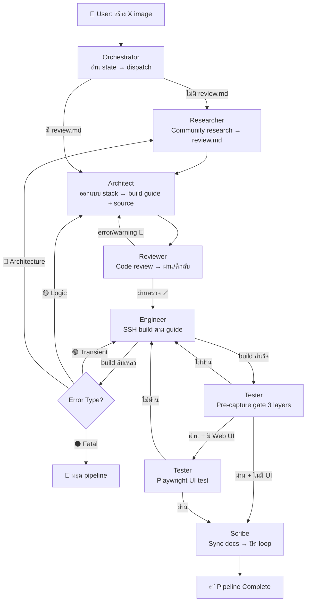

# Project Architecture — Folder Structure & Purpose

---

## 📁 Full Folder Tree

```text
openstack-image/
│
├── 📂 apps/                          [App Image Definitions]
│   ├── wordpress/                    (CMS — MariaDB + PHP-FPM + Nginx)
│   │   ├── wordpress.md             (Build guide)
│   │   ├── wordpress-review.md      (Community research)
│   │   ├── wordpress-errors.md      (AI mistakes log)
│   │   ├── wordpress-post-check.md  (Post-check checklist)
│   │   ├── docker-compose.yml       (Source: 3 services)
│   │   ├── nginx/
│   │   │   ├── default.conf         (HTTP)
│   │   │   └── default-https.conf   (HTTPS)
│   │   ├── php/
│   │   │   └── wordpress.ini        (PHP config)
│   │   ├── wordpress-bootstrap.service
│   │   ├── wordpress-bootstrap.sh
│   │   ├── README-wordpress-image.txt
│   │   └── 99-wordpress-image
│   │
│   ├── nextcloud/                    (File sync — PostgreSQL + Redis + Nginx)
│   ├── odoo/                         (ERP/CRM — PostgreSQL + Odoo 18 + Nginx)
│   ├── grafana-prometheus/           (Monitoring stack)
│   ├── n8n/                          (Workflow automation)
│   └── ... (other apps)
│
├── 📂 docs/                          [Project Documentation]
│   ├── README.md                    (Domain overview)
│   ├── AI-PIPELINE.md               (Build pipeline framework)
│   ├── ARCHITECTURE.md              (This file - folder structure)
│   ├── DEPENDENCIES.md              (File dependency map)
│   └── references/                  (Reusable references)
│       ├── mirrors.md               (Thai mirror matrix per OS)
│       └── cloud-init-scenarios.md  (Cloud-init user-data templates)
│
├── 📂 inventory/                     [Build Metadata]
│   ├── README.md                    (Inventory guide)
│   ├── build.env                    (Build environment config)
│   └── images/                      (Image metadata storage)
│
├── 📂 scripts/                       [Build & Verification Scripts]
│
├── 📄 AGENTS.md                      (Workspace instructions)
├── 📄 README.md                      (Project overview)
├── 📄 Makefile                       (Automation targets)
├── 📄 CONTRIBUTING.md                (Workflow guide)
└── 📄 .gitignore                     (Git ignore rules)
```

---

## 📌 Folder Purpose Matrix

| Folder | Purpose | Access | Frequency |
|---|---|---|---|
| **docs/** | Project documentation | AI + users | Read EVERY build |
| **apps/{app}/** | Per-app source + guide | AI + users | Read to understand app |
| **inventory/** | Build config + metadata | Build automation | Read build.env |
| **scripts/** | Build & verification scripts | Automation | Run during build |

---

## 🔄 Data Flow

### Build Phase (Image Domain)



**Key:** Image build is **standalone** — ไม่ผูก environment ใดๆ

---

## 🔐 Gitignore Policy

```gitignore
# Temp files during build (delete after use)
tmp/                                # build-specific env
scripts/temp/                       # temp script workspace

# Secrets (NEVER commit)
.env                                # all env files
*.private                           # private keys
credentials.txt                     # credentials
```

---

## 🌳 Dependency Hierarchy (Read in Order)

```
AGENTS.md                         [START HERE — Workspace Rules]
    ↓
    ├─ docs/AI-PIPELINE.md        (Build pipeline framework)
    ├─ docs/DEPENDENCIES.md       (File dependency map)
    ├─ apps/{app}/{app}.md        (Per-app build guide)
    └─ apps/_app-catalog.md       (App status)
```

---

## 🚀 Entry Points

### 👤 **User (สร้าง app image)**
1. `README.md` → Project overview
2. `AGENTS.md` → Workspace rules
3. `apps/_app-catalog.md` → App status
4. `apps/{app}/{app}.md` → Build guide

### 🐛 **Troubleshooter (fixing build issues)**
1. `README.md` → Overview
2. `docs/AI-PIPELINE.md` → Framework
3. `apps/{app}/docs/{app}-errors.md` → Previous errors

### 🏗️ **Maintainer (restructuring)**
1. `docs/DEPENDENCIES.md` → What depends on what?
2. `docs/ARCHITECTURE.md` → How does it all fit?

---

## 🔗 Quick Reference Links

| What | Location | Example |
|---|---|---|
| Build framework | `docs/AI-PIPELINE.md` | 4 phases + pre-capture gate |
| App status | `apps/_app-catalog.md` | "WordPress: ✅ ready" |
| Build guide | `apps/{app}/{app}.md` | Step-by-step commands |
| Mirror config | `docs/references/mirrors.md` | Thai mirrors per OS |
| Cloud-init template | `docs/references/cloud-init-scenarios.md` | User-data examples |
| Dependencies | `docs/DEPENDENCIES.md` | Update A → then update B |
| Inventory guide | `inventory/README.md` | Format spec + build.env |
| Build config | `inventory/build.env` | Build environment variables |

---

**Version:** 2026-07-16
**Purpose:** Visual architecture + folder guide
**Audience:** Everyone (AI + users + maintainers)
