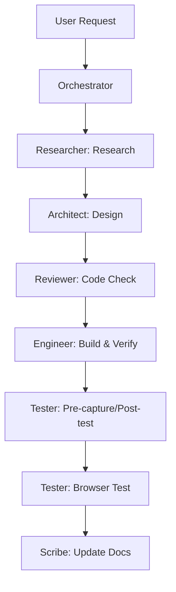

# OpenStack Image Domain

> Domain สำหรับ build / manage OpenStack images — guest images, app images, cloud-init templates

---

## 📋 ภาพรวม

OpenStack Image คือ domain รวมศูนย์สำหรับการสร้าง และบริหารจัดการ **golden images** ที่ใช้งานจริง เช่น:

- **Guest images** — OS พื้นฐาน (Ubuntu, Debian, Rocky, AlmaLinux, etc.) ให้ลูกค้าสร้าง VM จาก
- **App images** — OS + application stack พร้อมใช้ (WordPress, Nextcloud, Odoo, Docker Platform, Grafana+Prometheus, n8n)
- **Build pipeline** — ขั้นตอน, automation, testing สำหรับการ capture images
- **References** — mirror config, cloud-init templates

---

## 🗂️ โครงสร้าง Folder

```text
openstack-image/
├── apps/                    # App image definitions (1 folder per app)
├── docs/                    # Project documentation
│   ├── README.md           (คุณอยู่ที่นี่)
│   ├── AI-PIPELINE.md      (Build pipeline framework)
│   ├── ARCHITECTURE.md     (Folder structure)
│   ├── DEPENDENCIES.md     (File dependency map)
│   └── references/         (mirrors, cloud-init, stack components)
├── inventory/              # Build metadata
├── scripts/                # Build & verification scripts
├── AGENTS.md               # Workspace instructions
├── README.md               # Project overview
├── Makefile                # Automation targets
├── CONTRIBUTING.md         # Workflow guide
└── .gitignore
```

---

## 📊 ประเภท Image & สถานะ

| ประเภท | คำอธิบาย | ไฟล์ | สถานะ |
|---|---|---|---|
| **Guest images** | OS พื้นฐาน (9 OS) — cleanup + cloud-init พร้อม | `apps/_guest-images.md` | ⚠️ pipeline |
| **App catalog** | Overview app status + upstream signal | `apps/_app-catalog.md` | ✅ updated |
| **WordPress** | CMS — MariaDB + PHP-FPM + Nginx | `apps/wordpress/` | ✅ ผ่านตรวจ |
| **Nextcloud** | File sync — PostgreSQL + Redis + Nginx | `apps/nextcloud/` | ⚠️ รอ rebuild |
| **Odoo** | ERP/CRM — PostgreSQL + Odoo 18 | `apps/odoo/` | ✅ พร้อม build |
| **Grafana+Prometheus** | Monitoring stack | `apps/grafana-prometheus/` | ✅ built standalone |
| **n8n** | Workflow automation | `apps/n8n/` | ❌ รอเติม source |

---

## 📖 ไฟล์ที่ต้องอ่านก่อนทำงาน

### 1️⃣ **เอกสารหลัก**
- **`docs/README.md`** (คุณอยู่ที่นี่) — Domain overview
- **`docs/AI-PIPELINE.md`** — Build pipeline framework
- **`docs/ARCHITECTURE.md`** — Folder structure
- **`docs/DEPENDENCIES.md`** — File dependency map

### 2️⃣ **Reference**
- **`docs/references/mirrors.md`** — Mirror availability matrix (TH mirrors)
- **`docs/references/stack-components.md`** — Stack component catalog
- **`docs/references/cloud-init-scenarios.md`** — User-data templates

### 3️⃣ **Build Output**
- **`apps/_app-catalog.md`** — App status
- **`apps/_guest-images.md`** — Guest image pipeline
- **`apps/{app}/{app}.md`** — Per-app build guide

### 4️⃣ **Automation**
- **`Makefile`** — Quick targets (make build-app, make validate-env, etc.)

---

## 🔄 Workflow: สร้าง App Image ใหม่



---

## 🎯 Per-App Structure (1 App = 1 Folder)

```text
apps/{app}/
├── {app}.md                   ← Build guide — self-contained
├── {app}-review.md            ← Community research
├── {app}-errors.md            ← AI mistakes log
├── {app}-post-check.md        ← Post-check checklist
├── docker-compose.yml          ← Source file
├── {app}-bootstrap.sh          ← First-boot script
├── {app}-bootstrap.service     ← systemd oneshot unit
├── nginx/                      ← (ถ้าใช้ proxy)
│   ├── default.conf           ← HTTP config
│   └── default-https.conf     ← HTTPS config
├── README-{app}-image.txt      ← User-facing documentation
└── 99-{app}-image              ← Custom cloud-init config
```

---

## 🔧 วิธีใช้

### สำหรับ App Image
1. เปิด `apps/_app-catalog.md` → เลือก app
2. อ่าน `apps/{app}/{app}.md` → ดู status + prerequisites
3. อ่าน `docs/AI-PIPELINE.md` → เข้าใจ Pre-flight + Build + Verify phases
4. หลัง build → อัปเดต docs + ลบ temp

---

## 📌 Rules & Policies

### Standalone Domain
- Image build เป็น **standalone** ไม่ผูก environment ใดๆ
- ห้ามบันทึก temp IP, server ID, floating IP, Glance ID ลง docs กลาง
- ห้ามเก็บ password, token, private key, credentials
- Temp env อยู่ใน `tmp/{app}-build.env` (gitignored, ลบหลังจบ)

### Package Cache Policy
- ✅ **Keep** — `apt list`, `docker images`, cached packages
- ❌ **Remove** — runtime configs, logs, volumes, `.env` files, secrets

---

## 🔗 Quick Links

- **Build Pipeline:** `docs/AI-PIPELINE.md`
- **Mirror Config:** `docs/references/mirrors.md`
- **Stack Components:** `docs/references/stack-components.md`
- **Automation:** `Makefile`

---

**Last updated:** 2026-07-16
